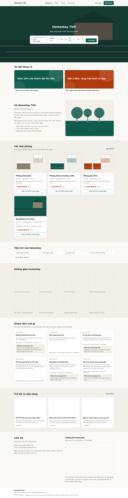
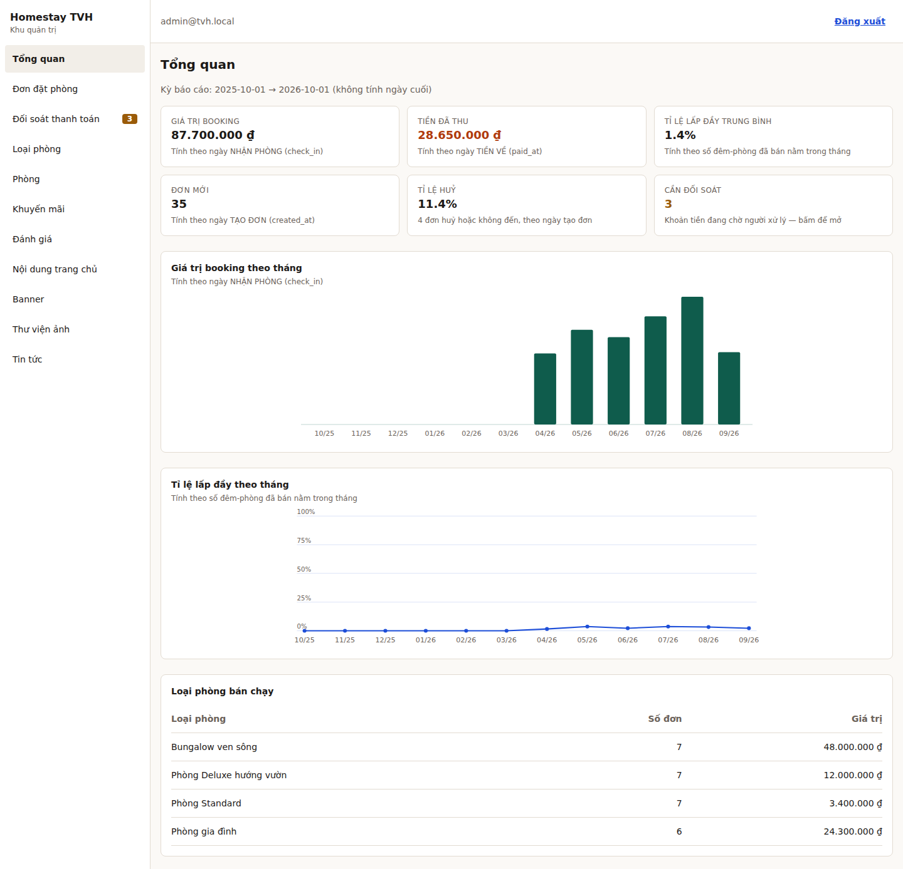
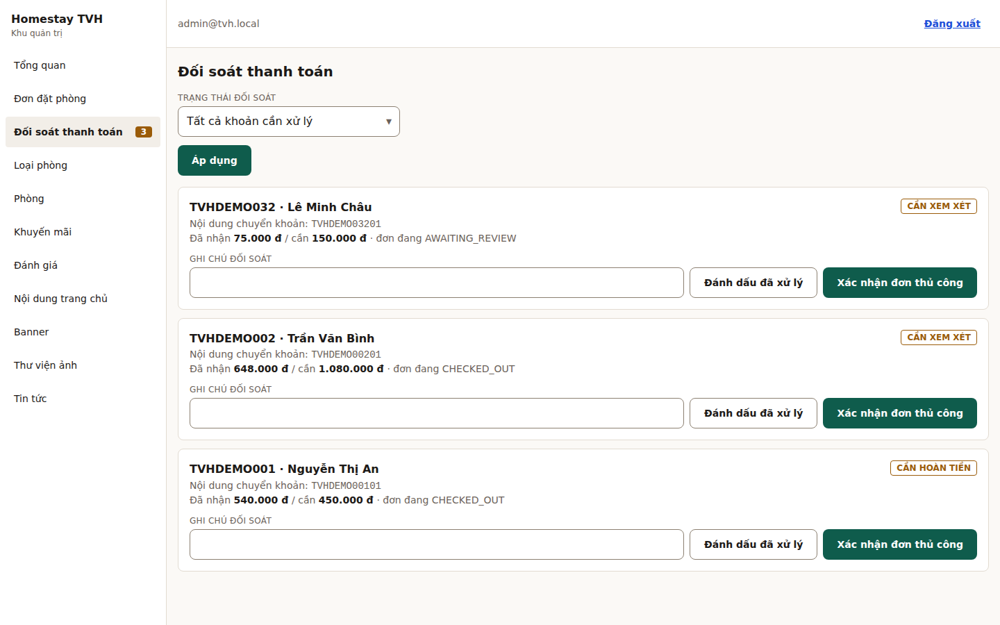

# Homestay TVH — Website giới thiệu & đặt phòng

Đồ án tốt nghiệp: hệ thống giới thiệu và đặt phòng homestay, gồm trang bán hàng
cho khách, khu quản trị cho chủ homestay, và REST API.

| Thành phần | Công nghệ |
|---|---|
| `backend/` | Java 21 · Spring Boot 3.5.6 · PostgreSQL 16 · Flyway · Spring Security |
| `frontend/` | Angular 21 · Tailwind CSS 4 · design system tự viết |
| `docs/` | Tài liệu kỹ thuật tiếng Việt |
| `plans/` | Kế hoạch triển khai 10 phase |

Điểm kỹ thuật cốt lõi: **chống đặt trùng phòng khoá ở tầng cơ sở dữ liệu** bằng
`EXCLUDE USING gist` trên kiểu `daterange` của PostgreSQL, không phụ thuộc kiểm
tra ở tầng service. Đây là lý do dự án chọn PostgreSQL thay vì MySQL — giải
thích đầy đủ ở [docs/erd.md](docs/erd.md#vì-sao-exclude-using-gist).

## Chạy trong ba lệnh

```bash
git clone <repo-url> homestay-tvh && cd homestay-tvh
./scripts/init-env.sh          # sinh bí mật ngẫu nhiên vào .env
docker compose up -d --build   # 4 service: db, api, web, mailpit
```

| Địa chỉ | Là gì |
|---|---|
| <http://localhost> | Trang khách |
| <http://localhost/admin> | Khu quản trị |
| <http://localhost/swagger-ui/index.html> | API tương tác (chỉ profile `demo`) |
| <http://localhost:8025> | Hộp thư giả — xem thư xác nhận |

**Mật khẩu quản trị demo** sinh ngẫu nhiên và chỉ nằm trong log container:

```bash
docker compose logs api | grep -i -A 4 'mat khau admin demo'
```

Tài khoản `admin@tvh.local`; lần đăng nhập đầu hệ thống **bắt buộc** đổi mật
khẩu. Tài khoản khách mẫu: `an.nguyen@example.com` / `khachdemo123`.

Máy không có Docker: xem đường chạy thủ công ở
[docs/cai-dat.md](docs/cai-dat.md#đường-2--chạy-thủ-công-không-cần-docker).

## Màn hình

### Trang chủ



### Tổng quan quản trị



### Đối soát thanh toán



## Dữ liệu mẫu

Profile `demo` nạp sẵn: 4 loại phòng, 15 phòng, 12 tiện ích, 40 đơn đặt phòng
trải đủ **tám trạng thái**, 3 khoản cần đối soát, 3 mã khuyến mãi (còn hạn / hết
hạn / hết lượt), 8 đánh giá, 1 khoảng đóng phòng, và nội dung trang chủ đầy đủ.

Mọi ngày trong dữ liệu mẫu là **tương đối** (`CURRENT_DATE ± n`), nên bộ dữ liệu
không cũ đi theo thời gian. Seed **không** đi qua Flyway — lý do ở
[DemoDataSeeder](backend/src/main/java/com/tvh/homestay/demo/DemoDataSeeder.java).

Ảnh minh hoạ là SVG tự vẽ trong repo, không phụ thuộc mạng. Thay bằng ảnh thật:
chép đè vào `frontend/public/images/demo/` với đúng tên tệp cũ.

## Yêu cầu môi trường

| Công cụ | Bản tối thiểu | Ghi chú |
|---|---|---|
| Docker | có Compose v2 | đường chạy khuyến nghị |
| JDK | 21 | chỉ khi chạy thủ công |
| Node.js | 20.19+ hoặc 22.12+ | Angular 21 yêu cầu |
| PostgreSQL | 16 | chỉ khi chạy thủ công — cần `btree_gist` |

## Profile

Chỉ có hai:

| Profile | Dùng khi | Gồm gì |
|---|---|---|
| `demo` | Phát triển và bản đem đi bảo vệ | Dữ liệu mẫu, Swagger UI, trang `/ui-kit` |
| `prod` | Triển khai thật | Không dữ liệu mẫu, không Swagger, không `/ui-kit` |

Đổi profile trên cùng một volume dữ liệu là an toàn — đây chính là lý do dữ liệu
mẫu không nằm trong lịch sử Flyway:

```bash
SPRING_PROFILES_ACTIVE=prod docker compose up -d api
```

## Bí mật

`JWT_SECRET` và `SEPAY_WEBHOOK_API_KEY` không có giá trị mặc định ở bất kỳ đâu:
không trong `application.yml`, không trong `.env.example`, không trong
`docker-compose.yml`. Ứng dụng dừng khởi động khi thiếu, ở mọi profile.
`scripts/init-env.sh` là đường duy nhất tạo ra giá trị thật.

Repo này công khai. Một giá trị mặc định "an toàn cho demo" nằm trong repo đồng
nghĩa với việc bất kỳ ai clone về cũng tự ký được JWT vai trò ADMIN cho mọi bản
triển khai dùng repo này.

## Múi giờ

Toàn hệ thống chạy `Asia/Ho_Chi_Minh`, đặt ở **bốn tầng độc lập**: biến `TZ` của
container, `-Duser.timezone` cho JVM, `spring.jackson.time-zone`, và
`hibernate.jdbc.time_zone`.

Chỉ đặt `spring.jackson.time-zone` là **không đủ** — thuộc tính đó chỉ chi phối
cách Jackson serialize JSON, không đổi `TimeZone.getDefault()` và không ảnh
hưởng `LocalDate.now()`. Hệ quả nếu làm sai: booking tạo trong khung 00:00–07:00
giờ Việt Nam bị gom nhóm vào tháng trước ở dashboard, trong khi đồng hồ đếm
ngược trên màn hình thanh toán vẫn đúng — sai một nửa nên rất khó nghi ngờ.

Endpoint `/api/health` phơi bày cả `appZone` lẫn `jvmDefaultZone` để kiểm tra
được điều này bằng mắt.

## Kiểm thử

```bash
cd backend  && ./mvnw verify   # 129 test — CẦN Docker (Testcontainers)
cd frontend && npm run build && npm run lint
```

Từng lớp test chứng minh điều gì: [docs/kiem-thu.md](docs/kiem-thu.md).

## Sự cố thường gặp

**`npm error Cannot read properties of null (reading 'edgesOut')`**
Lỗi của npm 10.9.x khi giải phụ thuộc peer optional của `vitest`. Dùng npm 11:

```bash
npx npm@11 install
```

**App không khởi động, log báo thiếu `JWT_SECRET`**
Đúng như thiết kế. Chạy `./scripts/init-env.sh`.

**Trang chủ trắng trơn, không có nội dung**
Không chạy ở profile `demo` nên dữ liệu mẫu không được nạp. Kiểm tra
`SPRING_PROFILES_ACTIVE`.

Bảng đầy đủ: [docs/cai-dat.md](docs/cai-dat.md#xử-lý-sự-cố).

## Tài liệu

| Tài liệu | Nội dung |
|---|---|
| [kien-truc.md](docs/kien-truc.md) | Thành phần hệ thống, phân lớp, lý do từng quyết định |
| [erd.md](docs/erd.md) | 21 bảng, từng ràng buộc, và **hai** lần dùng `EXCLUDE USING gist` |
| [use-case.md](docs/use-case.md) | 3 tác nhân, 6 use case chính có đặc tả đầy đủ |
| [luong-dat-phong.md](docs/luong-dat-phong.md) | Sequence đặt phòng, thanh toán, và biểu đồ 8 trạng thái |
| [api.md](docs/api.md) | 80 thao tác, quyền truy cập, giới hạn tần suất, mã lỗi |
| [bao-mat.md](docs/bao-mat.md) | Mô hình bảo mật **và 7 giới hạn đã biết** |
| [cai-dat.md](docs/cai-dat.md) | Cài đặt bằng Docker và không Docker, xử lý sự cố |
| [kiem-thu.md](docs/kiem-thu.md) | 129 test — từng lớp chứng minh điều gì |
| [thanh-toan-sepay.md](docs/thanh-toan-sepay.md) | Chi tiết tích hợp SePay và webhook |
| [so-lieu-va-quan-tri.md](docs/so-lieu-va-quan-tri.md) | Cách tính số liệu dashboard |
| [thiet-ke-giao-dien.md](docs/thiet-ke-giao-dien.md) | Design system, token màu, quy ước UI |

Kế hoạch triển khai đầy đủ:
[`plans/260907-1304-homestay-tvh-booking/`](plans/260907-1304-homestay-tvh-booking/)
— mở `plan.html` để xem bản trình bày có sơ đồ và mockup.
