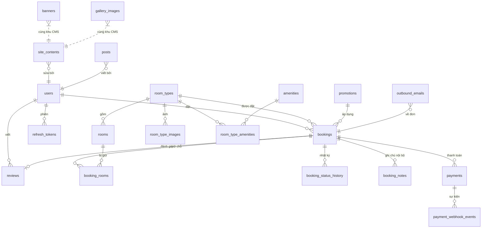

# Lược đồ cơ sở dữ liệu

**20 bảng nghiệp vụ**, dựng bởi bảy migration Flyway V1–V7. Bảng thứ 21 trong
schema `public` là `flyway_schema_history` — sổ ghi chép của chính Flyway, không
thuộc mô hình nghiệp vụ. Số 20 được `SchemaMigrationTest` canh:

```sql
SELECT count(*) FROM information_schema.tables
 WHERE table_schema = 'public' AND table_name <> 'flyway_schema_history';
```

Flyway là chủ schema; `spring.jpa.hibernate.ddl-auto` đặt `validate` và **không
bao giờ** được đổi thành `update` — Hibernate sẽ lặng lẽ thêm cột ngoài migration
và lớp canh gác mất tác dụng. Migration đã phát hành là **bất biến**: sửa lược đồ
nghĩa là thêm V8, không phải sửa V3.

## Sơ đồ quan hệ



## Bảng theo nhóm

### Tài khoản và phiên (V1)

| Bảng | Vai trò | Điểm đáng chú ý |
|---|---|---|
| `users` | Tài khoản khách và quản trị | `CHECK (email = lower(email))` ép chữ thường ở **tầng dữ liệu** — một chỗ quên `lower()` ở tầng ứng dụng là tạo được hai tài khoản cho cùng hộp thư. `token_version` tăng khi đăng xuất/đổi mật khẩu; JWT mang số này lúc phát hành nên token cũ chết ngay, không cần chờ hết hạn. `password_hash` giới hạn 72 ký tự đúng bằng trần của BCrypt. |
| `refresh_tokens` | Phiên đăng nhập dài hạn | Lưu **hash SHA-256** của token, không lưu token. Rò bảng này không cho ai đăng nhập được. |

### Phòng (V2)

| Bảng | Vai trò | Điểm đáng chú ý |
|---|---|---|
| `room_types` | Loại phòng bán ra | `slug` UNIQUE — là URL công khai, đổi slug là làm chết link đã chia sẻ. |
| `rooms` | Phòng vật lý | `status ∈ (AVAILABLE, MAINTENANCE, OUT_OF_SERVICE)`. Phòng bảo trì **vẫn có thể** đang có đơn — xem ghi chú ở `booking_rooms`. |
| `room_type_images` | Ảnh | Chỉ mục **một phần** `UNIQUE (room_type_id) WHERE is_cover` — mỗi loại phòng nhiều nhất một ảnh bìa, ép ở tầng dữ liệu. |
| `amenities`, `room_type_amenities` | Tiện ích | `category ∈ (ROOM, PROPERTY)`. `PROPERTY` là cách lược đồ diễn đạt "tiện ích của cả homestay" mà không cần bảng riêng. |

### Đặt phòng (V3) — phần quan trọng nhất

| Bảng | Vai trò | Điểm đáng chú ý |
|---|---|---|
| `bookings` | Đơn | `code` (mã đọc qua điện thoại được) tách khỏi `access_token` (32 ký tự hex từ `SecureRandom`). Tách là chủ ý: `code` in trên thư và nằm trong nội dung chuyển khoản nên **đoán được**, mà thứ đoán được thì không được phép cấp quyền. `room_type_name_snapshot` và `unit_price_snapshot` chụp lại tên và giá lúc đặt — đổi giá về sau không được làm đổi số tiền của một đơn đã chốt. Tám trạng thái, có `CHECK`. |
| `booking_rooms` | Gán đơn ↔ phòng vật lý | Nơi đặt ràng buộc sống còn. Xem mục dưới. |
| `booking_status_history` | Nhật ký chuyển trạng thái | `actor ∈ (GUEST, CUSTOMER, ADMIN, SYSTEM)`. Hai cột trạng thái cũng có `CHECK` — một dòng ghi sai chính tả không gây hỏng ngay nhưng làm hỏng mọi báo cáo đọc từ bảng này. |
| `booking_notes` | Ghi chú nội bộ (V7) | Không hiển thị cho khách. |

### Thanh toán (V4)

| Bảng | Vai trò | Điểm đáng chú ý |
|---|---|---|
| `payments` | Lần thanh toán | Một đơn có **nhiều** lần: chuyển hai lần, chuyển thiếu rồi bù, hoặc đặt lại sau khi hết hạn. `transfer_content` UNIQUE toàn cục = `code` + 2 chữ số `attempt_no`, nhờ hậu tố này mà QR của lần trước không khớp nhầm vào lần sau. `amount_received` **cộng dồn**, không ghi đè. `reconcile_status ∈ (NONE, NEEDS_REVIEW, REFUND_REQUIRED, RESOLVED)` + chỉ mục một phần `WHERE reconcile_status <> 'NONE'`. |
| `payment_webhook_events` | Nhật ký mọi webhook | Khoá chống xử lý trùng là `(provider, external_id)`. `provider_txn_id` ở `payments` cố ý **không** UNIQUE: nhà cung cấp có thể gửi cùng một mã tham chiếu cho nhiều sự kiện, đặt UNIQUE ở đó sẽ làm rơi webhook hợp lệ. |
| `outbound_emails` | Hộp thư đi | Thư được ghi vào bảng trong cùng giao dịch với việc đổi trạng thái đơn, rồi gửi sau — không gửi thẳng trong giao dịch, vì một đơn bị huỷ trong lúc chờ sẽ sinh ra lá thư tự mâu thuẫn với chính nó. |

### Khuyến mãi và đánh giá (V5)

| Bảng | Vai trò | Điểm đáng chú ý |
|---|---|---|
| `promotions` | Mã giảm giá | `usage_limit` NULL = **không giới hạn**, không phải hết lượt. Giao diện quản trị phải nói đúng điều đó. |
| `reviews` | Đánh giá | `UNIQUE (booking_id)` — "mỗi đơn một đánh giá" do cơ sở dữ liệu ép, không phải bằng một cú kiểm tra ở service mà hai tab qua mặt được. `guest_name_snapshot` NOT NULL, chụp từ đơn: nhận tên từ client nghĩa là ai gửi được đánh giá cũng ký tên bất kỳ ai. Lưu **văn bản thuần**, không HTML. |

### Nội dung (V6)

`site_contents` (khối trang chủ, `section_key` UNIQUE), `banners` (có cửa sổ thời
gian `starts_at`/`ends_at` + `CHECK` bảo đảm `ends_at > starts_at`),
`gallery_images`, `posts` (`slug` UNIQUE). Trường HTML được lọc **ở tầng vào**
trước khi lưu — xem [bao-mat.md](./bao-mat.md#nội-dung-html-của-cms).

## Vì sao `EXCLUDE USING gist`

```sql
ALTER TABLE booking_rooms
    ADD CONSTRAINT booking_rooms_no_overlap
    EXCLUDE USING gist (room_id WITH =, stay WITH &&)
    WHERE (status = 'ACTIVE');
```

Đây là câu hay bị hỏi nhất khi bảo vệ. Ba điều ràng buộc này bảo đảm mà tầng ứng
dụng không:

**1. Chống tranh chấp thật, không còn khe hở.** Cách làm quen thuộc là
`SELECT ... WHERE NOT EXISTS (...)` rồi `INSERT`. Giữa hai câu lệnh đó có một
khoảng thời gian; hai giao dịch song song cùng đọc "còn phòng" rồi cùng ghi, và
phòng 101 được bán hai lần. Khoá bi quan (`SELECT ... FOR UPDATE` trên hàng loại
phòng) bịt được khe đó nhưng biến mọi lượt đặt cùng loại phòng thành hàng đợi
một luồng, và không còn đúng khi chạy nhiều instance. Với `EXCLUDE`, PostgreSQL
bác một trong hai giao dịch bằng `SQLSTATE 23P01` **trong động cơ lưu trữ** —
không có khe hở nào để chen vào. `BookingConcurrencyIT` chứng minh bằng ba luồng
thật cùng đặt một phòng.

**2. Khoảng nửa mở `[)` đúng nghiệp vụ khách sạn.** Cột `stay` là
`daterange(check_in, check_out, '[)')` sinh tự động. Khách A trả phòng 10/03,
khách B nhận phòng 10/03: `[08/03,10/03)` và `[10/03,12/03)` **không** chồng
nhau, nên hợp lệ — và điều đó đúng mà không cần một dòng mã nào ở tầng ứng dụng.
Tự so ngày bằng `<`/`<=` là chỗ sai kinh điển: lệch một dấu bằng thì hoặc mất một
đêm doanh thu mỗi phòng, hoặc bán trùng.

**3. Đơn huỷ nhả phòng ngay mà vẫn giữ lịch sử.** `WHERE (status = 'ACTIVE')` làm
ràng buộc chỉ soi các dòng đang giữ chỗ. Huỷ đơn chỉ đổi `status` sang
`RELEASED`: phòng mở lại lập tức, dòng dữ liệu vẫn còn để tra cứu.

Cột `stay` là `GENERATED ALWAYS AS ... STORED`, không bao giờ ghi tay — để tầng
ứng dụng tự tính rồi ghi vào thì sẽ có lúc nó tính sai, và lúc đó ràng buộc canh
một giá trị sai.

### Bất biến đi kèm: `room_quantity` phải khớp số dòng ACTIVE

`bookings.room_quantity` và số dòng `booking_rooms` ACTIVE là hai nguồn sự thật
song song. Không có gì buộc chúng khớp thì một lần gán phòng thất bại một phần
để lại đơn đã thu cọc 3 phòng nhưng chỉ giữ 2 — và truy vấn phòng trống sẽ bán
phòng thứ ba cho khách khác.

Hai `CONSTRAINT TRIGGER` canh cả hai phía, và cả hai đều
`DEFERRABLE INITIALLY DEFERRED`. Điều này **bắt buộc**, không phải tuỳ chọn: gán
phòng diễn ra lần lượt từng dòng, nên ngay sau dòng đầu tiên bất biến đã tạm sai;
trigger chạy tức thì sẽ khiến không đơn nhiều phòng nào đặt được.

Hàm kiểm miễn trừ đúng ba trạng thái `CANCELLED`, `EXPIRED`, `NO_SHOW` — những
chuyến **không diễn ra**. `CHECKED_OUT` cố ý **không** nằm trong nhóm đó: khách
đã ở thật, nên các dòng `booking_rooms` của đơn ấy là bằng chứng lịch sử về số
đêm-phòng đã bán, và cũng là mẫu số của tỉ lệ lấp đầy.

### Vì sao đếm phòng trống bằng "đếm trực tiếp", không phải "tổng trừ đã đặt"

Cách "tổng số phòng trừ số dòng ACTIVE của loại" sai ở một tình huống **thiết
kế**, không phải hiếm: admin được phép chuyển một phòng đang có đơn sang
`MAINTENANCE`. Phòng đó bị trừ hai lần — một lần vì không còn `AVAILABLE`, một
lần nữa vì vẫn có dòng ACTIVE. Website báo thiếu phòng và mất doanh thu âm thầm.
Truy vấn thật dùng `CROSS JOIN LATERAL` đếm trực tiếp những phòng vừa khả dụng
vừa rảnh. `AvailabilityQueryIT.maintenanceRoom` canh đúng trường hợp này.
