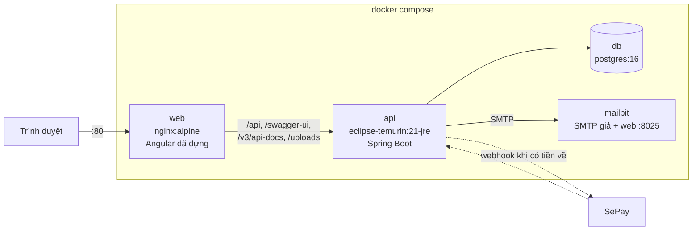
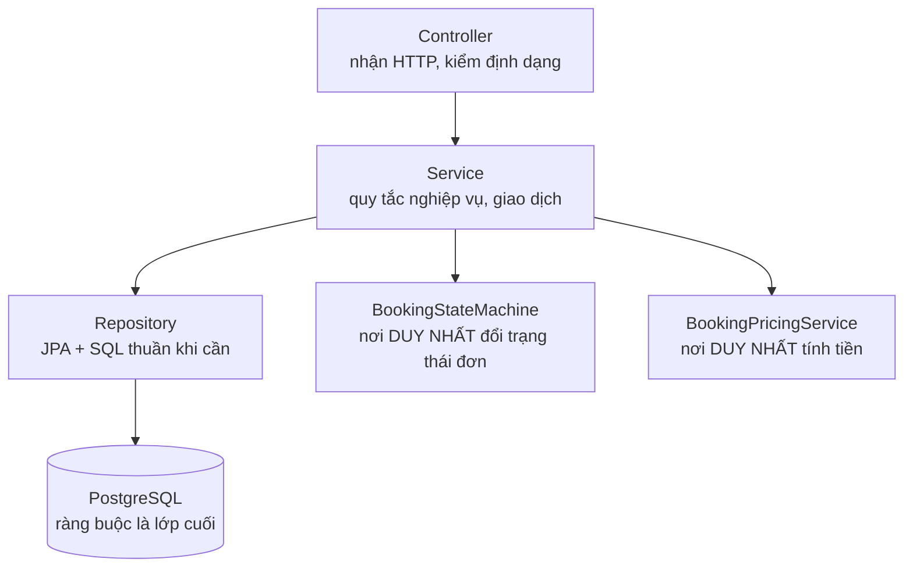

# Kiến trúc hệ thống

Tài liệu này mô tả các thành phần và lý do chúng được đặt như vậy. Chi tiết
lược đồ dữ liệu ở [erd.md](./erd.md); danh sách endpoint ở [api.md](./api.md);
mô hình bảo mật ở [bao-mat.md](./bao-mat.md).

## Thành phần khi chạy bằng Docker

Chỉ `web` (cổng 80) và giao diện `mailpit` (cổng 8025) mở ra máy chủ. `api` và
`db` **không** publish cổng nào — xem [bao-mat.md](./bao-mat.md) để biết vì sao
việc đóng cổng 8080 là điều kiện để tin được header `X-Forwarded-For`.

## Vì sao nginx phải chuyển tiếp bốn nhóm đường dẫn

`/swagger-ui/**` và `/v3/api-docs/**` **không** nằm dưới `/api`. Nếu nginx chỉ
proxy `/api`, hai nhóm đó rơi vào `try_files ... /index.html` và trả về trang
Angular kèm mã 200 — trông y như thành công. Cùng lỗi định tuyến làm
`/uploads/**` trả 404 và mọi ảnh khách tải lên biến mất.

Cả bốn khối dùng `location ^~`, không phải `location` thường. Khối cuối tệp
`location ~* \.(js|css|png|jpg|svg|…)$` là location **chính quy**, và nginx cho
location chính quy thắng mọi location tiền tố thường — không có `^~` thì
`/uploads/anh.jpg` rơi vào khối tĩnh và trả 404.

## Phân lớp phía backend

Hai lớp gom lại một chỗ vì lý do giống nhau. `BookingStateMachine` là nơi duy
nhất đổi trạng thái đơn, vì mỗi lần chuyển kéo theo ba việc phụ dễ quên: ghi
nhật ký, nhả phòng khi đơn không diễn ra, và hoàn lượt khuyến mãi.
`BookingPricingService` là nơi duy nhất tính tiền, vì hai công thức song song sẽ
lệch nhau ngay lần đầu có khuyến mãi hoặc làm tròn — và bên lệch là bên khách
nhìn thấy.

Frontend **không** tính tiền. Mọi con số hiển thị đều lấy từ phản hồi API, kể cả
số tiền giảm khi khách thử mã khuyến mãi (`POST /api/promotions/check` gọi lại
đúng `BookingPricingService` mà lúc tạo đơn sẽ dùng).

## Ràng buộc nằm ở tầng dữ liệu, không ở tầng ứng dụng

Quyết định kiến trúc quan trọng nhất của dự án: **chống bán trùng phòng bằng
`EXCLUDE USING gist`**, không bằng kiểm tra trong service.

Giữa lúc service hỏi "còn phòng không" và lúc nó ghi vào bảng luôn có một khe hở
mà một giao dịch khác chen vào được. Khoá bi quan ở tầng ứng dụng bịt được khe
đó nhưng trở thành điểm nghẽn và không sống sót khi chạy nhiều instance.
PostgreSQL đóng khe hở ngay trong động cơ lưu trữ. Giải thích đầy đủ ở
[erd.md](./erd.md#vì-sao-exclude-using-gist).

Hệ quả kiến trúc: **tầng ứng dụng phải biết đọc lỗi của cơ sở dữ liệu.** Mã lỗi
`23P01` (exclusion violation) được dịch thành `ROOM_NOT_AVAILABLE`, và vòng thử
phòng tiếp theo phải nằm ở giao dịch MỚI — PostgreSQL huỷ cả giao dịch khi ràng
buộc bị vi phạm, nên thử tiếp trong cùng giao dịch chỉ nhận `25P02`.

## Frontend

Angular 21 standalone, signals, không thư viện quản lý trạng thái ngoài. Ba khu:

| Khu | Đường dẫn | Bảo vệ |
|---|---|---|
| Công khai | `/`, `/phong`, `/dat-phong`, `/tra-cuu`, `/tin-tuc` | không |
| Tài khoản khách | `/tai-khoan/dat-phong` | `authGuard` |
| Quản trị | `/admin/**` | `adminGuard` + `hasRole('ADMIN')` ở máy chủ |

Khu quản trị nạp lười: người vào trang đặt phòng không tải mã của mười một màn
hình quản trị mà họ không bao giờ mở.

Design system tự viết (không Material, không Bootstrap) — lý do và bảng token ở
[thiet-ke-giao-dien.md](./thiet-ke-giao-dien.md).

## Luồng tiền

Chi tiết ở [thanh-toan-sepay.md](./thanh-toan-sepay.md) và
[luong-dat-phong.md](./luong-dat-phong.md). Tóm tắt: đơn giữ chỗ 15 phút, khách
chuyển khoản theo mã QR VietQR, SePay gọi webhook, hệ thống đối chiếu số tiền và
nội dung chuyển khoản rồi chuyển đơn sang `CONFIRMED`. Mọi khoản không khớp đi
vào hàng đợi đối soát thay vì bị bỏ qua.

## Múi giờ

`Asia/Ho_Chi_Minh` được đặt ở bốn chỗ, và cả bốn đều cần: biến `TZ` của
container, `JAVA_TOOL_OPTIONS=-Duser.timezone`, `spring.jackson.time-zone`, và
`hibernate.jdbc.time_zone`. Thiếu một chỗ thì ngày nhận phòng lệch một ngày với
khách đặt vào buổi tối.
