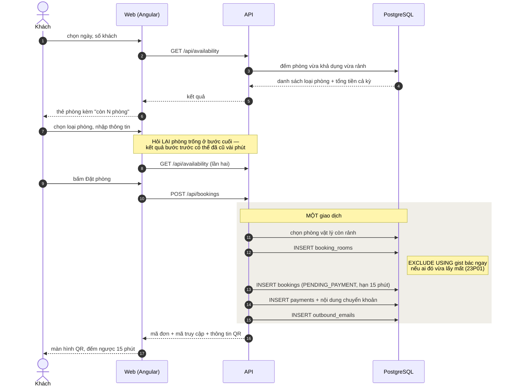
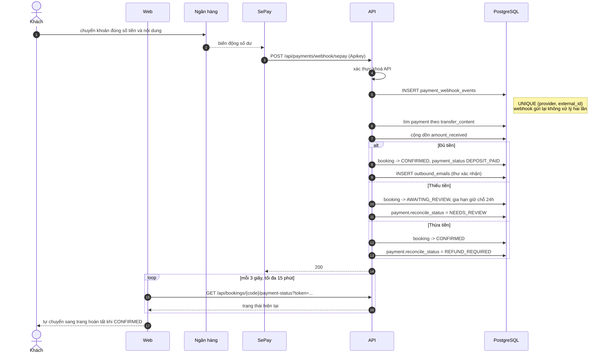
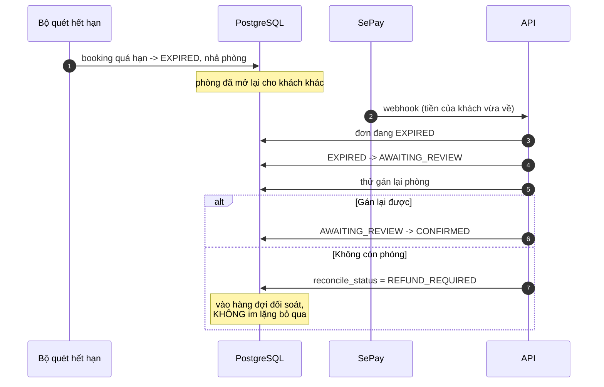
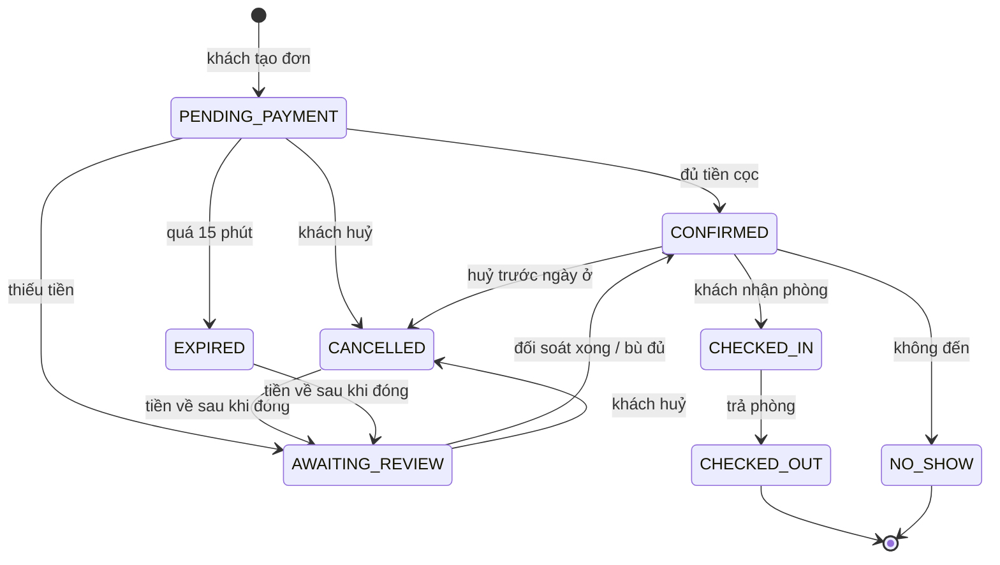

# Luồng đặt phòng và thanh toán

## Đặt phòng — từ lúc chọn ngày tới lúc có mã QR

Nếu bước ghi `booking_rooms` bị ràng buộc bác, hệ thống thử phòng còn lại **trong
một giao dịch mới** — PostgreSQL huỷ cả giao dịch khi ràng buộc bị vi phạm, nên
thử tiếp trong cùng giao dịch chỉ nhận `SQLSTATE 25P02`. Hết phòng thật thì trả
`ROOM_NOT_AVAILABLE`.

## Thanh toán và webhook

### Nhánh tiền về muộn

Cửa sổ tranh chấp là có thật: ngân hàng → nhà cung cấp → API trễ vài chục giây,
còn đồng hồ đếm ngược lại đẩy khách bấm chuyển khoản vào đúng phút cuối.

`CANCELLED` và `EXPIRED` có **đúng một** đường ra: sang `AWAITING_REVIEW`, và chỉ
khi tiền của khách về sau khi đơn đã đóng. Không mở thẳng sang `CONFIRMED` vì
phòng đã được nhả cho khách khác — phải qua `AWAITING_REVIEW` rồi mới thử gán
lại.

## Biểu đồ trạng thái đơn — tám trạng thái

**Ba trạng thái nhả phòng:** `CANCELLED`, `EXPIRED`, `NO_SHOW` — những chuyến
**không diễn ra**. Các dòng `booking_rooms` chuyển sang `RELEASED` và lượt khuyến
mãi được hoàn.

**`CHECKED_OUT` cố ý KHÔNG nhả phòng.** Khách đã ở thật, nên những dòng
`booking_rooms` của đơn đó là bằng chứng lịch sử về số đêm-phòng đã bán, không
phải chỗ đang bị giữ. Nhả chúng gây hỏng theo hai hướng cùng lúc: ràng buộc
`assert_booking_room_count` bác ngay (danh sách miễn trừ không có `CHECKED_OUT`),
và tỉ lệ lấp đầy của mọi chuyến đã hoàn tất về 0. Không nhả cũng không giam
phòng: ràng buộc chống trùng chỉ so **khoảng ngày**, mà khoảng ngày của một
chuyến đã trả phòng nằm trong quá khứ nên không chặn ai.

`BookingStateMachine` là nơi duy nhất thực hiện những bước chuyển này. Mỗi lần
chuyển kéo theo ba việc phụ mà rải rác ở controller thì chắc chắn có chỗ quên:
ghi nhật ký, nhả phòng khi cần, hoàn lượt khuyến mãi. Quên việc thứ hai là giam
phòng vĩnh viễn; quên việc thứ ba là đốt oan lượt của mã giảm giá.
