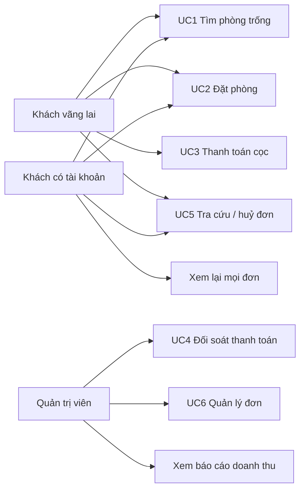

# Use case

Ba tác nhân, sáu use case chính. Đặc tả theo mẫu: tác nhân, tiền điều kiện,
luồng chính, luồng thay thế, hậu điều kiện.

## Tác nhân

| Tác nhân | Mô tả | Xác thực |
|---|---|---|
| **Khách vãng lai** | Không có tài khoản. Đặt phòng, tra cứu và huỷ đơn bằng mã đơn + số điện thoại. | Không đăng nhập. Thao tác trên một đơn cụ thể cần **mã đơn + số điện thoại** hoặc **mã truy cập** trong liên kết của thư xác nhận. |
| **Khách có tài khoản** | Làm được mọi thứ khách vãng lai làm, thêm việc xem lại mọi đơn ở một chỗ. | JWT, vai trò `CUSTOMER`. |
| **Quản trị viên** | Chủ homestay và nhân viên. | JWT, vai trò `ADMIN`. |

Tài khoản là **tuỳ chọn**, không phải điều kiện để đặt phòng. Bắt đăng ký trước
khi đặt là chỗ mất khách nhiều nhất của một trang đặt phòng.

---

## UC1 — Tìm phòng trống

**Tác nhân:** Khách vãng lai, Khách có tài khoản
**Tiền điều kiện:** Có ít nhất một loại phòng đang bật bán.

**Luồng chính**
1. Khách mở trang chủ; thanh tìm phòng nạp sẵn lịch của **toàn homestay**.
2. Khách chọn ngày nhận và ngày trả. Ngày quá khứ và ngày đã kín **mọi** loại
   phòng bị chặn ngay trong lịch, không cho bấm.
3. Khách chọn số người lớn, trẻ em, số phòng.
4. Hệ thống gọi `GET /api/availability` và trả về các loại phòng còn chỗ, kèm
   **tổng tiền cả kỳ** và số phòng còn lại.

**Luồng thay thế**
- *2a. Lịch không tải được:* khách vẫn chọn ngày được; mất phần chặn trước,
  backend vẫn từ chối ngày kín ở bước sau.
- *4a. Không loại phòng nào đủ chỗ:* hiện trạng thái rỗng kèm gợi ý đổi ngày
  hoặc giảm số khách mỗi phòng, không hiện danh sách trắng.

**Hậu điều kiện:** Không có gì được ghi. Truy vấn chỉ đọc.

---

## UC2 — Đặt phòng

**Tác nhân:** Khách vãng lai, Khách có tài khoản
**Tiền điều kiện:** Đã hoàn thành UC1 và chọn một loại phòng.

**Luồng chính**
1. Hệ thống **hỏi lại** phòng trống khi khách vào bước nhập thông tin — kết quả
   ở bước trước có thể đã cũ vài phút.
2. Khách nhập họ tên, số điện thoại, email, yêu cầu thêm; có thể thử mã khuyến
   mãi (`POST /api/promotions/check` trả về số tiền giảm **do backend tính**).
3. Khách bấm đặt phòng.
4. Trong **một giao dịch**: hệ thống chọn phòng vật lý còn rảnh, ghi
   `booking_rooms`, tạo đơn ở trạng thái `PENDING_PAYMENT`, sinh mã đơn và mã
   truy cập, đặt hạn giữ chỗ 15 phút, tạo bản ghi thanh toán và nội dung QR.
5. Hệ thống ghi thư xác nhận vào hộp thư đi và chuyển khách sang màn hình QR.

**Luồng thay thế**
- *4a. Phòng vừa bị người khác lấy:* ràng buộc `EXCLUDE` bác giao dịch
  (`SQLSTATE 23P01`); hệ thống thử phòng còn lại trong một giao dịch **mới**.
  Hết phòng thì trả `ROOM_NOT_AVAILABLE`, giao diện nói thẳng và đưa khách về
  bước chọn loại phòng.
- *2a. Mã khuyến mãi hết hạn hoặc hết lượt:* trả `INVALID_PROMOTION` /
  `PROMOTION_EXHAUSTED`; đơn vẫn đặt được với giá gốc.
- *3a. Khách gửi quá 10 đơn/phút từ cùng IP, hoặc 10 đơn/giờ từ cùng số điện
  thoại:* trả `TOO_MANY_REQUESTS`.

**Hậu điều kiện:** Một đơn `PENDING_PAYMENT` giữ đúng `room_quantity` phòng
trong 15 phút. Chưa thu tiền.

---

## UC3 — Thanh toán cọc

**Tác nhân:** Khách vãng lai, Khách có tài khoản
**Tiền điều kiện:** Có đơn `PENDING_PAYMENT` chưa hết hạn giữ chỗ.

**Luồng chính**
1. Màn hình hiện mã QR VietQR, số tài khoản, **số tiền cọc**, nội dung chuyển
   khoản, và đồng hồ đếm ngược.
2. Khách chuyển khoản bằng ứng dụng ngân hàng.
3. SePay gọi `POST /api/payments/webhook/sepay`.
4. Hệ thống xác thực khoá API, chống xử lý trùng theo `(provider, external_id)`,
   đối chiếu nội dung chuyển khoản với `transfer_content`, cộng dồn số tiền.
5. Đủ tiền → đơn chuyển `CONFIRMED`, thư xác nhận được gửi. Màn hình tự chuyển
   sang trang hoàn tất (hỏi trạng thái mỗi 3 giây).

**Luồng thay thế**
- *4a. Thiếu tiền:* đơn sang `AWAITING_REVIEW`, giữ chỗ gia hạn 24 giờ, khoản
  vào hàng đợi đối soát `NEEDS_REVIEW`. Màn hình **không** báo hết hạn — báo hết
  hạn với người đã chuyển tiền sẽ khiến họ chuyển thêm lần nữa.
- *4b. Thừa tiền:* đơn `CONFIRMED`, khoản vào hàng đợi `REFUND_REQUIRED`.
- *4c. Tiền về sau khi đơn đã `EXPIRED`/`CANCELLED`:* đơn mở lại sang
  `AWAITING_REVIEW` và hệ thống thử gán phòng lại. Không nhánh nào để tiền biến
  mất im lặng.
- *2a. Hết 15 phút mà chưa có tiền:* bộ quét chuyển đơn sang `EXPIRED`, nhả
  phòng và hoàn lượt khuyến mãi.

**Hậu điều kiện:** Đơn ở `CONFIRMED`, hoặc ở `AWAITING_REVIEW` với một khoản
trong hàng đợi đối soát. Mọi webhook đều được ghi nhật ký.

---

## UC4 — Đối soát thanh toán

**Tác nhân:** Quản trị viên
**Tiền điều kiện:** Đăng nhập với vai trò `ADMIN`, đã đổi mật khẩu tạm nếu có.

**Luồng chính**
1. Mở `/admin/payments`; mặc định hiện những khoản `NEEDS_REVIEW` và
   `REFUND_REQUIRED` — huy hiệu trên thanh điều hướng đếm đúng hai nhóm này.
2. Quản trị viên xem chi tiết: số tiền chờ, số tiền nhận, nội dung chuyển khoản,
   nhật ký webhook.
3. Chọn một trong hai: xác nhận thủ công (đơn sang `CONFIRMED`) hoặc đánh dấu đã
   xử lý (`RESOLVED`).

**Luồng thay thế**
- *3a. Cần hoàn tiền:* việc chuyển tiền làm ngoài hệ thống; quản trị viên đánh
  dấu `RESOLVED` kèm ghi chú sau khi đã hoàn.

**Hậu điều kiện:** Khoản rời hàng đợi. Huy hiệu giảm đi — đây là lý do bộ đếm
chỉ tính `NEEDS_REVIEW` và `REFUND_REQUIRED`, không tính `RESOLVED`.

---

## UC5 — Tra cứu và huỷ đơn

**Tác nhân:** Khách vãng lai, Khách có tài khoản
**Tiền điều kiện:** Biết mã đơn và số điện thoại đã dùng khi đặt.

**Luồng chính**
1. Mở `/tra-cuu`, nhập mã đơn và số điện thoại.
2. Hệ thống trả về đơn kèm trạng thái, phòng được xếp, và số tiền.
3. Khách bấm huỷ; hộp thoại xác nhận nói rõ hậu quả kèm **số tiền cọc thật của
   đơn đó**.
4. Đơn sang `CANCELLED`, các dòng `booking_rooms` sang `RELEASED`, phòng mở lại
   ngay, lượt khuyến mãi được hoàn.

**Luồng thay thế**
- *2a. Sai mã hoặc sai số điện thoại:* cùng một thông báo `BOOKING_NOT_FOUND`
  cho cả hai. Phân biệt hai câu là biến ô tra cứu thành công cụ dò xem mã nào có
  thật — mà mã đơn thì nằm trên sao kê ngân hàng.
- *3a. Đơn đã `CHECKED_IN`/`CHECKED_OUT`:* nút huỷ không hiện.

**Hậu điều kiện:** Phòng trở lại kho ngay lập tức; lịch sử vẫn còn.

---

## UC6 — Quản lý đơn đặt phòng

**Tác nhân:** Quản trị viên
**Tiền điều kiện:** Đăng nhập với vai trò `ADMIN`.

**Luồng chính**
1. Mở `/admin/bookings`; lọc theo trạng thái, khoảng ngày, từ khoá.
2. Mở chi tiết một đơn: thông tin khách, phòng được xếp, lịch sử chuyển trạng
   thái, các lần thanh toán, ghi chú nội bộ.
3. Chuyển trạng thái (nhận phòng, trả phòng, đánh dấu không đến, huỷ). Chỉ những
   bước hợp lệ theo bảng chuyển trạng thái mới hiện ra.
4. Mỗi lần chuyển ghi một dòng vào `booking_status_history` kèm người thực hiện.

**Luồng thay thế**
- *3a. Bước không hợp lệ:* backend trả `INVALID_STATE_TRANSITION` — giao diện là
  lớp trải nghiệm, `BookingStateMachine` mới là lớp quyết định.
- *3b. Gửi lại thư xác nhận:* có nút riêng, ghi vào hộp thư đi.

**Hậu điều kiện:** Trạng thái đơn đổi, nhật ký có thêm một dòng truy vết được về
người thực hiện.

---

## UC bổ sung

| Use case | Tác nhân | Ghi chú |
|---|---|---|
| Xem lại mọi đơn của mình | Khách có tài khoản | `GET /api/me/bookings` lọc theo token của phiên, **không** theo tham số trên URL. |
| Xem báo cáo doanh thu | Quản trị viên | Dashboard: doanh thu theo tháng, tỉ lệ lấp đầy, tỉ lệ huỷ. Chi tiết cách tính ở [so-lieu-va-quan-tri.md](./so-lieu-va-quan-tri.md). |
| Viết đánh giá | Khách đã trả phòng | Cần mã truy cập hoặc số điện thoại — cùng mức xác thực với tra cứu. Đánh giá chờ quản trị viên duyệt trước khi đăng. |
| Soạn nội dung trang chủ | Quản trị viên | Bốn màn hình CMS: khối trang chủ, banner, thư viện ảnh, tin tức. |
