# Phase 2: Schema cơ sở dữ liệu & Flyway migration

## Overview

Định nghĩa toàn bộ schema PostgreSQL bằng Flyway migration và ánh xạ sang JPA entity. Đây là phase nền — mọi phase sau phụ thuộc vào nó, nên schema phải đúng ngay từ đầu, đặc biệt là ràng buộc chống trùng lịch.

**19 bảng.** Vì kế hoạch chốt nguyên tắc migration bất biến, mọi bảng và cột phục vụ luồng thanh toán, đối soát và gửi mail phải có mặt ngay ở đây — thêm sau sẽ phải vá bằng V7/V8.

## Requirements

- Functional: 19 bảng, đủ ràng buộc khoá ngoại, CHECK trên **mọi** cột enum, UNIQUE, và ràng buộc `EXCLUDE` chống trùng phòng.
- Non-functional: `ddl-auto=validate` phải pass — entity và migration khớp tuyệt đối. Migration bất biến, không sửa file đã chạy.

## Danh sách bảng (19)

| # | Bảng | Migration | Vai trò |
|---|---|---|---|
| 1 | `users` | V1 | Tài khoản CUSTOMER/ADMIN |
| 2 | `refresh_tokens` | V1 | Refresh token đã băm, có xoay vòng |
| 3 | `amenities` | V2 | Tiện ích phòng và tiện ích homestay |
| 4 | `room_types` | V2 | Loại phòng |
| 5 | `rooms` | V2 | Phòng vật lý |
| 6 | `room_type_images` | V2 | Ảnh loại phòng |
| 7 | `room_type_amenities` | V2 | Bảng nối loại phòng ↔ tiện ích |
| 8 | `bookings` | V3 | Đơn đặt phòng |
| 9 | `booking_rooms` | V3 | Gán phòng vật lý — **nơi đặt ràng buộc EXCLUDE** |
| 10 | `booking_status_history` | V3 | Nhật ký chuyển trạng thái |
| 11 | `payments` | V4 | Lần thanh toán (nhiều dòng/booking) |
| 12 | `payment_webhook_events` | V4 | Nhật ký webhook + khoá idempotency |
| 13 | `outbound_emails` | V4 | Hộp thư đi (outbox) — bằng chứng gửi mail |
| 14 | `promotions` | V5 | Mã giảm giá |
| 15 | `reviews` | V5 | Đánh giá của khách |
| 16 | `site_contents` | V6 | Nội dung các khối trên landing |
| 17 | `banners` | V6 | Băng-rôn |
| 18 | `gallery_images` | V6 | Thư viện ảnh |
| 19 | `posts` | V6 | Tin tức / khuyến mãi |

## ERD

```mermaid
erDiagram
    users ||--o{ refresh_tokens : "có"
    users ||--o{ bookings : "đặt (nullable = guest)"
    users ||--o{ reviews : "viết (nullable = guest)"
    users ||--o{ booking_status_history : "thực hiện (nullable = SYSTEM)"

    room_types ||--o{ rooms : "gồm nhiều phòng vật lý"
    room_types ||--o{ room_type_images : "có ảnh"
    room_types ||--o{ bookings : "được đặt"
    room_types }o--o{ amenities : "room_type_amenities"

    bookings ||--|{ booking_rooms : "gán phòng"
    bookings ||--o{ payments : "nhiều lần thanh toán"
    bookings ||--o| reviews : "đánh giá (1-1)"
    bookings ||--o{ booking_status_history : "lịch sử trạng thái"
    bookings ||--o{ outbound_emails : "thư đã xếp hàng"
    rooms ||--o{ booking_rooms : "bị chiếm"
    promotions ||--o{ bookings : "áp dụng"
    payments ||--o{ payment_webhook_events : "đối soát"

    users {
        bigserial id PK
        varchar email UK "lowercase"
        varchar password_hash "BCrypt"
        varchar full_name
        varchar phone
        varchar role "CHECK: CUSTOMER|ADMIN"
        boolean enabled "default true"
        boolean must_change_password "default false"
        int token_version "default 0 - tăng khi logout/khoá/đổi quyền"
        timestamptz created_at
        timestamptz updated_at
    }
    refresh_tokens {
        bigserial id PK
        bigint user_id FK
        char token_hash UK "SHA-256 hex, 64 ký tự"
        timestamptz expires_at
        timestamptz revoked_at "NULL = còn hiệu lực"
        varchar replaced_by "token_hash kế nhiệm, phát hiện tái sử dụng"
        timestamptz created_at
    }
    amenities {
        bigserial id PK
        varchar code UK
        varchar name
        varchar icon
        varchar category "CHECK: ROOM|PROPERTY"
        int display_order
    }
    room_types {
        bigserial id PK
        varchar code UK
        varchar slug UK
        varchar name
        text short_description
        text description
        numeric base_price "NUMERIC(12,2) CHECK > 0"
        int capacity_adults "CHECK >= 1"
        int capacity_children "CHECK >= 0"
        varchar bed_info
        numeric area_sqm "NUMERIC(6,2)"
        int display_order
        boolean active
        timestamptz created_at
        timestamptz updated_at
    }
    rooms {
        bigserial id PK
        bigint room_type_id FK
        varchar room_number UK
        int floor
        varchar status "CHECK: AVAILABLE|MAINTENANCE|OUT_OF_SERVICE"
        text note
        timestamptz created_at
        timestamptz updated_at
    }
    room_type_images {
        bigserial id PK
        bigint room_type_id FK
        varchar url
        varchar public_id "id Cloudinary, NULL khi lưu local"
        varchar alt_text
        int display_order
        boolean is_cover
    }
    room_type_amenities {
        bigint room_type_id PK,FK
        bigint amenity_id PK,FK
    }
    bookings {
        bigserial id PK
        varchar code UK "TVH + 6 ký tự - hiển thị & tra cứu"
        char access_token UK "32 hex tu SecureRandom - bi mat thao tac"
        bigint user_id FK "NULL = guest"
        varchar guest_name
        varchar guest_email
        varchar guest_phone
        date check_in
        date check_out "CHECK > check_in"
        int adults "CHECK >= 1"
        int children "CHECK >= 0"
        bigint room_type_id FK
        varchar room_type_name_snapshot
        numeric unit_price_snapshot
        int room_quantity "CHECK >= 1"
        numeric subtotal_amount
        numeric discount_amount
        numeric total_amount "CHECK >= 0"
        numeric deposit_amount
        bigint promotion_id FK
        varchar status "CHECK: 8 gia tri"
        varchar payment_status "CHECK: 7 gia tri"
        text special_request
        timestamptz hold_expires_at
        inet client_ip "truy vet lam dung"
        varchar user_agent
        timestamptz cancelled_at
        text cancel_reason
        timestamptz created_at
        timestamptz updated_at
    }
    booking_rooms {
        bigserial id PK
        bigint booking_id FK "ON DELETE CASCADE"
        bigint room_id FK
        date check_in
        date check_out
        daterange stay "GENERATED [check_in, check_out)"
        varchar status "CHECK: ACTIVE|RELEASED"
    }
    booking_status_history {
        bigserial id PK
        bigint booking_id FK
        varchar from_status
        varchar to_status
        bigint changed_by FK "NULL = SYSTEM"
        varchar actor "CHECK: GUEST|CUSTOMER|ADMIN|SYSTEM"
        text note
        timestamptz created_at
    }
    payments {
        bigserial id PK
        bigint booking_id FK
        int attempt_no "CHECK >= 1"
        varchar provider "CHECK: SEPAY|MANUAL"
        numeric amount_expected
        numeric amount_received "default 0 - cong don"
        text qr_content
        varchar qr_image_url
        varchar transfer_content "code + 2 chu so attempt"
        varchar status "CHECK: 6 gia tri"
        varchar reconcile_status "CHECK: NONE|NEEDS_REVIEW|REFUND_REQUIRED|RESOLVED"
        varchar provider_txn_id
        timestamptz paid_at
        timestamptz expires_at
        timestamptz created_at
        timestamptz updated_at
    }
    payment_webhook_events {
        bigserial id PK
        varchar provider
        varchar external_id "UNIQUE (provider, external_id)"
        bigint payment_id FK "NULL khi khong khop"
        jsonb payload
        varchar processing_result "CHECK: MATCHED|UNMATCHED|LATE|DUPLICATE|ERROR"
        text error_message
        timestamptz received_at
        timestamptz processed_at
    }
    outbound_emails {
        bigserial id PK
        bigint booking_id FK
        varchar template
        varchar to_email
        jsonb payload
        varchar status "CHECK: PENDING|SENT|FAILED"
        int attempts "default 0"
        text last_error
        timestamptz sent_at
        timestamptz created_at
    }
    promotions {
        bigserial id PK
        varchar code UK
        varchar name
        text description
        varchar discount_type "CHECK: PERCENT|FIXED"
        numeric discount_value "CHECK > 0"
        numeric max_discount_amount "NULL = khong tran"
        int min_nights "default 1"
        numeric min_total_amount "default 0"
        timestamptz starts_at
        timestamptz ends_at "CHECK > starts_at"
        int usage_limit "NULL = khong gioi han"
        int used_count "CHECK >= 0"
        boolean active
    }
    reviews {
        bigserial id PK
        bigint booking_id FK,UK
        bigint user_id FK "NULL = guest"
        varchar guest_name_snapshot
        smallint rating "CHECK 1..5"
        varchar title "luu van ban thuan, khong HTML"
        text content "luu van ban thuan, khong HTML"
        varchar status "CHECK: PENDING|APPROVED|REJECTED"
        text admin_reply
        timestamptz replied_at
        timestamptz created_at
    }
    site_contents {
        bigserial id PK
        varchar section_key UK
        varchar title
        varchar subtitle
        text body "da sanitize truoc khi luu"
        jsonb data
        varchar image_url
        bigint updated_by FK
        timestamptz updated_at
    }
    banners {
        bigserial id PK
        varchar title
        varchar image_url
        varchar public_id
        varchar link_url "CHECK scheme http/https o tang ung dung"
        int display_order
        boolean active
        timestamptz starts_at
        timestamptz ends_at
    }
    gallery_images {
        bigserial id PK
        varchar url
        varchar public_id
        varchar caption
        varchar category
        int display_order
        boolean active
    }
    posts {
        bigserial id PK
        varchar slug UK
        varchar title
        text excerpt
        text content "da sanitize truoc khi luu"
        varchar cover_image_url
        boolean published
        timestamptz published_at
        bigint author_id FK
    }
```



## Tập giá trị enum (chốt ở đây, mọi phase sau dùng đúng tập này)

| Cột | Giá trị |
|---|---|
| `users.role` | `CUSTOMER`, `ADMIN` |
| `rooms.status` | `AVAILABLE`, `MAINTENANCE`, `OUT_OF_SERVICE` |
| `bookings.status` | `PENDING_PAYMENT`, `CONFIRMED`, `CHECKED_IN`, `CHECKED_OUT`, `CANCELLED`, `EXPIRED`, `NO_SHOW`, `AWAITING_REVIEW` |
| `bookings.payment_status` | `UNPAID`, `PARTIAL`, `DEPOSIT_PAID`, `PAID`, `OVERPAID`, `REFUND_REQUIRED`, `REFUNDED` |
| `booking_rooms.status` | `ACTIVE`, `RELEASED` |
| `payments.status` | `PENDING`, `PARTIAL`, `SUCCEEDED`, `OVERPAID`, `EXPIRED`, `FAILED` |
| `payments.reconcile_status` | `NONE`, `NEEDS_REVIEW`, `REFUND_REQUIRED`, `RESOLVED` |
| `payment_webhook_events.processing_result` | `MATCHED`, `UNMATCHED`, `LATE`, `DUPLICATE`, `ERROR` |
| `booking_status_history.actor` | `GUEST`, `CUSTOMER`, `ADMIN`, `SYSTEM` |
| `outbound_emails.status` | `PENDING`, `SENT`, `FAILED` |
| `reviews.status` | `PENDING`, `APPROVED`, `REJECTED` |

**Mọi cột trong bảng này đều phải có `CHECK (col IN (...))` trong migration.** Bỏ sót `CHECK` trên `booking_rooms.status` là lỗ hổng nguy hiểm nhất của schema: một lần ghi nhầm `'Active'` khiến dòng đó rơi ra ngoài mệnh đề `WHERE (status = 'ACTIVE')` của ràng buộc `EXCLUDE`, và phòng bị đặt trùng **âm thầm** — không lỗi, không log, và `BookingConcurrencyIT` không bắt được vì nó chỉ đi đường ghi đúng.

## Architecture — điểm mấu chốt: chống trùng lịch ở tầng DB

Một `booking` gắn với một **loại phòng** và số lượng phòng. Mỗi phòng vật lý được gán tạo ra một dòng `booking_rooms`. Ràng buộc sống còn nằm trên bảng đó:

```sql
CREATE EXTENSION IF NOT EXISTS btree_gist;

ALTER TABLE booking_rooms
  ADD COLUMN stay daterange
  GENERATED ALWAYS AS (daterange(check_in, check_out, '[)')) STORED;

ALTER TABLE booking_rooms
  ADD CONSTRAINT booking_rooms_no_overlap
  EXCLUDE USING gist (room_id WITH =, stay WITH &&)
  WHERE (status = 'ACTIVE');
```

Ba điều nó bảo đảm mà tầng service không bảo đảm được:

1. **Chống race condition thật.** Hai transaction song song cùng chèn phòng 101 cho khoảng ngày chồng nhau → Postgres bác một cái với SQLSTATE `23P01`. Không có khe hở giữa lúc "kiểm tra" và lúc "ghi".
2. **Khoảng nửa mở `[)`.** Khách A trả phòng 10/03, khách B nhận phòng 10/03 → `[08/03,10/03)` và `[10/03,12/03)` **không** chồng nhau → hợp lệ. Đúng nghiệp vụ khách sạn.
3. **`WHERE status = 'ACTIVE'`.** Booking bị huỷ chuyển dòng sang `RELEASED`, slot mở lại ngay, nhưng lịch sử vẫn còn để tra cứu.

Cần `btree_gist` vì `room_id` là số nguyên — GiST mặc định không có toán tử `=` cho kiểu này.

### Bất biến `room_quantity` ↔ `booking_rooms`

`bookings.room_quantity` và số dòng `booking_rooms` `ACTIVE` là hai nguồn sự thật song song. Không có ràng buộc nào buộc chúng khớp thì một lần gán phòng thất bại một phần sẽ để lại booking đã thu cọc 3 phòng nhưng chỉ giữ 2 — và truy vấn phòng trống sẽ bán thừa phòng thứ ba cho khách khác.

```sql
CREATE FUNCTION check_booking_room_count() RETURNS trigger AS $$
BEGIN
  IF EXISTS (
    SELECT 1 FROM bookings b
    WHERE b.id = COALESCE(NEW.booking_id, OLD.booking_id)
      AND b.status NOT IN ('CANCELLED','EXPIRED','NO_SHOW')
      AND b.room_quantity <> (
        SELECT count(*) FROM booking_rooms br
        WHERE br.booking_id = b.id AND br.status = 'ACTIVE')
  ) THEN
    RAISE EXCEPTION 'booking_rooms khong khop room_quantity';
  END IF;
  RETURN NULL;
END; $$ LANGUAGE plpgsql;

CREATE CONSTRAINT TRIGGER booking_room_count_check
  AFTER INSERT OR UPDATE OR DELETE ON booking_rooms
  DEFERRABLE INITIALLY DEFERRED
  FOR EACH ROW EXECUTE FUNCTION check_booking_room_count();
```

`DEFERRABLE INITIALLY DEFERRED` là bắt buộc: trigger chỉ chạy lúc commit, nên trong lúc gán lần lượt từng phòng bất biến được phép tạm sai.

### Vì sao `transfer_content` không còn UNIQUE tuyệt đối

Một booking có thể có nhiều lần thanh toán (khách chuyển hai lần, chuyển thiếu rồi bù, hoặc đặt lại sau khi hết hạn). `transfer_content` = `code` + 2 chữ số `attempt_no` (`TVH8F3K2Q01`), nên QR của lần trước không khớp vào lần sau:

```sql
CREATE UNIQUE INDEX uq_payments_transfer_content ON payments(transfer_content);
CREATE UNIQUE INDEX uq_payments_booking_attempt  ON payments(booking_id, attempt_no);
CREATE UNIQUE INDEX uq_webhook_provider_external ON payment_webhook_events(provider, external_id);
```

`provider_txn_id` **không** UNIQUE toàn cục (SePay có thể gửi cùng `referenceCode` cho các sự kiện khác nhau); khoá idempotency là `(provider, external_id)`.

## Related Code Files

- Create: `backend/src/main/resources/db/migration/V1__extensions_and_users.sql`
- Create: `backend/src/main/resources/db/migration/V2__rooms_and_amenities.sql`
- Create: `backend/src/main/resources/db/migration/V3__bookings_and_exclusion.sql`
- Create: `backend/src/main/resources/db/migration/V4__payments_and_outbox.sql`
- Create: `backend/src/main/resources/db/migration/V5__promotions_and_reviews.sql`
- Create: `backend/src/main/resources/db/migration/V6__cms_content.sql`
- Create: `backend/src/main/java/com/tvh/homestay/**/entity/*.java` (19 entity)
- Create: `backend/src/main/java/com/tvh/homestay/common/BaseAuditEntity.java` (`created_at`, `updated_at` qua `@MappedSuperclass` + `@EntityListeners(AuditingEntityListener.class)`)
- Create: `backend/src/main/java/com/tvh/homestay/**/repository/*.java`
- Create: `backend/src/test/java/com/tvh/homestay/SchemaMigrationTest.java`
- Create: `backend/src/test/java/com/tvh/homestay/SchemaConstraintIT.java`
- Create: `backend/src/test/resources/application-test.yml`
- Modify: `backend/pom.xml` (thêm `testcontainers:postgresql`, `junit-jupiter`)

## Implementation Steps

1. **V1** — `CREATE EXTENSION btree_gist`; `users` (CHECK role, email UNIQUE chữ thường, `token_version`, `must_change_password`), `refresh_tokens` (lưu `token_hash`, **không** lưu token gốc, có `revoked_at` và `replaced_by`).
2. **V2** — `amenities`, `room_types`, `rooms`, `room_type_images`, `room_type_amenities`. CHECK: `base_price > 0`, `capacity_adults >= 1`, `rooms.status`, `amenities.category`.
3. **V3** — `bookings` + `booking_rooms` + `booking_status_history`. Trên `bookings`: CHECK `check_out > check_in`, `total_amount >= 0`, `adults >= 1`, `room_quantity >= 1`, **CHECK `status`**, **CHECK `payment_status`**; `code` và `access_token` UNIQUE. Trên `booking_rooms`: **CHECK `status`**, cột generated `stay`, ràng buộc `EXCLUDE`, FK `ON DELETE CASCADE`. Thêm constraint trigger bất biến `room_quantity` ở trên.
4. **V4** — `payments` (CHECK `status`, CHECK `reconcile_status`, `amount_received >= 0`, index UNIQUE như trên), `payment_webhook_events` (CHECK `processing_result`, UNIQUE `(provider, external_id)`), `outbound_emails` (CHECK `status`).
5. **V5** — `promotions` (CHECK `ends_at > starts_at`, CHECK `discount_type`, `used_count >= 0`, và **CHECK `usage_limit IS NULL OR used_count <= usage_limit`**), `reviews` (`booking_id` UNIQUE, `user_id` nullable, `rating BETWEEN 1 AND 5`, CHECK `status`).
6. **V6** — `site_contents`, `banners`, `gallery_images`, `posts`.
7. Tạo index phục vụ truy vấn nóng:
   ```sql
   CREATE INDEX idx_bookings_status_checkin ON bookings(status, check_in);
   CREATE INDEX idx_bookings_guest_phone    ON bookings(guest_phone);
   CREATE INDEX idx_bookings_user           ON bookings(user_id) WHERE user_id IS NOT NULL;
   CREATE INDEX idx_bookings_hold_expiry    ON bookings(hold_expires_at)
     WHERE status = 'PENDING_PAYMENT';
   CREATE INDEX idx_booking_rooms_booking   ON booking_rooms(booking_id);
   CREATE INDEX idx_rooms_type_status       ON rooms(room_type_id, status);
   CREATE INDEX idx_payments_booking        ON payments(booking_id);
   CREATE INDEX idx_payments_reconcile      ON payments(reconcile_status)
     WHERE reconcile_status <> 'NONE';
   CREATE INDEX idx_outbound_emails_pending ON outbound_emails(status) WHERE status = 'PENDING';
   ```
   (Ràng buộc `EXCLUDE` đã tự tạo index GiST cho `booking_rooms`, không tạo thêm.)
8. Viết entity JPA khớp từng cột. `stay` là cột generated → `@Column(insertable=false, updatable=false)` hoặc bỏ khỏi entity; **không** để Hibernate ghi vào nó.
9. Kiểu dữ liệu: `NUMERIC(12,2)` ↔ `BigDecimal`, `TIMESTAMPTZ` ↔ `OffsetDateTime`, `DATE` ↔ `LocalDate`, `JSONB` ↔ `@JdbcTypeCode(SqlTypes.JSON)`, `inet` ↔ `String` với `@JdbcTypeCode(SqlTypes.INET)`.
10. `SchemaMigrationTest`: Testcontainers Postgres 16 thật, chạy Flyway, khởi động Spring context với `ddl-auto=validate`.
11. `SchemaConstraintIT`: một test cho **mỗi** ràng buộc sống còn — chồng ngày → `23P01`; nửa mở liền kề → OK; `booking_rooms.status = 'Active'` → vi phạm CHECK (không được lọt); `room_quantity` lệch số dòng `ACTIVE` → vi phạm trigger lúc commit; `used_count > usage_limit` → vi phạm CHECK.

## Verify

```bash
cd backend
./mvnw -q test -Dtest='SchemaMigrationTest,SchemaConstraintIT'

docker exec -it homestay-db psql -U postgres -d homestay <<'SQL'
-- Chồng ngày cùng phòng => PHẢI lỗi 23P01
INSERT INTO booking_rooms(booking_id, room_id, check_in, check_out, status)
VALUES (1, 1, '2026-10-01', '2026-10-05', 'ACTIVE');
INSERT INTO booking_rooms(booking_id, room_id, check_in, check_out, status)
VALUES (2, 1, '2026-10-03', '2026-10-07', 'ACTIVE');

-- Nửa mở liền kề => PHẢI thành công
INSERT INTO booking_rooms(booking_id, room_id, check_in, check_out, status)
VALUES (3, 1, '2026-10-05', '2026-10-08', 'ACTIVE');

-- Sai chính tả trạng thái => PHẢI lỗi CHECK, không được lọt
INSERT INTO booking_rooms(booking_id, room_id, check_in, check_out, status)
VALUES (4, 1, '2026-10-02', '2026-10-04', 'Active');
SQL

# Đếm bảng: phải ra đúng 19
docker exec -it homestay-db psql -U postgres -d homestay -tAc \
  "SELECT count(*) FROM information_schema.tables
    WHERE table_schema='public' AND table_name <> 'flyway_schema_history';"

# Mọi cột enum phải có CHECK
docker exec -it homestay-db psql -U postgres -d homestay -c \
  "SELECT conrelid::regclass AS bang, conname FROM pg_constraint
    WHERE contype='c' ORDER BY 1;"

./mvnw flyway:info   # tất cả migration Success, không Pending/Failed
```

## Todo

- [ ] V1 extensions + users (`token_version`, `must_change_password`) + refresh_tokens
- [ ] V2 amenities + room_types + rooms + images + bảng nối
- [ ] V3 bookings (+ `access_token`, `client_ip`) + booking_rooms + EXCLUDE + status history
- [ ] V3 constraint trigger bất biến `room_quantity` (DEFERRABLE)
- [ ] V4 payments (nhiều lần/booking, `amount_received`, `reconcile_status`) + webhook events + outbox
- [ ] V5 promotions (CHECK `usage_limit`) + reviews (`user_id` nullable)
- [ ] V6 site_contents + banners + gallery + posts
- [ ] CHECK cho **mọi** cột enum trong bảng ở mục "Tập giá trị enum"
- [ ] Index cho truy vấn nóng
- [ ] 19 entity JPA + repository
- [ ] `SchemaMigrationTest` (Testcontainers, ddl-auto=validate)
- [ ] `SchemaConstraintIT` phủ 5 ràng buộc sống còn

## Success Criteria

- [ ] `./mvnw test` xanh với Testcontainers Postgres thật (không dùng H2 — H2 không có `EXCLUDE`/`daterange`)
- [ ] Spring context khởi động với `ddl-auto=validate` mà không sai lệch entity/schema
- [ ] Đếm bảng ra đúng **19**
- [ ] Chèn hai khoảng ngày chồng nhau cùng phòng bị bác với `23P01`
- [ ] Chèn khoảng nửa mở liền kề (`10/05` nối `10/05`) thành công
- [ ] Ghi `booking_rooms.status = 'Active'` bị CHECK chặn — **không** lọt xuống DB
- [ ] Commit với `room_quantity` lệch số dòng `ACTIVE` bị trigger chặn
- [ ] Mã khuyến mãi có `usage_limit IS NULL` không bị CHECK chặn
- [ ] `flyway:info` báo mọi migration Success

## Risk Assessment

| Rủi ro | Dấu hiệu | Phản ứng đã định |
|---|---|---|
| Thiếu `CHECK` trên một cột enum nào đó | Dữ liệu có giá trị lạ; với `booking_rooms.status` thì phòng bị đặt trùng âm thầm | Truy vấn `pg_constraint` trong bước Verify liệt kê toàn bộ CHECK — đối chiếu với bảng enum ở trên, thiếu cái nào thấy ngay |
| Hibernate cố ghi cột generated `stay` | Lỗi `cannot insert into generated column` lúc chạy | `insertable=false, updatable=false` ngay từ đầu; test chèn qua JPA (không chỉ SQL thô) ở Phase 4 |
| Constraint trigger DEFERRABLE làm chậm hoặc gây khoá | Thời gian commit tăng khi đặt nhiều phòng | Trigger chỉ chạy lúc commit và chỉ đọc một booking; nếu vẫn chậm → chuyển sang kiểm tra ở tầng service **và** giữ test bất biến trong `SchemaConstraintIT` |
| `ddl-auto=validate` fail vì lệch kiểu nhỏ | App không khởi động, log "wrong column type" | Sửa entity theo migration (migration là chủ), không bao giờ sửa ngược |
| Sửa migration đã chạy làm lệch checksum | Flyway báo `Migration checksum mismatch` | Không bao giờ sửa file V đã chạy — luôn thêm file V mới. Dev muốn làm lại: `docker compose down -v` |
| Phát sinh nhu cầu bảng/cột mới ở Phase 5 | Phải thêm V7/V8 vá víu | Đó chính là lý do `payments`, `payment_webhook_events`, `outbound_emails` và các trạng thái đối soát được đưa vào ngay Phase 2 thay vì để Phase 5 |

**Rollback:** `docker compose -f docker-compose.dev.yml down -v` xoá volume và chạy lại migration từ đầu (chưa có dữ liệu thật ở phase này).
