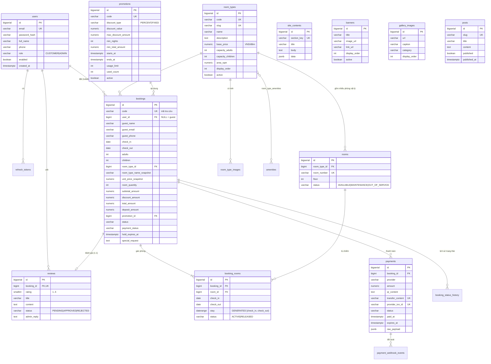

# Phase 2: Schema cơ sở dữ liệu & Flyway migration

## Overview

Định nghĩa toàn bộ schema PostgreSQL bằng Flyway migration và ánh xạ sang JPA entity. Đây là phase nền — mọi phase sau phụ thuộc vào nó, nên schema phải đúng ngay từ đầu, đặc biệt là ràng buộc chống trùng lịch.

## Requirements

- Functional: 16 bảng, đủ ràng buộc khoá ngoại, CHECK, UNIQUE và ràng buộc `EXCLUDE` chống trùng phòng.
- Non-functional: `ddl-auto=validate` phải pass — entity và migration khớp tuyệt đối. Migration bất biến, không sửa file đã chạy.

## ERD



## Architecture — điểm mấu chốt: chống trùng lịch ở tầng DB

Một `booking` gắn với một **loại phòng** và số lượng phòng. Mỗi phòng vật lý được gán tạo ra một dòng `booking_rooms`. Ràng buộc sống còn nằm trên bảng đó:

```sql
CREATE EXTENSION IF NOT EXISTS btree_gist;

ALTER TABLE booking_rooms
  ADD COLUMN stay daterange
  GENERATED ALWAYS AS (daterange(check_in, check_out, '[)')) STORED;

ALTER TABLE booking_rooms
  ADD CONSTRAINT booking_rooms_no_overlap
  EXCLUDE USING gist (room_id WITH =, stay WITH &&)
  WHERE (status = 'ACTIVE');
```

Ba điều nó bảo đảm mà tầng service không bảo đảm được:

1. **Chống race condition thật.** Hai transaction song song cùng chèn phòng 101 cho khoảng ngày chồng nhau → Postgres bác một cái với SQLSTATE `23P01`. Không có khe hở giữa lúc "kiểm tra" và lúc "ghi".
2. **Khoảng nửa mở `[)`.** Khách A trả phòng 10/03, khách B nhận phòng 10/03 → `[08/03,10/03)` và `[10/03,12/03)` **không** chồng nhau → hợp lệ. Đúng nghiệp vụ khách sạn.
3. **`WHERE status = 'ACTIVE'`.** Booking bị huỷ chuyển dòng sang `RELEASED`, slot mở lại ngay, nhưng lịch sử vẫn còn để tra cứu.

Cần `btree_gist` vì `room_id` là số nguyên — GiST mặc định không có toán tử `=` cho kiểu này.

## Related Code Files

- Create: `backend/src/main/resources/db/migration/V1__extensions_and_users.sql`
- Create: `backend/src/main/resources/db/migration/V2__rooms_and_amenities.sql`
- Create: `backend/src/main/resources/db/migration/V3__bookings_and_exclusion.sql`
- Create: `backend/src/main/resources/db/migration/V4__payments.sql`
- Create: `backend/src/main/resources/db/migration/V5__promotions_and_reviews.sql`
- Create: `backend/src/main/resources/db/migration/V6__cms_content.sql`
- Create: `backend/src/main/java/com/tvh/homestay/**/entity/*.java` (16 entity)
- Create: `backend/src/main/java/com/tvh/homestay/common/BaseAuditEntity.java` (`created_at`, `updated_at` qua `@MappedSuperclass` + `@EntityListeners(AuditingEntityListener.class)`)
- Create: `backend/src/main/java/com/tvh/homestay/**/repository/*.java`
- Create: `backend/src/test/java/com/tvh/homestay/SchemaMigrationTest.java`
- Create: `backend/src/test/resources/application-test.yml`
- Modify: `backend/pom.xml` (thêm `testcontainers:postgresql`, `junit-jupiter`)

## Implementation Steps

1. **V1** — `CREATE EXTENSION btree_gist`; bảng `users` (CHECK role IN CUSTOMER/ADMIN, email UNIQUE lowercase), `refresh_tokens` (lưu `token_hash`, không lưu token gốc).
2. **V2** — `amenities`, `room_types`, `rooms`, `room_type_images`, `room_type_amenities`. Ràng buộc: `base_price > 0`, `room_number` UNIQUE, `rooms.status` CHECK.
3. **V3** — `bookings` + `booking_rooms` + `booking_status_history`. Trên `bookings`: `CHECK (check_out > check_in)`, `CHECK (total_amount >= 0)`, `CHECK (adults >= 1)`, `code` UNIQUE. Trên `booking_rooms`: cột generated `stay` + ràng buộc `EXCLUDE` như trên + FK `ON DELETE CASCADE` về booking.
4. **V4** — `payments` (`transfer_content` UNIQUE — đây là khoá đối soát; `provider_txn_id` UNIQUE NULL — đây là khoá idempotency webhook), `payment_webhook_events` (`external_id` UNIQUE).
5. **V5** — `promotions` (CHECK `ends_at > starts_at`, CHECK discount_type, `used_count >= 0`), `reviews` (`booking_id` UNIQUE để 1 booking chỉ 1 đánh giá, `rating BETWEEN 1 AND 5`).
6. **V6** — `site_contents`, `banners`, `gallery_images`, `posts`.
7. Tạo index phục vụ truy vấn nóng:
   ```sql
   CREATE INDEX idx_bookings_status_checkin ON bookings(status, check_in);
   CREATE INDEX idx_bookings_guest_phone   ON bookings(guest_phone);
   CREATE INDEX idx_bookings_user          ON bookings(user_id) WHERE user_id IS NOT NULL;
   CREATE INDEX idx_booking_rooms_booking  ON booking_rooms(booking_id);
   CREATE INDEX idx_rooms_type_status      ON rooms(room_type_id, status);
   CREATE INDEX idx_payments_transfer      ON payments(transfer_content);
   ```
   (Ràng buộc `EXCLUDE` đã tự tạo index GiST cho `booking_rooms`, không tạo thêm.)
8. Viết entity JPA khớp từng cột. `stay` là cột generated → map `@Column(insertable=false, updatable=false)` hoặc bỏ khỏi entity; **không** để Hibernate ghi vào nó.
9. Dùng `NUMERIC(12,2)` ↔ `BigDecimal`, `TIMESTAMPTZ` ↔ `OffsetDateTime`, `DATE` ↔ `LocalDate`, `JSONB` ↔ `@JdbcTypeCode(SqlTypes.JSON)`.
10. Viết `SchemaMigrationTest` dùng Testcontainers: khởi động Postgres 16 thật, chạy Flyway, khởi động Spring context với `ddl-auto=validate`.
11. Viết test chèn trực tiếp hai dòng `booking_rooms` chồng ngày cùng `room_id` → khẳng định ném `23P01`.

## Verify

```bash
cd backend
./mvnw -q test -Dtest=SchemaMigrationTest

# Kiểm tra ràng buộc bằng tay
docker exec -it homestay-db psql -U postgres -d homestay <<'SQL'
INSERT INTO booking_rooms(booking_id, room_id, check_in, check_out, status)
VALUES (1, 1, '2026-10-01', '2026-10-05', 'ACTIVE');
-- Dòng dưới PHẢI lỗi 23P01:
INSERT INTO booking_rooms(booking_id, room_id, check_in, check_out, status)
VALUES (2, 1, '2026-10-03', '2026-10-07', 'ACTIVE');
-- Dòng dưới PHẢI thành công (nửa mở, không chồng):
INSERT INTO booking_rooms(booking_id, room_id, check_in, check_out, status)
VALUES (3, 1, '2026-10-05', '2026-10-08', 'ACTIVE');
SQL

./mvnw flyway:info   # tất cả migration Success, không có Pending/Failed
```

## Todo

- [ ] V1 extensions + users + refresh_tokens
- [ ] V2 amenities + room_types + rooms + images
- [ ] V3 bookings + booking_rooms + ràng buộc EXCLUDE + status history
- [ ] V4 payments + payment_webhook_events
- [ ] V5 promotions + reviews
- [ ] V6 site_contents + banners + gallery + posts
- [ ] Index cho truy vấn nóng
- [ ] 16 entity JPA + repository
- [ ] `SchemaMigrationTest` (Testcontainers, ddl-auto=validate)
- [ ] Test khẳng định `23P01` khi chèn chồng ngày

## Success Criteria

- [ ] `./mvnw test` xanh với Testcontainers Postgres thật (không dùng H2 — H2 không có `EXCLUDE`/`daterange`)
- [ ] Spring context khởi động với `ddl-auto=validate` mà không sai lệch entity/schema
- [ ] Chèn hai khoảng ngày chồng nhau cùng phòng bị DB bác với `23P01`
- [ ] Chèn khoảng nửa mở liền kề (`10/05` nối `10/05`) thành công
- [ ] `flyway:info` báo mọi migration Success

## Risk Assessment

| Rủi ro | Dấu hiệu | Phản ứng đã định |
|---|---|---|
| Hibernate cố ghi cột generated `stay` | Lỗi `cannot insert into generated column` lúc chạy | Đánh dấu `insertable=false, updatable=false` ngay từ đầu; test chèn qua JPA (không chỉ qua SQL thô) ở Phase 4 |
| `ddl-auto=validate` fail vì lệch kiểu nhỏ (VD `varchar` vs `text`) | App không khởi động, log "wrong column type" | Sửa entity theo migration (migration là chủ), không bao giờ sửa ngược |
| Sửa migration đã chạy làm lệch checksum | Flyway báo `Migration checksum mismatch` | Không bao giờ sửa file V đã chạy — luôn thêm file V mới. Dev muốn làm lại: `docker compose down -v` |
| Snapshot giá trong booking bị quên | Đổi giá loại phòng làm đổi doanh thu lịch sử | Cột `unit_price_snapshot`, `room_type_name_snapshot` bắt buộc NOT NULL ngay từ V3 |

**Rollback:** `docker compose -f docker-compose.dev.yml down -v` xoá volume và chạy lại migration từ đầu (chưa có dữ liệu thật ở phase này).
