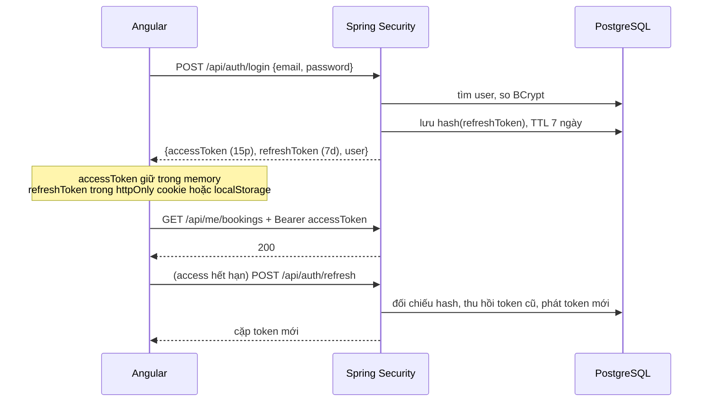

# Phase 3: Xác thực & phân quyền (JWT)

## Overview

Ba lớp người dùng cùng tồn tại: **guest** (không tài khoản, tra cứu bằng mã booking + SĐT), **CUSTOMER** (đăng ký/đăng nhập, xem lịch sử, đánh giá), **ADMIN** (toàn quyền quản trị). Phase này dựng JWT access + refresh token có xoay vòng, và khoá đúng từng nhóm endpoint.

**Chạy song song được với Phase 4** — không chạm cùng file.

## Requirements

- Functional: đăng ký, đăng nhập, làm mới token, đăng xuất, đổi mật khẩu, `GET /api/me`.
- Non-functional: mật khẩu băm BCrypt cost 10+; refresh token lưu **hash** trong DB, xoay vòng mỗi lần dùng; endpoint tra cứu guest có giới hạn tần suất chống dò mã booking.

## Architecture



**Ma trận phân quyền**

| Nhóm endpoint | Quyền |
|---|---|
| `GET /api/room-types`, `/api/availability`, `/api/content/**`, `/api/reviews` (đã duyệt) | Công khai |
| `POST /api/bookings`, `POST /api/bookings/lookup` | Công khai (có rate limit) |
| `POST /api/payments/webhook/sepay` | Công khai + xác thực chữ ký/API key của SePay |
| `/api/auth/**` | Công khai |
| `/api/me/**` | `CUSTOMER` hoặc `ADMIN` |
| `/api/admin/**` | Chỉ `ADMIN` |
| `/swagger-ui/**`, `/v3/api-docs/**` | Chỉ bật ở profile `dev` |

## Related Code Files

- Create: `backend/src/main/java/com/tvh/homestay/auth/JwtService.java` (ký/giải HS256, đọc `${JWT_SECRET}`)
- Create: `backend/src/main/java/com/tvh/homestay/auth/JwtAuthenticationFilter.java`
- Create: `backend/src/main/java/com/tvh/homestay/auth/AuthController.java`, `AuthService.java`
- Create: `backend/src/main/java/com/tvh/homestay/auth/dto/` (RegisterRequest, LoginRequest, TokenResponse, MeResponse)
- Create: `backend/src/main/java/com/tvh/homestay/auth/RefreshTokenService.java`
- Create: `backend/src/main/java/com/tvh/homestay/user/UserDetailsServiceImpl.java`
- Create: `backend/src/main/java/com/tvh/homestay/common/RateLimitFilter.java` (Bucket4j in-memory theo IP)
- Modify: `backend/src/main/java/com/tvh/homestay/config/SecurityConfig.java` (thay permitAll tạm của Phase 1)
- Create: `frontend/src/app/core/services/auth.service.ts` (signal `currentUser`)
- Create: `frontend/src/app/core/services/token-storage.service.ts`
- Create: `frontend/src/app/core/interceptors/auth.interceptor.ts` (gắn Bearer + tự refresh khi 401, chống refresh lặp)
- Create: `frontend/src/app/core/guards/auth.guard.ts`, `admin.guard.ts`
- Create: `backend/src/test/java/com/tvh/homestay/auth/AuthFlowIT.java`

## Implementation Steps

1. `JwtService`: ký HS256, claim `sub` = user id, `role`, `exp`. Access 15 phút, refresh 7 ngày. Secret ≥ 32 byte đọc từ `JWT_SECRET`; **fail fast** khi thiếu, không dùng giá trị mặc định.
2. `RefreshTokenService`: sinh token ngẫu nhiên 256-bit, lưu `SHA-256(token)` vào `refresh_tokens`. Khi refresh: đối chiếu hash → thu hồi dòng cũ (`revoked_at`) → phát cặp mới (rotation). Nếu gặp token đã thu hồi → thu hồi toàn bộ token của user đó (dấu hiệu bị đánh cắp).
3. `JwtAuthenticationFilter`: đọc header `Authorization: Bearer`, nạp `SecurityContext`. Token hỏng/hết hạn → 401 dạng `problem+json`, không stack trace.
4. `SecurityConfig`: `SessionCreationPolicy.STATELESS`, tắt CSRF (API thuần token), bật CORS cho origin của frontend (đọc từ env), khai báo ma trận phân quyền ở trên.
5. `AuthController`: `POST /register`, `POST /login`, `POST /refresh`, `POST /logout`, `POST /change-password`, `GET /api/me`.
6. Đăng ký: chuẩn hoá email về chữ thường, kiểm tra trùng, validate mật khẩu ≥ 8 ký tự. Vai trò mặc định `CUSTOMER` — **không cho phép** client tự truyền `role`.
7. `RateLimitFilter`: giới hạn `POST /api/auth/login` và `POST /api/bookings/lookup` ở 10 request/phút/IP; vượt → 429.
8. Frontend `auth.service.ts`: signal `currentUser`, `login()`, `logout()`, `register()`; lưu access token trong bộ nhớ, refresh token trong `localStorage`.
9. `auth.interceptor.ts`: gắn Bearer; bắt 401 → gọi refresh một lần → phát lại request. Dùng cờ chống vòng lặp vô hạn khi refresh cũng 401.
10. `auth.guard.ts` chặn `/tai-khoan/**`; `admin.guard.ts` chặn `/admin/**` (kiểm tra role, không chỉ kiểm tra "có token").
11. `AuthFlowIT`: đăng ký → đăng nhập → gọi `/api/me` → refresh → gọi lại → logout → khẳng định token cũ bị từ chối.

## Verify

```bash
cd backend && ./mvnw -q test -Dtest=AuthFlowIT

# Kiểm tra thủ công
TOKEN=$(curl -s -X POST localhost:8080/api/auth/login \
  -H 'Content-Type: application/json' \
  -d '{"email":"admin@tvh.local","password":"Admin@123"}' | jq -r .accessToken)

curl -s localhost:8080/api/me -H "Authorization: Bearer $TOKEN"      # 200
curl -s -o /dev/null -w '%{http_code}\n' localhost:8080/api/admin/bookings   # 401
curl -s -o /dev/null -w '%{http_code}\n' localhost:8080/api/admin/bookings \
  -H "Authorization: Bearer $TOKEN"                                          # 200 nếu ADMIN

# Rate limit: request thứ 11 trong 1 phút phải trả 429
for i in $(seq 1 11); do curl -s -o /dev/null -w '%{http_code} ' \
  -X POST localhost:8080/api/auth/login -H 'Content-Type: application/json' \
  -d '{"email":"x@y.z","password":"sai"}'; done; echo
```

## Todo

- [ ] `JwtService` + fail fast khi thiếu `JWT_SECRET`
- [ ] `RefreshTokenService` lưu hash + xoay vòng + phát hiện tái sử dụng
- [ ] `JwtAuthenticationFilter` + lỗi dạng `problem+json`
- [ ] `SecurityConfig` với ma trận phân quyền đầy đủ
- [ ] `AuthController` 6 endpoint + validate đăng ký
- [ ] `RateLimitFilter` cho login và lookup
- [ ] Frontend: auth service (signal), token storage, interceptor tự refresh
- [ ] `auth.guard` + `admin.guard`
- [ ] `AuthFlowIT` chạy hết vòng đời token

## Success Criteria

- [ ] Đăng ký → đăng nhập → `/api/me` trả đúng thông tin user
- [ ] Access token hết hạn được interceptor tự làm mới, người dùng không bị đá ra
- [ ] `/api/admin/**` trả 403 với token `CUSTOMER`, 401 khi không token
- [ ] Client gửi `"role":"ADMIN"` lúc đăng ký vẫn chỉ tạo được `CUSTOMER`
- [ ] Refresh token đã dùng lại lần hai bị từ chối và thu hồi cả họ token
- [ ] Login sai 11 lần trong 1 phút → 429
- [ ] Không có secret nào nằm trong `application.yml`

## Risk Assessment

| Rủi ro | Dấu hiệu | Phản ứng đã định |
|---|---|---|
| Interceptor refresh gây vòng lặp vô hạn khi refresh token cũng hết hạn | Trình duyệt bắn liên tục `/auth/refresh`, tab treo | Cờ `isRefreshing` + hàng đợi request; refresh fail → logout ngay, chuyển về trang đăng nhập |
| JWT secret yếu hoặc bị commit | Secret nằm trong file yml/git | Đọc từ env, fail fast lúc khởi động; quét secret trước mỗi commit |
| Rate limit in-memory mất tác dụng khi chạy nhiều instance | Dò mã booking vẫn thành công dù có giới hạn | Chấp nhận trong phạm vi đồ án (chạy 1 instance); ghi rõ giới hạn này trong `docs/`. Nếu cần scale → chuyển sang Redis |
| CORS cấu hình `*` kèm credentials | Trình duyệt báo lỗi CORS hoặc bảo mật lỏng | Liệt kê tường minh origin từ env, không dùng `*` |

**Rollback:** revert commit của phase; Phase 4 không phụ thuộc auth nên vẫn chạy tiếp được.
