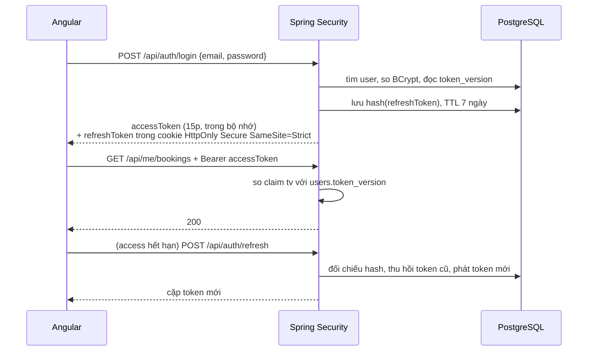

# Phase 4: Xác thực & phân quyền (JWT)

## Overview

Ba lớp người dùng cùng tồn tại: **guest** (không tài khoản, thao tác bằng `access_token` của booking), **CUSTOMER** (đăng ký/đăng nhập, xem lịch sử, đánh giá), **ADMIN** (toàn quyền quản trị). Phase này dựng JWT access + refresh token có xoay vòng, khoá đúng từng nhóm endpoint, và đặt giới hạn tần suất ở những chỗ thực sự bị lạm dụng.

**Chạy song song được với Phase 5.**

## Requirements

- Functional: đăng ký, đăng nhập, làm mới token, đăng xuất, đổi mật khẩu, `GET /api/me`.
- Non-functional: mật khẩu băm BCrypt cost 10+; refresh token lưu **hash**, xoay vòng mỗi lần dùng, đặt trong cookie `HttpOnly`; thu hồi quyền có hiệu lực **ngay**, không chờ token hết hạn; giới hạn tần suất hoạt động đúng cả khi chạy sau reverse proxy.

## Architecture



### Thu hồi quyền trên hệ thống stateless

Access token stateless không thể "bị từ chối" sau khi đăng xuất nếu không có cơ chế nào khác — nghĩa là khoá tài khoản hay hạ quyền ADMIN sẽ chỉ có hiệu lực sau tối đa 15 phút. Với một hệ thống có tiền và có dữ liệu khách hàng, 15 phút là quá dài.

Giải pháp nhẹ nhất là một số nguyên: `users.token_version`.

- Token mang claim `tv` = giá trị lúc phát.
- `JwtAuthenticationFilter` so `tv` trong token với `token_version` trong DB (một truy vấn theo khoá chính, có cache ngắn). Lệch → 401.
- Đăng xuất, đổi mật khẩu, khoá tài khoản, đổi vai trò đều tăng `token_version` → mọi access token đang lưu hành của người đó chết ngay lập tức.

Nhờ vậy tiêu chí "sau đăng xuất token cũ bị từ chối" trở thành khẳng định đúng thay vì một lời hứa mà thiết kế không thực hiện được.

### Refresh token đặt ở đâu

Cookie `HttpOnly; Secure; SameSite=Strict`, **không** `localStorage`. Refresh token sống 7 ngày; để nó trong `localStorage` nghĩa là bất kỳ lỗ hổng XSS nào — kể cả một file SVG được tải lên rồi phục vụ cùng origin — cũng đọc được nó và chiếm phiên ADMIN trong một tuần. Cơ chế phát hiện tái sử dụng không cứu được, vì kẻ tấn công dùng token còn nạn nhân là người bị thu hồi.

### Ma trận phân quyền — đầy đủ, mặc định đóng

`SecurityConfig` kết thúc bằng `anyRequest().denyAll()`. Endpoint nào chưa có trong bảng này là **đóng**, không phải mở. Bảng phải được cập nhật cùng lúc với mọi phase thêm endpoint.

| Endpoint | Quyền | Rate limit |
|---|---|---|
| `GET /api/health` | Công khai | — |
| `GET /api/room-types/**` | Công khai | — |
| `GET /api/availability` | Công khai | 60/phút/IP |
| `GET /api/content/**`, `GET /api/posts/**` | Công khai | — |
| `GET /api/reviews` (đã duyệt) | Công khai | — |
| `POST /api/promotions/check` | Công khai | 20/phút/IP |
| `POST /api/bookings` | Công khai | 10/phút/IP **và** 3 booking đang giữ chỗ/SĐT |
| `POST /api/bookings/lookup` | Công khai | 10/phút/IP **và** 5 lần sai/mã/giờ |
| `POST /api/bookings/{code}/cancel` | Công khai + `access_token` hoặc `phone` | 10/phút/IP **và** 5 lần sai/mã/giờ |
| `GET /api/bookings/{code}/payment-status` | Công khai + `access_token` | 60/phút/mã |
| `POST /api/bookings/{code}/review` | Công khai + `access_token` hoặc `phone` | 5/phút/IP |
| `POST /api/payments/webhook/sepay` | Công khai + API key của SePay | — |
| `GET /uploads/**` | Công khai (chỉ ảnh tĩnh) | — |
| `POST /api/auth/register`, `/login`, `/refresh`, `/logout` | Công khai | 10/phút/IP **và** 5/phút/email cho login |
| `/api/me/**` | `CUSTOMER` hoặc `ADMIN` | — |
| `/api/admin/**` | Chỉ `ADMIN` | — |
| `/api/admin/dev/**` (mô phỏng thanh toán) | Chỉ `ADMIN` **và** cờ `payments.simulator.enabled` | — |
| `/swagger-ui/**`, `/v3/api-docs/**` | Bật ở profile `demo`, tắt ở `prod` | — |
| mọi đường dẫn khác | `denyAll()` | — |

Thiếu một dòng trong bảng này không phải lỗi nhỏ: `payment-status` không được liệt kê nghĩa là màn hình QR nhận 401 và không bao giờ chuyển sang trang cảm ơn.

### Giới hạn tần suất phải sống sót sau nginx

Trong bản đóng gói, mọi request đi qua nginx rồi `proxy_pass` sang API. nginx **không** tự thêm `X-Forwarded-For`; `HttpServletRequest.getRemoteAddr()` vì thế trả IP container nginx cho mọi khách. Hậu quả kép:

- Giới hạn 10 request/phút trở thành giới hạn **toàn hệ thống** — một vòng `while true; do curl ...; done` khoá tính năng đăng nhập của mọi khách.
- Nếu chữa cháy bằng cách đọc thẳng `X-Forwarded-For` mà nginx không ghi đè, kẻ tấn công tự đặt header giả và dò không giới hạn.

Nên phase này yêu cầu **cả ba** thứ, và Phase 9 phải kiểm tra lại:

1. nginx **ghi đè** `X-Real-IP $remote_addr` và `X-Forwarded-For $proxy_add_x_forwarded_for` (Phase 9).
2. Spring bật `server.forward-headers-strategy: framework`.
3. Có khoá giới hạn thứ hai **không phụ thuộc IP**: theo `email` cho login, theo `code` cho các thao tác booking, theo `guestPhone` cho tạo booking. Đây là lớp còn tác dụng ngay cả khi IP bị giả mạo.

Kịch bản nghiệm thu rate limit phải chạy qua nginx (`localhost:80`), không phải `localhost:8080` — test qua cổng API trực tiếp sẽ xanh cả khi cấu hình production sai.

## Related Code Files

- Create: `backend/src/main/java/com/tvh/homestay/auth/JwtService.java` (HS256, đọc `${JWT_SECRET}`, claim `tv`)
- Create: `backend/src/main/java/com/tvh/homestay/auth/JwtAuthenticationFilter.java`
- Create: `backend/src/main/java/com/tvh/homestay/auth/AuthController.java`, `AuthService.java`
- Create: `backend/src/main/java/com/tvh/homestay/auth/dto/` (RegisterRequest, LoginRequest, TokenResponse, MeResponse)
- Create: `backend/src/main/java/com/tvh/homestay/auth/RefreshTokenService.java`
- Create: `backend/src/main/java/com/tvh/homestay/user/UserDetailsServiceImpl.java`, `TokenVersionCache.java`
- Create: `backend/src/main/java/com/tvh/homestay/common/RateLimitFilter.java`, `RateLimitKeyResolver.java`
- Modify: `backend/src/main/java/com/tvh/homestay/config/SecurityConfig.java`
- Modify: `backend/src/main/resources/application.yml` — `server.forward-headers-strategy: framework`
- Create: `frontend/src/app/core/services/auth.service.ts` (signal `currentUser`)
- Create: `frontend/src/app/core/interceptors/auth.interceptor.ts` (`withCredentials`, tự refresh, chống vòng lặp)
- Create: `frontend/src/app/core/guards/auth.guard.ts`, `admin.guard.ts`
- Create: `backend/src/test/java/com/tvh/homestay/auth/AuthFlowIT.java`
- Create: `backend/src/test/java/com/tvh/homestay/auth/EndpointAuthorizationIT.java`

## Implementation Steps

1. `JwtService`: ký HS256; claim `sub` = user id, `role`, `tv`, `exp`. Access 15 phút, refresh 7 ngày. Secret ≥ 32 byte đọc từ `JWT_SECRET`; **fail fast** khi thiếu ở **mọi** profile, kể cả `demo` — không có giá trị mặc định ở bất kỳ đâu, kể cả `.env.example`.
2. `RefreshTokenService`: token ngẫu nhiên 256-bit từ `SecureRandom`, lưu `SHA-256(token)`. Khi refresh: đối chiếu hash → ghi `revoked_at` và `replaced_by` cho dòng cũ → phát cặp mới. Gặp token đã thu hồi → thu hồi toàn bộ họ token của user đó và tăng `token_version`.
3. `JwtAuthenticationFilter`: đọc `Authorization: Bearer`, kiểm chữ ký và hạn, **so `tv` với `users.token_version`** (cache 30 giây theo user id), nạp `SecurityContext`. Hỏng/hết hạn/lệch `tv` → 401 dạng `problem+json`, không stack trace.
4. `SecurityConfig`: `SessionCreationPolicy.STATELESS`, tắt CSRF cho API token nhưng **bật** cho endpoint refresh dùng cookie (hoặc dùng `SameSite=Strict` + kiểm `Origin`), CORS liệt kê tường minh origin từ env (không `*`), và ma trận phân quyền ở trên kết thúc bằng `anyRequest().denyAll()`.
5. `AuthController`: `POST /register`, `/login`, `/refresh`, `/logout`, `/change-password`, `GET /api/me`.
6. Đăng ký: chuẩn hoá email về chữ thường, kiểm trùng, mật khẩu ≥ 8 ký tự. Vai trò luôn `CUSTOMER` — **không** đọc trường `role` từ client.
7. Đăng xuất: thu hồi refresh token **và** tăng `token_version` → access token còn hạn cũng chết ngay.
8. `must_change_password`: khi cờ bật, mọi endpoint trừ `/api/me` và `/change-password` trả 403 `PASSWORD_CHANGE_REQUIRED`. Tài khoản admin trong dữ liệu mẫu bật cờ này.
9. `RateLimitFilter` + `RateLimitKeyResolver`: Bucket4j in-memory, khoá theo bảng ma trận (IP, email, mã booking, SĐT). Vượt → 429 kèm `Retry-After`.
10. Frontend `auth.service.ts`: signal `currentUser`; access token giữ trong bộ nhớ; refresh token nằm trong cookie nên mọi request dùng `withCredentials: true`.
11. `auth.interceptor.ts`: gắn Bearer; bắt 401 → gọi refresh một lần → phát lại request. Cờ `isRefreshing` + hàng đợi chống vòng lặp vô hạn khi refresh cũng 401.
12. `auth.guard.ts` chặn `/tai-khoan/**`; `admin.guard.ts` kiểm **vai trò**, không chỉ kiểm "có token".
13. `AuthFlowIT`: đăng ký → đăng nhập → `/api/me` → refresh → gọi lại → logout → khẳng định access token cũ **và** refresh token cũ đều bị từ chối; khoá tài khoản → token đang lưu hành mất hiệu lực ngay.
14. `EndpointAuthorizationIT`: quét toàn bộ endpoint đã đăng ký trong `RequestMappingHandlerMapping`, đối chiếu với ma trận phân quyền, và **fail nếu có endpoint nào không xuất hiện trong ma trận**. Đây là lưới chắn để các phase sau không lặng lẽ thêm endpoint bị bỏ quên.

## Verify

```bash
cd backend && ./mvnw -q test -Dtest='AuthFlowIT,EndpointAuthorizationIT'

TOKEN=$(curl -s -X POST localhost:8080/api/auth/login -H 'Content-Type: application/json' \
  -d '{"email":"admin@tvh.local","password":"'"$DEMO_ADMIN_PASSWORD"'"}' | jq -r .accessToken)

curl -s localhost:8080/api/me -H "Authorization: Bearer $TOKEN"                          # 200
curl -s -o /dev/null -w '%{http_code}\n' localhost:8080/api/admin/bookings                # 401
curl -s -o /dev/null -w '%{http_code}\n' localhost:8080/api/admin/bookings \
  -H "Authorization: Bearer $TOKEN"                                                       # 200

# Thu hồi tức thì: logout rồi dùng lại access token cũ => 401, không chờ 15 phút
curl -s -X POST localhost:8080/api/auth/logout -H "Authorization: Bearer $TOKEN"
curl -s -o /dev/null -w '%{http_code}\n' localhost:8080/api/me -H "Authorization: Bearer $TOKEN"  # 401

# Rate limit PHẢI kiểm qua nginx (cổng 80), không phải cổng API
for i in $(seq 1 11); do curl -s -o /dev/null -w '%{http_code} ' \
  -X POST localhost/api/auth/login -H 'Content-Type: application/json' \
  -d '{"email":"x@y.z","password":"sai"}'; done; echo    # request thứ 11 => 429

# Giả mạo IP không thoát được giới hạn theo email
for i in $(seq 1 11); do curl -s -o /dev/null -w '%{http_code} ' \
  -X POST localhost/api/auth/login -H "X-Forwarded-For: 1.2.3.$i" \
  -H 'Content-Type: application/json' -d '{"email":"x@y.z","password":"sai"}'; done; echo   # vẫn 429
```

## Todo

- [ ] `JwtService` + claim `tv` + fail fast khi thiếu `JWT_SECRET` ở mọi profile
- [ ] `users.token_version` + `TokenVersionCache` + thu hồi tức thì
- [ ] `RefreshTokenService` lưu hash, xoay vòng, phát hiện tái sử dụng
- [ ] Refresh token đặt trong cookie `HttpOnly; Secure; SameSite=Strict`
- [ ] `JwtAuthenticationFilter` + lỗi dạng `problem+json`
- [ ] `SecurityConfig` với ma trận đầy đủ, kết thúc `anyRequest().denyAll()`
- [ ] `server.forward-headers-strategy: framework`
- [ ] `AuthController` 6 endpoint + validate đăng ký + chặn client tự đặt `role`
- [ ] `must_change_password` chặn mọi thao tác khác
- [ ] `RateLimitFilter` + khoá theo IP, email, mã booking, SĐT
- [ ] Frontend: auth service (signal), interceptor `withCredentials` + chống vòng lặp
- [ ] `auth.guard` + `admin.guard` kiểm vai trò
- [ ] `AuthFlowIT` + `EndpointAuthorizationIT` (fail khi có endpoint ngoài ma trận)

## Success Criteria

- [ ] Đăng ký → đăng nhập → `/api/me` trả đúng thông tin user
- [ ] Access token hết hạn được interceptor tự làm mới, người dùng không bị đá ra
- [ ] Sau đăng xuất, access token cũ bị từ chối **ngay**, không chờ hết 15 phút
- [ ] Khoá tài khoản hoặc hạ quyền ADMIN có hiệu lực ngay với token đang lưu hành
- [ ] `/api/admin/**` trả 403 với token `CUSTOMER`, 401 khi không token
- [ ] Client gửi `"role":"ADMIN"` lúc đăng ký vẫn chỉ tạo được `CUSTOMER`
- [ ] Refresh token đã dùng lại lần hai bị từ chối và thu hồi cả họ token
- [ ] Refresh token không đọc được bằng JavaScript (cookie `HttpOnly`)
- [ ] Login sai 11 lần trong 1 phút **qua nginx** → 429; đổi `X-Forwarded-For` mỗi lần vẫn 429
- [ ] `EndpointAuthorizationIT` fail khi thêm endpoint mới mà quên cập nhật ma trận
- [ ] Không có secret nào nằm trong `application.yml` hay `.env.example`

## Risk Assessment

| Rủi ro | Dấu hiệu | Phản ứng đã định |
|---|---|---|
| Interceptor refresh gây vòng lặp vô hạn | Trình duyệt bắn liên tục `/auth/refresh`, tab treo | Cờ `isRefreshing` + hàng đợi; refresh fail → logout, chuyển về trang đăng nhập |
| Kiểm `token_version` mỗi request làm tăng tải DB | Số truy vấn tăng tuyến tính theo request | Cache 30 giây theo user id; chấp nhận cửa sổ thu hồi ≤ 30 giây, ghi rõ trong `docs/` |
| JWT secret yếu hoặc bị commit | Secret nằm trong yml, `.env.example`, hoặc `docker-compose.yml` | Fail fast ở mọi profile; Phase 9 sinh secret ngẫu nhiên lúc dựng lần đầu; quét secret **bao gồm** cả file `.example` |
| Rate limit in-memory mất tác dụng khi chạy nhiều instance | Dò mã booking vẫn thành công | Chấp nhận trong phạm vi đồ án (1 instance) và ghi rõ trong `docs/`; khoá theo email/mã/SĐT vẫn thu hẹp đáng kể bề mặt. Cần scale → chuyển sang Redis |
| CORS cấu hình `*` kèm credentials | Trình duyệt báo lỗi CORS hoặc bảo mật lỏng | Liệt kê tường minh origin từ env |
| Cookie `SameSite=Strict` chặn refresh khi frontend khác origin | Người dùng bị đăng xuất bất thường lúc dev | Dev chạy qua proxy cùng origin (`proxy.conf.json`, Phase 1); production frontend và API cùng tên miền qua nginx |

**Rollback:** revert commit; Phase 5 không phụ thuộc auth nên vẫn chạy tiếp được.
