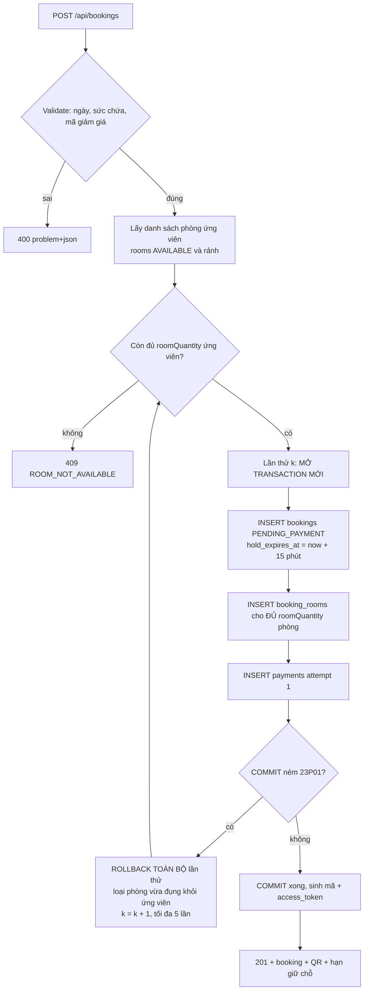
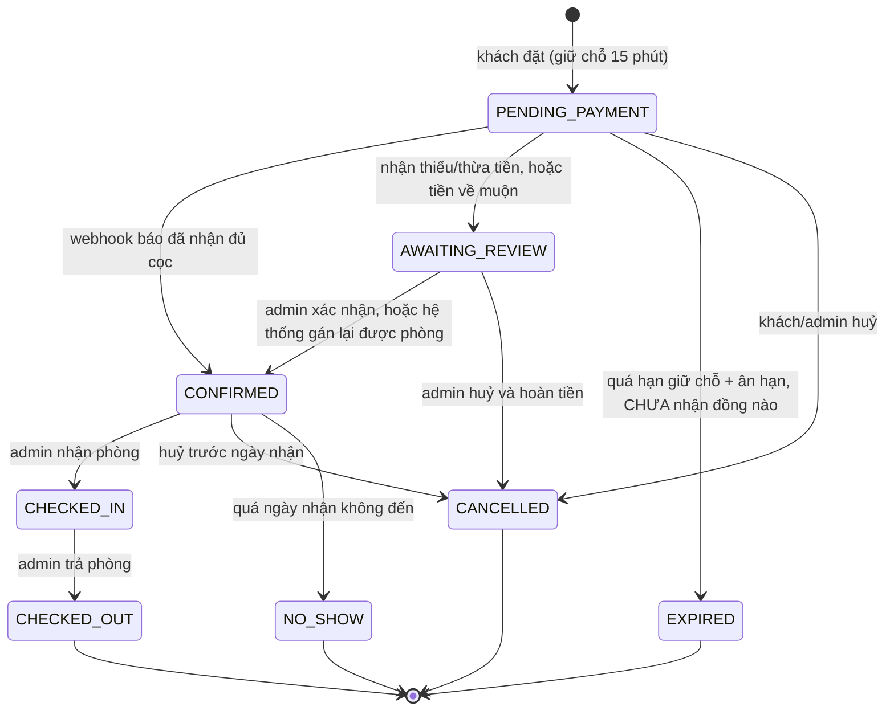

# Phase 4: Lõi đặt phòng & chống trùng lịch

## Overview

Phase quan trọng nhất của đồ án. Xây truy vấn phòng trống, thuật toán gán phòng vật lý, vòng đời booking và cơ chế giữ chỗ. Đây cũng là nơi chứng minh bằng test rằng hệ thống không thể đặt trùng.

**Chạy song song được với Phase 3.**

## Requirements

- Functional: tìm phòng trống theo khoảng ngày; tạo booking (guest hoặc user); tra cứu bằng mã + SĐT; huỷ booking; tự hết hạn giữ chỗ.
- Non-functional: hai request đồng thời cùng phòng cùng ngày → đúng một thành công, **kể cả khi loại phòng còn nhiều phòng**. Truy vấn phòng trống dưới 200ms với dữ liệu mẫu.

## Architecture

### Truy vấn phòng trống

Đếm trực tiếp số phòng **khả dụng và rảnh**, thay vì lấy tổng trừ đi số đã đặt:

```sql
SELECT rt.id, rt.name, rt.base_price, rt.slug, c.available_count
FROM room_types rt
CROSS JOIN LATERAL (
  SELECT count(*) AS available_count
  FROM rooms r
  WHERE r.room_type_id = rt.id
    AND r.status = 'AVAILABLE'
    AND NOT EXISTS (
      SELECT 1 FROM booking_rooms br
      WHERE br.room_id = r.id
        AND br.status = 'ACTIVE'
        AND br.stay && daterange(:checkIn, :checkOut, '[)')
    )
) c
WHERE rt.active
  AND rt.capacity_adults  >= :adultsPerRoom
  AND rt.capacity_children >= :childrenPerRoom
  AND c.available_count   >= :roomQuantity;
```

Hai điều câu này sửa so với cách "tổng trừ đã đặt":

1. **Chạy được.** PostgreSQL cấm tham chiếu alias cột output trong `HAVING`, và `HAVING` không kèm `GROUP BY` biến cả câu thành một nhóm duy nhất khiến `rt.id`, `rt.name` bị từ chối. `CROSS JOIN LATERAL` không vướng cả hai.
2. **Không trừ nhầm.** Cách cũ đếm tổng phòng `AVAILABLE` rồi trừ đi mọi `booking_rooms` `ACTIVE` của loại phòng đó — kể cả booking nằm trên phòng đã chuyển sang `MAINTENANCE`. Phòng bảo trì có booking cũ bị trừ hai lần, website báo thiếu phòng và mất doanh thu âm thầm. Admin **được phép** chuyển phòng đang có booking sang `MAINTENANCE` (Phase 6), nên đây là tình huống thiết kế, không phải hiếm gặp.

Sức chứa so theo **từng phòng** (`:adultsPerRoom = ceil(adults / roomQuantity)`), không so tổng số khách với sức chứa một phòng.

Toán tử `&&` chạy trên index GiST mà ràng buộc `EXCLUDE` đã tạo — không cần index thêm.

### Thuật toán gán phòng — vòng thử nằm NGOÀI transaction



**Vì sao vòng thử phải nằm ngoài transaction.** Bản kế hoạch đầu đặt `BEGIN` bên ngoài rồi bắt `23P01` và thử phòng kế tiếp trong cùng transaction. Điều đó bất khả thi ở cả ba tầng:

- **PostgreSQL:** bất kỳ lỗi nào cũng đưa transaction vào trạng thái aborted; lệnh kế tiếp trả `25P02 current transaction is aborted`, **không phải** `23P01`. Chỉ `ROLLBACK TO SAVEPOINT` mới lấy lại quyền điều khiển.
- **Spring:** `DataIntegrityViolationException` là unchecked exception → transaction bị đánh dấu rollback-only. Bắt lại rồi chạy tiếp sẽ ném `UnexpectedRollbackException` lúc commit, tức lần thử thành công cuối cùng cũng bị vứt đi.
- **JPA:** sau khi provider ném exception, `EntityManager` ở trạng thái không xác định và phải bị huỷ, không được dùng lại để `persist`.

Hậu quả nếu giữ thiết kế cũ: khách nhận **HTTP 500 dù loại phòng còn phòng trống**, vì `25P02` không phải `23P01` nên bị ném nguyên trạng.

Vì `EXCLUDE` không hỗ trợ `ON CONFLICT`, chỉ có hai lối đúng: savepoint cho mỗi lần thử, hoặc **mỗi lần thử là một transaction hoàn toàn mới**. Kế hoạch chọn phương án thứ hai — đơn giản hơn, không phụ thuộc `nestedTransactionAllowed`, và dễ đọc:

```java
// BookingService — KHÔNG @Transactional ở tầng này
public BookingResponse create(CreateBookingRequest req) {
    var excluded = new HashSet<Long>();
    for (int attempt = 1; attempt <= MAX_ATTEMPTS; attempt++) {
        var candidates = roomRepository.findFreeRooms(
                req.roomTypeId(), req.checkIn(), req.checkOut(), excluded);
        if (candidates.size() < req.roomQuantity()) {
            throw new RoomNotAvailableException();
        }
        var picked = candidates.subList(0, req.roomQuantity());
        try {
            return bookingTxService.createInNewTransaction(req, picked); // @Transactional(REQUIRES_NEW)
        } catch (DataIntegrityViolationException e) {
            if (!SqlStates.isExclusionViolation(e)) throw e;  // chỉ 23P01
            excluded.addAll(picked.stream().map(Room::getId).toList());
        }
    }
    throw new RoomNotAvailableException();
}
```

`SqlStates.isExclusionViolation` đọc `SQLState` từ `PSQLException` gốc và so đúng `23P01`. Mọi mã khác ném nguyên trạng — nếu bắt chung mọi `DataIntegrityViolationException` thì lỗi khoá ngoại sẽ bị báo là "hết phòng" và che bug thật.

**All-or-nothing với nhiều phòng.** Một lần thử gán đủ `roomQuantity` phòng trong một transaction, hoặc rollback toàn bộ. Không bao giờ commit một phần. Constraint trigger `booking_room_count_check` (Phase 2, DEFERRABLE) là lưới chắn ở tầng DB: commit nào để lại `booking_rooms` lệch `room_quantity` đều bị bác.

### Vòng đời booking



`AWAITING_REVIEW` là trạng thái mới, sinh ra để không còn đường nào dẫn tới "khách đã trả tiền nhưng hệ thống im lặng". Scheduler **không bao giờ** đụng tới nó.

Mọi trạng thái kết thúc (`EXPIRED`, `CANCELLED`, `NO_SHOW`) kéo theo `booking_rooms.status = 'RELEASED'` → slot mở lại tức thì. Mọi lần chuyển trạng thái ghi một dòng `booking_status_history` kèm `actor`.

### Scheduler hết hạn giữ chỗ — ba điều kiện bảo vệ

```sql
WITH expired AS (
  UPDATE bookings b SET status = 'EXPIRED', updated_at = now()
  WHERE b.status = 'PENDING_PAYMENT'
    AND b.hold_expires_at < now() - interval '5 minutes'      -- (1) ân hạn
    AND NOT EXISTS (                                           -- (2) chưa nhận đồng nào
      SELECT 1 FROM payments p
      WHERE p.booking_id = b.id AND p.amount_received > 0)
    AND NOT EXISTS (                                           -- (3) không có webhook đang chờ xử lý
      SELECT 1 FROM payment_webhook_events e
      JOIN payments p2 ON p2.id = e.payment_id
      WHERE p2.booking_id = b.id AND e.processed_at IS NULL)
  RETURNING b.id, b.status
)
INSERT INTO booking_status_history(booking_id, from_status, to_status, actor, note, created_at)
SELECT id, 'PENDING_PAYMENT', 'EXPIRED', 'SYSTEM', 'Hết hạn giữ chỗ', now() FROM expired;
```

Rồi một câu thứ hai nhả phòng của đúng tập id đó. Cả ba câu nằm trong một transaction.

Điều kiện (1) và (2) tồn tại vì cửa sổ đua thật sự tồn tại: ngân hàng → SePay → API thường trễ 5–30 giây, và đồng hồ đếm ngược trên màn hình QR khuyến khích khách bấm chuyển khoản vào đúng phút cuối. Không có chúng, kịch bản "khách chuyển tiền phút 14, webhook về phút 16" kết thúc bằng tiền trong tài khoản, phòng đã bán cho người khác, và không bản ghi nào.

Bulk `UPDATE` đi vòng qua Hibernate nên **phải** ghi `booking_status_history` bằng `RETURNING` như trên, và gọi `EntityManager.clear()` sau đó để first-level cache không trả trạng thái cũ.

## Related Code Files

- Create: `backend/src/main/java/com/tvh/homestay/availability/AvailabilityService.java`, `AvailabilityController.java`, `dto/AvailabilityResponse.java`
- Create: `backend/src/main/java/com/tvh/homestay/booking/BookingService.java` — điều phối, **không** `@Transactional`
- Create: `backend/src/main/java/com/tvh/homestay/booking/BookingTxService.java` — `@Transactional(REQUIRES_NEW)`, một lần thử gán
- Create: `backend/src/main/java/com/tvh/homestay/common/SqlStates.java` — nhận diện `23P01` từ `PSQLException`
- Create: `backend/src/main/java/com/tvh/homestay/booking/BookingPricingService.java` — tính tiền + áp mã giảm giá
- Create: `backend/src/main/java/com/tvh/homestay/booking/BookingCodeGenerator.java` — `SecureRandom` + Crockford Base32
- Create: `backend/src/main/java/com/tvh/homestay/booking/BookingStatus.java`, `BookingStateMachine.java`
- Create: `backend/src/main/java/com/tvh/homestay/booking/BookingExpiryScheduler.java` — `@Scheduled(fixedDelay=60000)`
- Create: `backend/src/main/java/com/tvh/homestay/booking/BookingController.java` (công khai), `MyBookingController.java` (`/api/me/bookings`)
- Create: `backend/src/main/java/com/tvh/homestay/promotion/PromotionService.java` — validate, tiêu thụ và **hoàn** lượt
- Create: `backend/src/main/java/com/tvh/homestay/common/GlobalExceptionHandler.java` — RFC 7807
- Create: `frontend/src/app/core/services/booking.service.ts`, `availability.service.ts`
- Create: `frontend/src/app/shared/` — date-range-picker, button, input, modal, badge, spinner, pagination, currency pipe, **data-table**, **image-uploader**
- Create: `backend/src/test/java/com/tvh/homestay/booking/BookingConcurrencyIT.java`
- Create: `backend/src/test/java/com/tvh/homestay/booking/AvailabilityQueryIT.java`
- Create: `backend/src/test/java/com/tvh/homestay/booking/BookingLifecycleIT.java`
- Create: `backend/src/test/java/com/tvh/homestay/booking/BookingExpiryIT.java`

## Implementation Steps

1. `AvailabilityService` chạy truy vấn `CROSS JOIN LATERAL` ở trên qua native query, trả danh sách loại phòng kèm `availableCount` và tổng tiền dự tính.
2. Validate đầu vào: `check_in >= hôm nay theo giờ Việt Nam` (`LocalDate.now(ZoneId.of("Asia/Ho_Chi_Minh"))`, **không** dùng `LocalDate.now()`), `check_out > check_in`, số đêm ≤ 30, `adults >= 1`, sức chứa từng phòng đủ.
3. `BookingPricingService`: `subtotal = base_price × số đêm × số phòng`; áp khuyến mãi (PERCENT có trần `max_discount_amount`, FIXED không vượt subtotal); `deposit = 30% total`, làm tròn tới nghìn đồng. **Số tiền cọc do backend quyết định**, frontend chỉ hiển thị.
4. `PromotionService`:
   - `validate()` — còn hiệu lực, đủ `min_nights`/`min_total_amount`.
   - `consume()` — `UPDATE promotions SET used_count = used_count + 1 WHERE id = ? AND (usage_limit IS NULL OR used_count < usage_limit)` rồi kiểm tra số dòng bị ảnh hưởng. Mệnh đề `usage_limit IS NULL OR` là bắt buộc: thiếu nó thì mọi mã không giới hạn cho ra `NULL` → 0 dòng → hệ thống từ chối toàn bộ mã vô hạn.
   - `release()` — giảm `used_count` khi booking vào trạng thái kết thúc, gọi trong cùng transaction của `BookingStateMachine`. Thiếu bước này thì một mã 10 lượt bị đốt sạch bởi 10 người bấm đặt rồi bỏ ngang trong 15 phút.
5. `BookingCodeGenerator`: **`SecureRandom`** (không dùng `java.util.Random` — seed 48-bit khôi phục được từ vài mã liên tiếp, dự đoán được mọi mã tương lai). Crockford Base32 6 ký tự, bảng chữ `0123456789ABCDEFGHJKMNPQRSTVWXYZ` (đã sẵn loại I, L, O, U) → `TVH8F3K2Q`. Đụng UNIQUE thì sinh lại, tối đa 5 lần.
6. `bookings.access_token`: 32 ký tự hex từ `SecureRandom`, sinh cùng lúc với mã. Đây mới là **bí mật thao tác**; mã booking chỉ để hiển thị và làm nội dung chuyển khoản (nó nằm trên sao kê ngân hàng, ảnh chụp màn hình, dashboard SePay — không thể coi là bí mật).
7. `BookingTxService.createInNewTransaction()`: `@Transactional(propagation = REQUIRES_NEW)`, insert booking → insert đủ `booking_rooms` → insert `payments` attempt 1 → commit. `BookingService.create()` giữ vòng thử ở ngoài như mã mẫu trên.
8. `BookingController`:
   - `POST /api/bookings` — tạo (guest hoặc user đã đăng nhập; `user_id` lấy từ token nếu có). Lưu `client_ip` + `user_agent` để truy vết lạm dụng. Có rate limit theo IP **và** theo `guestPhone` (Phase 3).
   - `POST /api/bookings/lookup` — body `{code, phone}`, so khớp cả hai, trả booking kèm `accessToken` để các thao tác sau dùng.
   - `POST /api/bookings/{code}/cancel` — yêu cầu `accessToken` **hoặc** `{phone}`; có rate limit theo `code`.
   - `GET /api/bookings/{code}/payment-status?token=...` — yêu cầu `access_token`; có rate limit theo `code`.
9. `MyBookingController`: `GET /api/me/bookings` phân trang, `GET /api/me/bookings/{code}` — lọc theo `user_id` trong token, **không** tin `userId` client gửi.
10. `BookingStateMachine`: bảng chuyển trạng thái hợp lệ theo sơ đồ trên; chuyển sai → 409 `INVALID_STATE_TRANSITION`. Mỗi lần chuyển: ghi `booking_status_history` (kèm `actor`), nhả `booking_rooms` nếu vào trạng thái kết thúc, gọi `PromotionService.release()` — tất cả trong cùng transaction, không rải rác ở controller.
11. `BookingExpiryScheduler`: mỗi phút, chạy đúng câu SQL ba điều kiện ở trên, rồi `EntityManager.clear()`. `booking.hold-minutes` và `booking.expiry-grace-minutes` đọc từ `application.yml` để test chạy với giá trị nhỏ.
12. `GlobalExceptionHandler`: map từng exception nghiệp vụ sang mã lỗi ổn định — `ROOM_NOT_AVAILABLE`, `INVALID_PROMOTION`, `PROMOTION_EXHAUSTED`, `BOOKING_NOT_FOUND`, `INVALID_STATE_TRANSITION`, `RATE_LIMITED`. Frontend hiển thị thông báo tiếng Việt theo mã, không parse chuỗi.
13. Frontend: `availability.service.ts` + `booking.service.ts`; dựng thư viện `shared/` gồm cả `data-table` và `image-uploader` (Phase 6 và Phase 7 đều dùng — chốt ở đây để hai phase đó không tranh nhau tạo).
14. **Chốt `shared/` ở cuối phase này.** Sau điểm này, Phase 6 và Phase 7 chỉ được thêm file mới vào `shared/`, không sửa file đã có.

## Verify

```bash
cd backend
./mvnw -q test -Dtest='Booking*IT,Availability*IT'
```

Bốn test bắt buộc và điều mỗi cái chứng minh:

| Test | Kịch bản | Khẳng định |
|---|---|---|
| `BookingConcurrencyIT#lastRoom` | 20 thread, loại phòng còn **1** phòng | đúng 1 thành công, 19 nhận 409, DB có 1 dòng `ACTIVE` |
| `BookingConcurrencyIT#multiRoom` | 3 thread, loại phòng còn **3** phòng, mỗi request 1 phòng | cả 3 thành công, 3 dòng `ACTIVE`, không request nào nhận 500 |
| `BookingConcurrencyIT#partialAllocation` | 2 thread, còn 3 phòng, một request xin 3 phòng và một xin 1 phòng | không bao giờ tồn tại booking có `booking_rooms` lệch `room_quantity` |
| `AvailabilityQueryIT#maintenanceRoom` | phòng `MAINTENANCE` **đang có** booking `ACTIVE` | `availableCount` đếm đúng các phòng còn lại, không bị trừ hai lần |

Kịch bản `multiRoom` là bắt buộc: với đúng 1 phòng ứng viên, vòng thử thoát ngay ở thất bại đầu tiên nên test cũ xanh dù thiết kế transaction sai. Bug chỉ lộ khi loại phòng có ≥ 2 phòng — tức toàn bộ dữ liệu thật.

```bash
# Kiểm tra thủ công
curl -s "localhost:8080/api/availability?checkIn=2026-10-01&checkOut=2026-10-04&adults=2&roomQuantity=1" | jq

RESP=$(curl -s -X POST localhost:8080/api/bookings -H 'Content-Type: application/json' -d '{
  "roomTypeId":1,"checkIn":"2026-10-01","checkOut":"2026-10-04","roomQuantity":1,
  "adults":2,"children":0,"guestName":"Nguyen Van A",
  "guestEmail":"a@example.com","guestPhone":"0900000001"}')
CODE=$(echo "$RESP" | jq -r .code)          # TVH8F3K2Q — đã gồm tiền tố TVH
TOKEN=$(echo "$RESP" | jq -r .accessToken)

# Đặt lại y hệt khi chỉ còn 1 phòng => 409 ROOM_NOT_AVAILABLE (không phải 500)
curl -s "localhost:8080/api/bookings/$CODE/payment-status?token=$TOKEN" | jq
curl -s "localhost:8080/api/bookings/$CODE/payment-status" -o /dev/null -w '%{http_code}\n'  # 401

# Hết hạn: chạy profile test với hold-minutes=1, grace=0
# => booking EXPIRED, booking_rooms RELEASED, và có dòng booking_status_history actor=SYSTEM
docker exec -it homestay-db psql -U postgres -d homestay -c \
  "SELECT from_status, to_status, actor FROM booking_status_history ORDER BY id DESC LIMIT 3;"
```

## Todo

- [ ] `AvailabilityService` với truy vấn `CROSS JOIN LATERAL` + `NOT EXISTS`
- [ ] Validate ngày theo `ZoneId.of("Asia/Ho_Chi_Minh")` tường minh
- [ ] `BookingPricingService` (giá, khuyến mãi, cọc 30% do backend quyết)
- [ ] `PromotionService`: `consume()` xử lý `usage_limit IS NULL`, `release()` hoàn lượt
- [ ] `SqlStates` nhận diện đúng `23P01`, mã khác ném nguyên trạng
- [ ] `BookingTxService` `REQUIRES_NEW` + vòng thử ở `BookingService` ngoài transaction
- [ ] Gán all-or-nothing cho `roomQuantity > 1`
- [ ] `BookingCodeGenerator` dùng `SecureRandom`
- [ ] `bookings.access_token` sinh cùng booking, dùng cho mọi thao tác theo `{code}`
- [ ] `BookingController` (tạo / lookup / cancel / payment-status) + ghi `client_ip`
- [ ] `MyBookingController` lọc theo token
- [ ] `BookingStateMachine` + `AWAITING_REVIEW` + ghi lịch sử + nhả phòng + hoàn lượt khuyến mãi
- [ ] `BookingExpiryScheduler` ba điều kiện + ghi lịch sử qua `RETURNING` + `EntityManager.clear()`
- [ ] `GlobalExceptionHandler` RFC 7807 + 6 mã lỗi ổn định
- [ ] Thư viện `shared/` Angular gồm `data-table` và `image-uploader` (chốt trước Phase 6/7)
- [ ] 4 test bắt buộc trong bảng Verify

## Success Criteria

- [ ] `lastRoom`: 20 thread, 1 phòng → đúng 1 thành công, 19 nhận **409** (không có 500 nào)
- [ ] `multiRoom`: 3 thread, 3 phòng → cả 3 thành công, không request nào nhận 500
- [ ] `partialAllocation`: không bao giờ tồn tại booking có `booking_rooms` lệch `room_quantity`
- [ ] `maintenanceRoom`: phòng bảo trì có booking cũ không làm giảm nhầm số phòng trống
- [ ] Loại phòng hết sạch không xuất hiện trong kết quả tìm kiếm
- [ ] Khách A trả phòng 10/03, khách B nhận phòng 10/03 → cả hai đặt được cùng phòng
- [ ] Booking quá hạn **và chưa nhận đồng nào** mới chuyển `EXPIRED`; booking đã nhận tiền không bao giờ bị scheduler đụng
- [ ] Hết hạn sinh dòng `booking_status_history` với `actor = SYSTEM`
- [ ] Huỷ booking → slot mở lại ngay, lượt khuyến mãi được hoàn, lịch sử vẫn tra cứu được
- [ ] Mã khuyến mãi `usage_limit IS NULL` dùng được không giới hạn
- [ ] Gọi `payment-status` không kèm `access_token` → 401
- [ ] Tra cứu sai SĐT → 404, không rò rỉ thông tin booking
- [ ] Chuyển trạng thái sai (VD `CHECKED_OUT` → `CHECKED_IN`) → 409
- [ ] Mọi lỗi trả `application/problem+json` có `code` ổn định

## Risk Assessment

| Rủi ro | Dấu hiệu | Phản ứng đã định |
|---|---|---|
| Ai đó "tối ưu" bằng cách gộp vòng thử vào một `@Transactional` | 500 xuất hiện khi loại phòng còn nhiều phòng; log có `25P02` hoặc `UnexpectedRollbackException` | `multiRoom` bắt được ngay. Ghi chú lý do ngay trong javadoc của `BookingService.create()` để người sau không gộp lại |
| Bắt nhầm mọi `DataIntegrityViolationException` thành "hết phòng" | Lỗi khoá ngoại bị báo là hết phòng, che bug thật | `SqlStates.isExclusionViolation` so đúng `23P01` từ `PSQLException.getSQLState()`; test riêng cho trường hợp vi phạm FK |
| Vòng thử chậm khi loại phòng gần kín | Thời gian tạo booking tăng lúc cao điểm | Ứng viên đã lọc sẵn bằng `NOT EXISTS` trước khi thử; tối đa 5 lần thử; mỗi lần thử là transaction ngắn |
| Giữ chỗ 15 phút quá ngắn/dài | Khách thanh toán xong thì booking đã hết hạn, hoặc phòng bị giam vô ích | `booking.hold-minutes` + `booking.expiry-grace-minutes` trong `application.yml`; ân hạn 5 phút hấp thụ độ trễ ngân hàng |
| `used_count` khuyến mãi bị vượt hoặc bị đốt oan | Mã giới hạn 10 lượt dùng được 12, hoặc báo hết lượt khi chưa ai trả tiền | `consume()` cập nhật có điều kiện; `release()` nằm trong `BookingStateMachine`; test cả hai chiều |
| Booking bị huỷ nhưng `booking_rooms` quên `RELEASED` | Phòng bị giam vĩnh viễn, tìm kiếm báo hết phòng sai | Nhả phòng nằm trong cùng transaction của `BookingStateMachine`; test khẳng định |
| Bulk update của scheduler bỏ qua lịch sử trạng thái | Admin không biết ai/khi nào huỷ booking của khách | `UPDATE ... RETURNING` + `INSERT ... SELECT` trong cùng transaction; tiêu chí nghiệm thu kiểm tra dòng lịch sử, không chỉ kiểm tra trạng thái cuối |

**Rollback:** revert commit; schema không đổi nên không cần migration hoàn tác.
