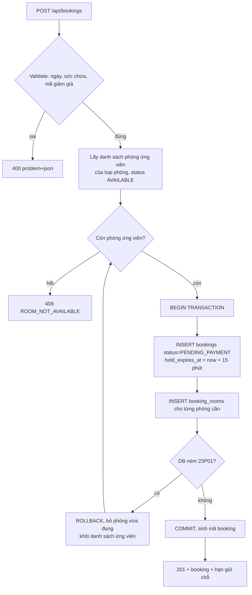
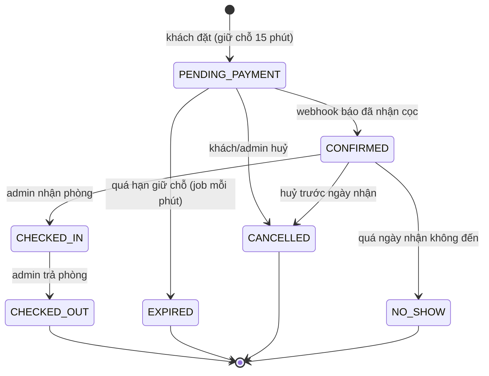

# Phase 4: Lõi đặt phòng & chống trùng lịch

## Overview

Phase quan trọng nhất của đồ án. Xây truy vấn phòng trống, thuật toán gán phòng vật lý, vòng đời booking và cơ chế giữ chỗ. Đây cũng là nơi chứng minh bằng test rằng hệ thống không thể đặt trùng.

**Chạy song song được với Phase 3.**

## Requirements

- Functional: tìm phòng trống theo khoảng ngày; tạo booking (guest hoặc user); tra cứu bằng mã + SĐT; huỷ booking; tự hết hạn giữ chỗ.
- Non-functional: hai request đồng thời cùng phòng cùng ngày → đúng một thành công. Truy vấn phòng trống dưới 200ms với dữ liệu mẫu.

## Architecture

### Truy vấn phòng trống

```sql
SELECT rt.id, rt.name, rt.base_price,
       (SELECT count(*) FROM rooms r
         WHERE r.room_type_id = rt.id AND r.status = 'AVAILABLE')
     - (SELECT count(*) FROM booking_rooms br
          JOIN rooms r2 ON r2.id = br.room_id
         WHERE r2.room_type_id = rt.id
           AND br.status = 'ACTIVE'
           AND br.stay && daterange(:checkIn, :checkOut, '[)')
       ) AS available_count
  FROM room_types rt
 WHERE rt.active
   AND rt.capacity_adults >= :adults
HAVING available_count > 0;
```

Toán tử `&&` chạy trên index GiST mà ràng buộc `EXCLUDE` đã tạo — không cần index thêm.

### Thuật toán gán phòng (lạc quan + dựa vào DB)



Không dùng `LOCK TABLE`, không dùng `SELECT FOR UPDATE` toàn bảng. Ràng buộc `EXCLUDE` là trọng tài duy nhất; service chỉ thử lần lượt các phòng ứng viên. Số lần thử tối đa = số phòng của loại đó.

### Vòng đời booking



Mọi trạng thái kết thúc (`EXPIRED`, `CANCELLED`, `NO_SHOW`) đều kéo theo `booking_rooms.status = 'RELEASED'` → slot mở lại tức thì. Mọi lần chuyển trạng thái ghi một dòng `booking_status_history`.

## Related Code Files

- Create: `backend/src/main/java/com/tvh/homestay/availability/AvailabilityService.java`, `AvailabilityController.java`, `dto/AvailabilityResponse.java`
- Create: `backend/src/main/java/com/tvh/homestay/booking/BookingService.java` — điều phối
- Create: `backend/src/main/java/com/tvh/homestay/booking/RoomAllocator.java` — vòng thử phòng, bắt `23P01`
- Create: `backend/src/main/java/com/tvh/homestay/booking/BookingPricingService.java` — tính tiền + áp mã giảm giá
- Create: `backend/src/main/java/com/tvh/homestay/booking/BookingCodeGenerator.java` — `TVH` + 6 ký tự Crockford Base32
- Create: `backend/src/main/java/com/tvh/homestay/booking/BookingStatus.java`, `BookingStateMachine.java`
- Create: `backend/src/main/java/com/tvh/homestay/booking/BookingExpiryScheduler.java` — `@Scheduled(fixedDelay=60000)`
- Create: `backend/src/main/java/com/tvh/homestay/booking/BookingController.java` (công khai), `MyBookingController.java` (`/api/me/bookings`)
- Create: `backend/src/main/java/com/tvh/homestay/promotion/PromotionService.java` — validate + tăng `used_count`
- Create: `backend/src/main/java/com/tvh/homestay/common/GlobalExceptionHandler.java` — RFC 7807
- Create: `frontend/src/app/core/services/booking.service.ts`, `availability.service.ts`
- Create: `frontend/src/app/shared/` — date-range-picker, button, input, modal, badge, spinner, pagination, currency pipe
- Create: `backend/src/test/java/com/tvh/homestay/booking/BookingConcurrencyIT.java`
- Create: `backend/src/test/java/com/tvh/homestay/booking/AvailabilityQueryIT.java`
- Create: `backend/src/test/java/com/tvh/homestay/booking/BookingLifecycleIT.java`

## Implementation Steps

1. `AvailabilityService` chạy truy vấn trên qua native query, trả về danh sách loại phòng kèm `availableCount` và tổng tiền dự tính.
2. Validate đầu vào: `check_in >= hôm nay`, `check_out > check_in`, số đêm ≤ 30, `adults >= 1`, sức chứa đủ.
3. `BookingPricingService`: `subtotal = base_price × số đêm × số phòng`; áp khuyến mãi (PERCENT có trần `max_discount_amount`, FIXED không vượt subtotal); `deposit = 30% total`, làm tròn tới nghìn đồng.
4. `PromotionService.validate()`: còn hiệu lực, chưa vượt `usage_limit`, đủ `min_nights`/`min_total_amount`. Tăng `used_count` bằng `UPDATE ... SET used_count = used_count + 1 WHERE id = ? AND used_count < usage_limit` rồi kiểm tra số dòng bị ảnh hưởng — tránh race, không đọc-rồi-ghi.
5. `RoomAllocator.allocate(roomTypeId, dates, quantity)`: lấy phòng ứng viên sắp xếp theo `room_number`, thử chèn; bắt `DataIntegrityViolationException` có SQLSTATE `23P01` → loại phòng đó ra, thử tiếp; hết ứng viên → ném `RoomNotAvailableException` (409).
6. `BookingCodeGenerator`: Crockford Base32 6 ký tự (bỏ I, L, O, U tránh nhầm) → `TVH8F3K2Q`; đụng UNIQUE thì sinh lại, tối đa 5 lần.
7. `BookingService.create()`: `@Transactional`, thứ tự — validate → tính tiền → insert booking → allocate → commit. Đặt `hold_expires_at = now + 15 phút`.
8. `BookingController`:
   - `POST /api/bookings` — tạo (guest hoặc user đã đăng nhập, lấy `user_id` từ token nếu có)
   - `POST /api/bookings/lookup` — body `{code, phone}`, so khớp cả hai, trả booking (có rate limit từ Phase 3)
   - `POST /api/bookings/{code}/cancel` — body `{phone}` để xác thực guest
9. `MyBookingController`: `GET /api/me/bookings` phân trang, `GET /api/me/bookings/{code}` — lọc theo `user_id` trong token, **không** tin `userId` client gửi.
10. `BookingStateMachine`: bảng chuyển trạng thái hợp lệ; chuyển sai → 409 `INVALID_STATE_TRANSITION`. Ghi `booking_status_history` mỗi lần chuyển.
11. `BookingExpiryScheduler`: mỗi phút tìm `PENDING_PAYMENT` có `hold_expires_at < now` → `EXPIRED` + `booking_rooms` → `RELEASED` (một câu `UPDATE ... FROM`, tránh N+1).
12. `GlobalExceptionHandler`: map từng exception nghiệp vụ sang mã lỗi ổn định (`ROOM_NOT_AVAILABLE`, `INVALID_PROMOTION`, `BOOKING_NOT_FOUND`, `INVALID_STATE_TRANSITION`) — frontend hiển thị thông báo tiếng Việt theo mã, không parse chuỗi.
13. Frontend: `availability.service.ts` + `booking.service.ts` gọi API; dựng thư viện `shared/` (date-range-picker tự viết, chặn ngày quá khứ và ngày đã kín).
14. **Chốt `shared/` ở cuối phase này** để Phase 6 và Phase 7 tách nhánh song song mà không đụng nhau.

## Verify

```bash
cd backend
./mvnw -q test -Dtest='Booking*IT,Availability*IT'

# BookingConcurrencyIT phải khẳng định: 20 thread đặt cùng loại phòng chỉ có 1 phòng
# => đúng 1 thành công, 19 nhận 409, và DB chỉ có 1 dòng booking_rooms ACTIVE.

# Kiểm tra thủ công
curl -s "localhost:8080/api/availability?checkIn=2026-10-01&checkOut=2026-10-04&adults=2" | jq
curl -s -X POST localhost:8080/api/bookings -H 'Content-Type: application/json' -d '{
  "roomTypeId":1,"checkIn":"2026-10-01","checkOut":"2026-10-04","roomQuantity":1,
  "adults":2,"children":0,"guestName":"Nguyen Van A",
  "guestEmail":"a@example.com","guestPhone":"0900000001"}' | jq

# Đặt lại y hệt khi chỉ còn 1 phòng => 409 ROOM_NOT_AVAILABLE
# Chờ quá 15 phút (hoặc hạ hold xuống 1 phút ở profile test) => booking EXPIRED, phòng trống lại
curl -s -X POST localhost:8080/api/bookings/lookup -H 'Content-Type: application/json' \
  -d '{"code":"TVH8F3K2Q","phone":"0900000001"}' | jq
```

## Todo

- [ ] `AvailabilityService` + native query + validate ngày
- [ ] `BookingPricingService` (giá, khuyến mãi, cọc 30%)
- [ ] `PromotionService` tăng `used_count` an toàn race
- [ ] `RoomAllocator` bắt `23P01` và thử phòng kế tiếp
- [ ] `BookingCodeGenerator` Crockford Base32
- [ ] `BookingService.create()` transactional + giữ chỗ 15 phút
- [ ] `BookingController` (tạo / lookup / cancel)
- [ ] `MyBookingController` lọc theo token
- [ ] `BookingStateMachine` + ghi `booking_status_history`
- [ ] `BookingExpiryScheduler` mỗi phút
- [ ] `GlobalExceptionHandler` RFC 7807 + mã lỗi ổn định
- [ ] Thư viện `shared/` Angular (chốt trước khi tách Phase 6/7)
- [ ] `BookingConcurrencyIT`, `AvailabilityQueryIT`, `BookingLifecycleIT`

## Success Criteria

- [ ] 20 thread đặt song song 1 phòng cuối cùng → đúng 1 thành công, 19 nhận 409, DB có đúng 1 dòng ACTIVE
- [ ] Loại phòng hết sạch không xuất hiện trong kết quả tìm kiếm
- [ ] Khách A trả phòng 10/03, khách B nhận phòng 10/03 → cả hai đặt được cùng phòng
- [ ] Booking `PENDING_PAYMENT` quá hạn tự chuyển `EXPIRED` và trả phòng về trạng thái trống
- [ ] Huỷ booking → slot mở lại ngay, lịch sử vẫn tra cứu được
- [ ] Tra cứu sai SĐT → 404, không rò rỉ thông tin booking
- [ ] Chuyển trạng thái sai (VD `CHECKED_OUT` → `CHECKED_IN`) → 409
- [ ] Mọi lỗi trả `application/problem+json` có `code` ổn định

## Risk Assessment

| Rủi ro | Dấu hiệu | Phản ứng đã định |
|---|---|---|
| Bắt nhầm mọi `DataIntegrityViolationException` thành "hết phòng" | Lỗi khoá ngoại bị báo là hết phòng, che bug thật | Kiểm tra đúng SQLSTATE `23P01` (lấy từ `PSQLException.getSQLState()`), lỗi khác ném nguyên trạng |
| Vòng thử phòng chậm khi loại phòng có nhiều phòng và gần kín | Thời gian tạo booking tăng vọt lúc cao điểm | Giới hạn 20 lần thử; lấy phòng ứng viên đã loại sẵn phòng bận bằng truy vấn `NOT EXISTS` trước khi thử |
| Giữ chỗ 15 phút quá ngắn/dài | Khách thanh toán xong thì booking đã hết hạn, hoặc phòng bị giam vô ích | Đưa vào `application.yml` (`booking.hold-minutes`) để chỉnh không cần build lại; test chạy với 1 phút |
| `used_count` của khuyến mãi bị vượt do race | Mã giới hạn 10 lượt nhưng dùng được 12 | Cập nhật có điều kiện (`WHERE used_count < usage_limit`) và kiểm tra số dòng ảnh hưởng, không đọc-rồi-ghi |
| Booking bị huỷ nhưng `booking_rooms` quên `RELEASED` | Phòng bị giam vĩnh viễn, tìm kiếm báo hết phòng sai | Đưa việc nhả phòng vào cùng transaction của `BookingStateMachine`, không rải rác ở controller; test khẳng định |

**Rollback:** revert commit; schema không đổi nên không cần migration hoàn tác.
