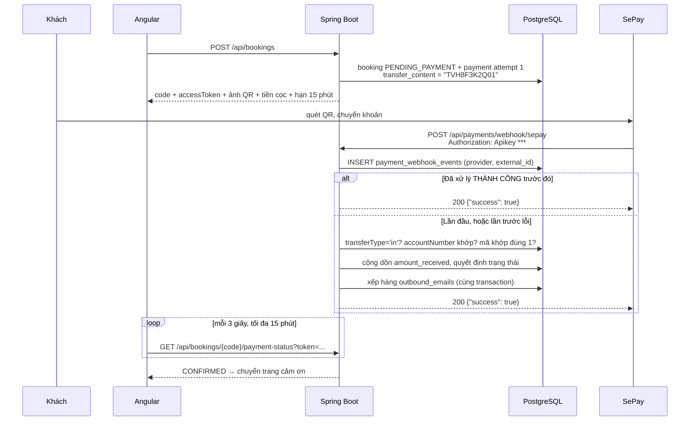

# Phase 5: Thanh toán QR, webhook & email

## Overview

Khách đặt xong nhận mã QR VietQR đúng số tiền cọc kèm nội dung chuyển khoản duy nhất. SePay gọi webhook khi tiền về → booking tự chuyển `CONFIRMED` → email xác nhận. Mọi khoản tiền không khớp được đều rơi vào hàng đợi đối soát, **không bao giờ biến mất im lặng**.

## Requirements

- Functional: sinh QR; nhận webhook; đối soát theo nội dung chuyển khoản; hàng đợi đối soát cho admin; gửi email qua outbox; frontend hỏi trạng thái để tự chuyển trang.
- Non-functional: webhook **idempotent** nhưng **xử lý lại được khi lần trước lỗi**; không bao giờ tin số tiền do client gửi; không có nhánh nào kết thúc bằng "tiền đã vào nhưng không ai biết".

## Architecture



### Xác thực và đối soát webhook — năm lớp

1. **Xác thực khoá.** So header `Authorization: Apikey <SEPAY_WEBHOOK_API_KEY>` bằng `MessageDigest.isEqual` (chống timing attack). Sai → 401, ghi log. SePay còn hỗ trợ HMAC-SHA256 và whitelist IP — mạnh hơn, nhưng phụ thuộc gói tài khoản; ghi thành khuyến nghị trong `docs/`, không đặt làm yêu cầu chặn.
2. **Chiều tiền.** Bắt buộc `transferType == "in"`. Thiếu kiểm tra này thì một giao dịch **chuyển đi** có memo chứa mã booking — ví dụ nhân viên hoàn tiền cho khách khác và gõ mã vào nội dung để đối soát — sẽ xác nhận booking trong khi tiền đi ra khỏi tài khoản.
3. **Tài khoản đích.** `accountNumber` (và `subAccount` nếu có) phải khớp tài khoản nhận cọc trong cấu hình. Tiền vào tài khoản khác không được xác nhận booking.
4. **Idempotency có phân biệt kết quả.** Khoá `(provider, external_id)`. Nếu bản ghi cũ có `processing_result IN ('MATCHED','LATE','DUPLICATE')` → trả 200 ngay. Nếu là `ERROR` → **xử lý lại**. Bản kế hoạch đầu chèn khoá trước rồi bỏ qua mọi lần sau, nên một lỗi tạm thời sẽ khoá vĩnh viễn khoản tiền đó khỏi mọi lần thử lại.
5. **Khớp mã và số tiền.** Regex neo `\bTVH[0-9A-HJKMNP-TV-Z]{6}\d{2}\b` trên `content`, và chỉ chấp nhận khi tìm được **đúng một** mã. Nhiều mã → `UNMATCHED`, đẩy vào hàng đợi đối soát. Số tiền cộng dồn `amount_received`, so với `amount_expected` với dung sai ±1.000đ.

### Bảng quyết định sau khi khớp

| Tình huống | `payments.status` | `bookings.status` | Hành động |
|---|---|---|---|
| Đủ tiền, booking còn `PENDING_PAYMENT` | `SUCCEEDED` | `CONFIRMED` | Xếp hàng mail xác nhận |
| Thiếu tiền (cộng dồn chưa đủ) | `PARTIAL` | `AWAITING_REVIEW` | Gia hạn giữ chỗ **+24h**, xếp hàng mail nhắc, hiện ở hàng đợi đối soát |
| Thừa tiền | `OVERPAID` | `CONFIRMED` | `reconcile_status = REFUND_REQUIRED`, hiện ở hàng đợi đối soát |
| Đủ tiền nhưng booking đã `EXPIRED`/`CANCELLED` | `SUCCEEDED` | thử gán lại phòng | Gán được → `CONFIRMED` + mail; hết phòng → `AWAITING_REVIEW` + `reconcile_status = NEEDS_REVIEW` |
| Không khớp mã nào, hoặc khớp nhiều mã | — | — | `processing_result = UNMATCHED`, hiện ở hàng đợi đối soát |
| Sai `transferType`/`accountNumber` | — | — | `processing_result = UNMATCHED`, ghi log cảnh báo |

Nhánh thứ tư là nhánh cứu tiền của khách. Nó tồn tại vì cửa sổ đua thật sự tồn tại, và vì trạng thái `EXPIRED` không có đường quay lại `CONFIRMED` trong máy trạng thái — nên phải đi qua `AWAITING_REVIEW`. Chính sách đã chốt với người dùng: **tự gán lại phòng cùng loại; không còn phòng thì chuyển admin xử lý**, không tự ý hoàn tiền hay đổi ngày.

### Phản hồi cho SePay

Trả **HTTP 200 kèm body `{"success": true}`** trong 30 giây. SePay chỉ coi là giao thành công khi có body đó; trả 200 body rỗng vẫn bị đưa vào hàng đợi retry tới 7 lần trong 5 giờ. Chỉ trả 401 khi sai khoá.

### Email qua outbox, không gửi trực tiếp

Bản kế hoạch đầu nói `@TransactionalEventListener(AFTER_COMMIT)` ở một chỗ và `@Async + AFTER_COMMIT` ở chỗ khác — hai hành vi khác nhau: listener thuần chạy trong **cùng thread**, nên SMTP chậm 20 giây làm webhook trả về sau 20 giây. Và cả hai đều không để lại bằng chứng: mail hỏng là mất, không ai biết, không gửi lại được.

Thay bằng outbox:

1. Ghi một dòng `outbound_emails` trạng thái `PENDING` **trong cùng transaction** với việc xác nhận booking. Webhook trả về ngay, không chờ SMTP.
2. `EmailDispatchScheduler` mỗi 30 giây lấy các dòng `PENDING`, gửi, cập nhật `SENT` hoặc tăng `attempts` + ghi `last_error`. Quá 5 lần → `FAILED`.
3. Admin thấy trạng thái mail trên chi tiết booking và có nút gửi lại.

Nhờ vậy tiêu chí "email đã gửi" kiểm chứng được bằng SQL thay vì bằng mắt nhìn Mailpit.

## Related Code Files

- Create: `backend/src/main/java/com/tvh/homestay/payment/PaymentService.java`
- Create: `backend/src/main/java/com/tvh/homestay/payment/VietQrGenerator.java`
- Create: `backend/src/main/java/com/tvh/homestay/payment/SepayWebhookController.java`, `SepayWebhookService.java`
- Create: `backend/src/main/java/com/tvh/homestay/payment/dto/SepayWebhookPayload.java` — `id` (số), `gateway`, `transactionDate`, `accountNumber`, `subAccount`, `code`, `content`, `transferType`, `description`, `transferAmount`, `accumulated`, `referenceCode`
- Create: `backend/src/main/java/com/tvh/homestay/payment/PaymentReallocationService.java` — gán lại phòng cho tiền về muộn
- Create: `backend/src/main/java/com/tvh/homestay/payment/PaymentStatusController.java`
- Create: `backend/src/main/java/com/tvh/homestay/payment/PaymentSimulatorController.java` — `/api/admin/dev/**`, cần ADMIN **và** cờ bật
- Create: `backend/src/main/java/com/tvh/homestay/mail/MailService.java`, `SmtpMailSender.java`, `LoggingMailSender.java`
- Create: `backend/src/main/java/com/tvh/homestay/mail/EmailOutboxService.java`, `EmailDispatchScheduler.java`
- Create: `backend/src/main/resources/templates/mail/booking-confirmed.html`, `booking-partial.html`, `booking-cancelled.html`
- Create: `backend/src/main/java/com/tvh/homestay/config/MailConfig.java`
- Create: `frontend/src/app/features/landing/booking/payment-qr.component.ts`
- Create: `backend/src/test/java/com/tvh/homestay/payment/SepayWebhookIT.java`
- Create: `backend/src/test/java/com/tvh/homestay/payment/PaymentRaceIT.java`
- Modify: `backend/src/main/java/com/tvh/homestay/config/SecurityConfig.java` — mở đúng đường webhook

## Implementation Steps

1. `VietQrGenerator`: dựng URL ảnh QR từ `SEPAY_ACCOUNT_NUMBER`, `SEPAY_BANK_CODE`, tiền cọc và `transfer_content`.
2. `transfer_content` = `bookings.code` + 2 chữ số `attempt_no`, ví dụ `TVH8F3K2Q01`. Hậu tố khiến QR của lần trước **không** khớp vào lần sau — không có nó, khách quét lại ảnh QR cũ trong tab đang mở sẽ trả tiền vào một booking đã chết.
3. `PaymentService.createForBooking()`: tạo dòng `payments` `PENDING`, `amount_expected` = cọc, `expires_at = hold_expires_at + ân hạn`. Gọi từ `BookingTxService` (Phase 4) trong cùng transaction.
4. `SepayWebhookController` `POST /api/payments/webhook/sepay`, ủy quyền cho `SepayWebhookService` chạy năm lớp kiểm tra ở trên và bảng quyết định.
5. Ghi nguyên payload vào `payment_webhook_events.payload` (JSONB) cho mọi sự kiện, kể cả không khớp — đây là chứng cứ đối soát khi SePay đổi tên trường.
6. Chuyển trạng thái booking **luôn** qua `BookingStateMachine` để ghi `booking_status_history` với `actor = SYSTEM`.
7. `PaymentReallocationService`: với tiền về muộn, gọi lại `RoomAllocator` (Phase 4) cho cùng loại phòng và khoảng ngày. Gán được → `CONFIRMED`; không → `AWAITING_REVIEW` + `NEEDS_REVIEW`.
8. `EmailOutboxService.enqueue()` trong cùng transaction; `EmailDispatchScheduler` gửi và retry như mô tả trên.
9. `MailConfig`: có `MAIL_HOST` → `SmtpMailSender`; không có → `LoggingMailSender` ghi đầy đủ nội dung ra log. Cả hai đều cập nhật `outbound_emails`, nên bằng chứng gửi luôn tồn tại.
10. Mẫu email tiếng Việt: mã booking, loại phòng, ngày nhận/trả, số phòng, tổng tiền, đã cọc, còn lại, liên hệ homestay.
11. `PaymentStatusController`: `GET /api/bookings/{code}/payment-status?token={accessToken}` — yêu cầu `access_token`, chỉ trả `{status, paymentStatus, expiresAt}`. Có rate limit theo `code`.
12. `PaymentSimulatorController`: `POST /api/admin/dev/payments/{transferContent}/simulate-transfer`.
    Ba rào chắn cùng lúc: đường dẫn dưới `/api/admin/**` (cần ADMIN), cờ `payments.simulator.enabled` **mặc định false**, và không nạp ở profile `prod`.
    Bản kế hoạch đầu chỉ dùng `@Profile("dev")` — không đủ, vì bản `docker compose` chạy profile `demo`, nên endpoint sẽ có mặt mà không có auth: bất kỳ ai đặt phòng rồi gọi nó là xác nhận được booking miễn phí.
13. Frontend `payment-qr.component`: ảnh QR, số tài khoản và nội dung để copy tay, đếm ngược tới `expiresAt`, hỏi trạng thái mỗi 3 giây (dừng khi đạt trạng thái cuối, khi hết hạn, hoặc `ngOnDestroy`).
14. Hết giờ chưa trả tiền → báo hết hạn kèm nút đặt lại. Nếu đã trả một phần → báo "đang chờ đối soát", **không** báo hết hạn.

## Verify

```bash
cd backend && ./mvnw -q test -Dtest='SepayWebhookIT,PaymentRaceIT'
```

`SepayWebhookIT` phủ 8 tình huống: đúng key + đủ tiền → `CONFIRMED`; gọi lại cùng `external_id` → 200, không đổi dữ liệu, không gửi mail lần hai; lần trước `ERROR` → xử lý lại được; sai key → 401; `transferType='out'` → không xác nhận; `accountNumber` lạ → không xác nhận; content chứa hai mã → `UNMATCHED`; thiếu tiền → `AWAITING_REVIEW` + `PARTIAL` + gia hạn giữ chỗ.

`PaymentRaceIT`: tiền về **sau** hạn giữ chỗ → không bao giờ kết thúc ở trạng thái tiền đã nhận mà booking `EXPIRED` im lặng.

```bash
# Demo trọn luồng (profile demo, cần đăng nhập admin)
ADMIN=$(curl -s -X POST localhost:8080/api/auth/login -H 'Content-Type: application/json' \
  -d '{"email":"admin@tvh.local","password":"'"$DEMO_ADMIN_PASSWORD"'"}' | jq -r .accessToken)

RESP=$(curl -s -X POST localhost:8080/api/bookings -H 'Content-Type: application/json' -d '{
  "roomTypeId":1,"checkIn":"2026-11-01","checkOut":"2026-11-03","roomQuantity":1,
  "adults":2,"guestName":"Tran B","guestEmail":"b@example.com","guestPhone":"0900000002"}')
CODE=$(echo "$RESP" | jq -r .code)                 # TVH8F3K2Q, ĐÃ gồm tiền tố TVH
TOKEN=$(echo "$RESP" | jq -r .accessToken)
CONTENT=$(echo "$RESP" | jq -r .payment.transferContent)   # TVH8F3K2Q01
DEPOSIT=$(echo "$RESP" | jq -r .depositAmount)             # 300000 = 30% của 2 đêm × 500k

curl -s "localhost:8080/api/bookings/$CODE/payment-status?token=$TOKEN" | jq   # PENDING_PAYMENT
curl -s -X POST "localhost:8080/api/admin/dev/payments/$CONTENT/simulate-transfer" \
  -H "Authorization: Bearer $ADMIN"
curl -s "localhost:8080/api/bookings/$CODE/payment-status?token=$TOKEN" | jq   # CONFIRMED

# Bằng chứng mail nằm trong DB, không phải nằm trong Mailpit
docker exec -it homestay-db psql -U postgres -d homestay -c \
  "SELECT template, status, attempts, sent_at FROM outbound_emails ORDER BY id DESC LIMIT 3;"

# Idempotency + chiều tiền
WEBHOOK=localhost:8080/api/payments/webhook/sepay
post() { curl -s -o /dev/null -w '%{http_code} ' -X POST $WEBHOOK \
  -H "Authorization: Apikey $SEPAY_WEBHOOK_API_KEY" -H 'Content-Type: application/json' -d "$1"; }

post '{"id":92704,"transferType":"in","accountNumber":"'"$SEPAY_ACCOUNT_NUMBER"'","content":"'"$CONTENT"'","transferAmount":'"$DEPOSIT"'}'
post '{"id":92704,"transferType":"in","accountNumber":"'"$SEPAY_ACCOUNT_NUMBER"'","content":"'"$CONTENT"'","transferAmount":'"$DEPOSIT"'}'   # 200, dữ liệu không đổi
post '{"id":92705,"transferType":"out","accountNumber":"'"$SEPAY_ACCOUNT_NUMBER"'","content":"'"$CONTENT"'","transferAmount":'"$DEPOSIT"'}'  # 200 nhưng UNMATCHED
echo

# Body phản hồi phải là {"success": true}
curl -s -X POST $WEBHOOK -H "Authorization: Apikey $SEPAY_WEBHOOK_API_KEY" \
  -H 'Content-Type: application/json' -d '{"id":92706,"transferType":"in","content":"KHONG-KHOP","transferAmount":1000}'

# Sai key => 401
curl -s -o /dev/null -w '%{http_code}\n' -X POST $WEBHOOK -H 'Authorization: Apikey sai' -d '{}'
```

## Todo

- [ ] `VietQrGenerator` + `transfer_content` có hậu tố `attempt_no`
- [ ] `PaymentService.createForBooking()` gọi trong transaction tạo booking
- [ ] Xác thực API key chống timing attack
- [ ] Kiểm tra `transferType == "in"` và `accountNumber` khớp
- [ ] Regex neo, chỉ chấp nhận đúng một mã trong nội dung
- [ ] Idempotency theo `(provider, external_id)` **có phân biệt `ERROR` để xử lý lại**
- [ ] Cộng dồn `amount_received`, dung sai ±1.000đ
- [ ] Bảng quyết định 6 nhánh, gồm nhánh tiền về muộn
- [ ] `PaymentReallocationService` gán lại phòng, hết phòng → `AWAITING_REVIEW`
- [ ] Trả `{"success": true}` kèm HTTP 200
- [ ] `outbound_emails` + `EmailDispatchScheduler` + retry
- [ ] `MailService` + fallback ghi log, cả hai cập nhật outbox
- [ ] 3 mẫu email Thymeleaf tiếng Việt
- [ ] `payment-status` yêu cầu `access_token` + polling frontend có dọn dẹp
- [ ] `PaymentSimulatorController` dưới `/api/admin/**` + cờ mặc định tắt
- [ ] `SepayWebhookIT` phủ 8 tình huống; `PaymentRaceIT` phủ tiền về muộn

## Success Criteria

- [ ] Đặt phòng → QR đúng tiền cọc, nội dung chuyển khoản = mã + số lần thử
- [ ] Webhook hợp lệ → `CONFIRMED`, `DEPOSIT_PAID`, có dòng `outbound_emails`
- [ ] Phản hồi webhook là HTTP 200 **và** body `{"success": true}`
- [ ] Gọi lại cùng `external_id` → 200, dữ liệu không đổi, không sinh mail thứ hai
- [ ] Sự kiện lần trước `ERROR` được xử lý lại khi SePay retry
- [ ] `transferType = "out"` hoặc `accountNumber` lạ → **không** xác nhận booking
- [ ] Nội dung chứa hai mã booking → `UNMATCHED`, vào hàng đợi đối soát
- [ ] Sai API key → 401, không thay đổi gì trong DB
- [ ] Chuyển thiếu tiền → `AWAITING_REVIEW`, giữ chỗ được gia hạn, scheduler không đụng tới
- [ ] Chuyển thiếu rồi bù đủ → cộng dồn đủ → `CONFIRMED`
- [ ] Tiền về sau hạn giữ chỗ → gán lại được thì `CONFIRMED`, không thì `AWAITING_REVIEW` + `NEEDS_REVIEW`; **không có nhánh nào kết thúc im lặng**
- [ ] Thiếu SMTP → app vẫn chạy, `outbound_emails` vẫn ghi nhận, nội dung nằm trong log
- [ ] Gọi endpoint mô phỏng không kèm token ADMIN → 401; với cờ tắt → 404
- [ ] Hết 15 phút chưa trả tiền → trang QR báo hết hạn; đã trả một phần → báo đang đối soát

## Risk Assessment

| Rủi ro | Dấu hiệu | Phản ứng đã định |
|---|---|---|
| Chưa có tài khoản SePay lúc bảo vệ | Không có webhook thật để demo | Endpoint mô phỏng (có ADMIN + cờ) nằm trong phạm vi phase; demo bằng nó, cắm key thật vào là chạy |
| Endpoint mô phỏng lọt ra ngoài | Ai cũng xác nhận booking không trả tiền | Ba rào chắn độc lập; test khẳng định 401 khi không có ADMIN và 404 khi cờ tắt |
| SePay đổi tên trường payload | Webhook trả 200 nhưng không khớp được | Lưu `payload` JSONB mọi sự kiện; `UNMATCHED` hiện lên hàng đợi đối soát nên không im lặng; log rõ trường nào thiếu |
| SMTP chậm hoặc hỏng | Webhook timeout, hoặc mail mất không ai biết | Outbox: webhook không bao giờ chờ SMTP; mail hỏng có `last_error` và nút gửi lại |
| Polling 3 giây chạy mãi sau khi rời trang | Rò rỉ bộ nhớ, API bị gọi vô ích | Huỷ trong `ngOnDestroy`; dừng khi đạt trạng thái cuối hoặc hết hạn |
| Tin số tiền do client gửi | Trả 1.000đ vẫn được xác nhận | Số tiền chỉ lấy từ payload webhook, so với `amount_expected` trong DB |
| Hàng đợi đối soát không ai nhìn | Tiền lạc nằm im trong bảng | Đếm số dòng cần đối soát hiển thị ngay trên dashboard admin (Phase 6), không giấu trong màn hình con |

**Rollback:** revert commit; booking vẫn tạo được (mất bước thanh toán tự động), admin xác nhận thủ công qua màn hình đối soát ở Phase 6.
