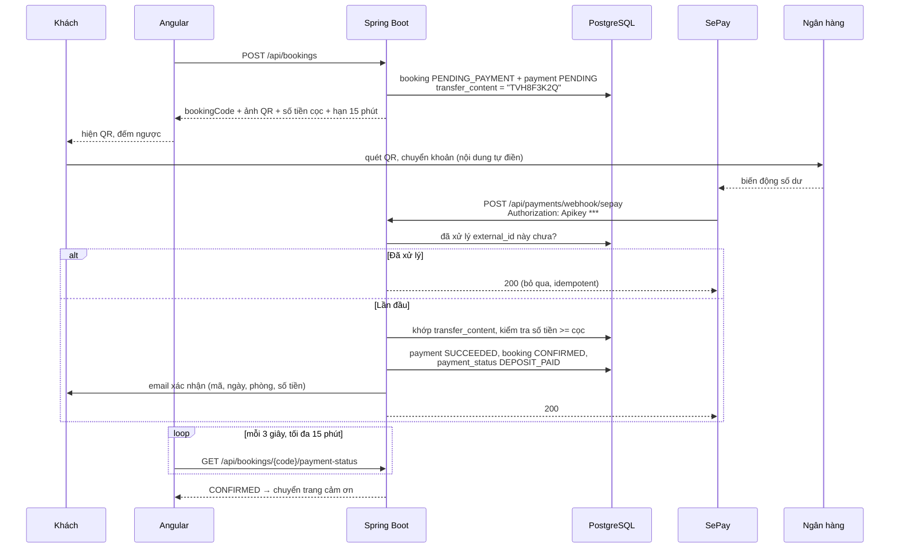

# Phase 5: Thanh toán QR, webhook & email

## Overview

Khách đặt xong nhận mã QR VietQR đúng số tiền cọc kèm nội dung chuyển khoản duy nhất. SePay gọi webhook khi tiền về → booking tự chuyển `CONFIRMED` → gửi email xác nhận. Có đường mô phỏng cho môi trường dev khi chưa có tài khoản SePay thật.

## Requirements

- Functional: sinh QR; nhận webhook; đối soát theo nội dung chuyển khoản; gửi email xác nhận/huỷ; frontend hỏi trạng thái để tự chuyển trang khi tiền về.
- Non-functional: webhook **idempotent** (gọi lại nhiều lần không cộng tiền hai lần), có xác thực, và không bao giờ tin số tiền do client gửi.

## Architecture



**Ba lớp bảo vệ webhook**

1. **Xác thực** — so header `Authorization: Apikey <SEPAY_WEBHOOK_API_KEY>` bằng so sánh chống timing attack. Sai → 401, ghi log.
2. **Idempotency** — `payment_webhook_events.external_id` UNIQUE. Chèn trước, chèn trùng → trả 200 ngay, không xử lý lại.
3. **Đối chiếu số tiền** — số tiền lấy từ payload của SePay so với `payments.amount` trong DB. Thiếu tiền → ghi nhận `PARTIAL`, giữ `PENDING_PAYMENT`, báo admin; thừa tiền → vẫn xác nhận và đánh dấu để admin hoàn lại.

## Related Code Files

- Create: `backend/src/main/java/com/tvh/homestay/payment/PaymentService.java`
- Create: `backend/src/main/java/com/tvh/homestay/payment/VietQrGenerator.java` — dựng URL `https://qr.sepay.vn/img?acc=&bank=&amount=&des=`
- Create: `backend/src/main/java/com/tvh/homestay/payment/SepayWebhookController.java`
- Create: `backend/src/main/java/com/tvh/homestay/payment/dto/SepayWebhookPayload.java`
- Create: `backend/src/main/java/com/tvh/homestay/payment/PaymentStatusController.java` — `GET /api/bookings/{code}/payment-status`
- Create: `backend/src/main/java/com/tvh/homestay/payment/DevPaymentSimulatorController.java` — `@Profile("dev")`
- Create: `backend/src/main/java/com/tvh/homestay/mail/MailService.java` (interface), `SmtpMailService.java`, `LoggingMailService.java` (fallback)
- Create: `backend/src/main/resources/templates/mail/booking-confirmed.html`, `booking-cancelled.html`, `booking-pending.html` (Thymeleaf, tiếng Việt)
- Create: `backend/src/main/java/com/tvh/homestay/config/MailConfig.java` — chọn bean theo `spring.mail.host` có mặt hay không
- Create: `frontend/src/app/features/landing/booking/payment-qr.component.ts` — hiện QR + đếm ngược + hỏi trạng thái
- Create: `backend/src/test/java/com/tvh/homestay/payment/SepayWebhookIT.java`
- Modify: `backend/src/main/java/com/tvh/homestay/booking/BookingService.java` — tạo payment kèm booking
- Modify: `backend/src/main/java/com/tvh/homestay/config/SecurityConfig.java` — mở đường webhook

## Implementation Steps

1. `VietQrGenerator`: dựng URL ảnh QR từ `SEPAY_ACCOUNT_NUMBER`, `SEPAY_BANK_CODE`, số tiền cọc, nội dung `transfer_content`. Nội dung chuyển khoản = mã booking không dấu gạch (`TVH8F3K2Q`) — ngắn, khách gõ tay được nếu app ngân hàng không quét được.
2. `PaymentService.createForBooking()`: tạo `payments` trạng thái `PENDING`, `transfer_content` UNIQUE, `expires_at` = `hold_expires_at` của booking.
3. `SepayWebhookController` `POST /api/payments/webhook/sepay`:
   - xác thực API key (`MessageDigest.isEqual`, không dùng `equals`)
   - chèn `payment_webhook_events` với `external_id` = `id` của SePay; đụng UNIQUE → 200 và dừng
   - tìm payment theo `transfer_content` xuất hiện trong trường `content`/`description` của payload (dùng regex `TVH[0-9A-Z]{6}`)
   - so số tiền, chuyển `payment` → `SUCCEEDED`, `booking` → `CONFIRMED`, `payment_status` → `DEPOSIT_PAID` (qua `BookingStateMachine` để ghi lịch sử)
   - lưu nguyên payload vào `raw_payload` (JSONB) phục vụ đối soát
   - luôn trả 200 cho trường hợp đã xử lý/không khớp (tránh SePay retry vô hạn); chỉ 401 khi sai key
4. Gửi mail **sau khi transaction commit** (`@TransactionalEventListener(AFTER_COMMIT)`) — mail hỏng không được rollback thanh toán.
5. `MailConfig`: có `MAIL_HOST` → `SmtpMailService`; không có → `LoggingMailService` ghi đầy đủ nội dung ra log (đủ để demo).
6. Mẫu email Thymeleaf tiếng Việt: mã booking, loại phòng, ngày nhận/trả, số phòng, tổng tiền, đã cọc, còn lại, thông tin liên hệ homestay.
7. `PaymentStatusController`: `GET /api/bookings/{code}/payment-status` trả `{status, paymentStatus, expiresAt}` — công khai nhưng chỉ lộ đúng ba trường này.
8. `DevPaymentSimulatorController` (`@Profile("dev")`): `POST /api/dev/payments/{transferContent}/simulate-transfer` dựng payload SePay giả rồi gọi thẳng handler — demo trọn luồng khi chưa có tài khoản thật. **Không** được nạp ở profile `prod`.
9. Frontend `payment-qr.component`: hiện ảnh QR, số tài khoản/nội dung để copy thủ công, đồng hồ đếm ngược tới `expiresAt`, hỏi trạng thái mỗi 3 giây (dừng khi `CONFIRMED`, khi hết hạn, hoặc khi rời trang — nhớ `ngOnDestroy`).
10. Hết giờ chưa trả tiền → hiện thông báo booking đã hết hạn kèm nút đặt lại.
11. `SepayWebhookIT`: đúng key + đúng nội dung → CONFIRMED; gọi lại lần hai → vẫn 1 payment SUCCEEDED; sai key → 401; thiếu tiền → giữ `PENDING_PAYMENT`.

## Verify

```bash
cd backend && ./mvnw -q test -Dtest=SepayWebhookIT

# Demo trọn luồng ở profile dev (không cần tài khoản SePay)
CODE=$(curl -s -X POST localhost:8080/api/bookings -H 'Content-Type: application/json' \
  -d '{"roomTypeId":1,"checkIn":"2026-11-01","checkOut":"2026-11-03","roomQuantity":1,
       "adults":2,"guestName":"Tran B","guestEmail":"b@example.com","guestPhone":"0900000002"}' \
  | jq -r .code)

curl -s "localhost:8080/api/bookings/$CODE/payment-status" | jq   # PENDING_PAYMENT
curl -s -X POST "localhost:8080/api/dev/payments/TVH$CODE/simulate-transfer"
curl -s "localhost:8080/api/bookings/$CODE/payment-status" | jq   # CONFIRMED
open http://localhost:8025                                        # Mailpit: có mail xác nhận

# Idempotency: gọi webhook hai lần cùng external_id
curl -s -X POST localhost:8080/api/payments/webhook/sepay \
  -H "Authorization: Apikey $SEPAY_WEBHOOK_API_KEY" -H 'Content-Type: application/json' \
  -d '{"id":"evt_1","content":"TVH'"$CODE"'","transferAmount":500000}' -w '\n%{http_code}\n'
# lần hai => 200, và trong DB vẫn chỉ có 1 payment SUCCEEDED

# Sai key => 401
curl -s -o /dev/null -w '%{http_code}\n' -X POST localhost:8080/api/payments/webhook/sepay \
  -H 'Authorization: Apikey sai' -d '{}'
```

## Todo

- [ ] `VietQrGenerator` + nội dung chuyển khoản duy nhất
- [ ] `PaymentService.createForBooking()` gắn vào luồng tạo booking
- [ ] `SepayWebhookController` + xác thực API key chống timing attack
- [ ] Idempotency qua `payment_webhook_events.external_id`
- [ ] Đối chiếu số tiền (thiếu/đủ/thừa xử lý khác nhau)
- [ ] Gửi mail sau commit (`AFTER_COMMIT`)
- [ ] `MailService` + fallback ghi log khi thiếu SMTP
- [ ] 3 mẫu email Thymeleaf tiếng Việt
- [ ] `GET /payment-status` + polling frontend có dọn dẹp
- [ ] `DevPaymentSimulatorController` chỉ ở profile dev
- [ ] `SepayWebhookIT` phủ 4 tình huống

## Success Criteria

- [ ] Đặt phòng → QR hiện đúng số tiền cọc và nội dung chuyển khoản khớp mã booking
- [ ] Webhook hợp lệ → booking `CONFIRMED`, `payment_status` `DEPOSIT_PAID`, email đã gửi
- [ ] Gọi webhook lại cùng `external_id` → 200, dữ liệu không đổi, không gửi mail lần hai
- [ ] Sai API key → 401 và không có thay đổi nào trong DB
- [ ] Chuyển thiếu tiền → booking vẫn `PENDING_PAYMENT`, admin thấy cảnh báo
- [ ] Thiếu cấu hình SMTP → app vẫn chạy, nội dung mail nằm trong log
- [ ] Profile `prod` không nạp endpoint mô phỏng (test khẳng định)
- [ ] Hết 15 phút chưa trả tiền → trang QR báo hết hạn, booking `EXPIRED`

## Risk Assessment

| Rủi ro | Dấu hiệu | Phản ứng đã định |
|---|---|---|
| Chưa có tài khoản SePay lúc bảo vệ đồ án | Không có webhook thật để demo | Endpoint mô phỏng ở profile dev đã nằm trong phạm vi phase; demo bằng nó, cắm key thật sau là chạy ngay |
| Endpoint mô phỏng lọt lên production | Ai cũng xác nhận được booking mà không trả tiền | `@Profile("dev")` + test khẳng định bean không tồn tại ở profile `prod` |
| SePay đổi tên trường payload | Webhook trả 200 nhưng không khớp được booking | Lưu `raw_payload` JSONB mọi sự kiện; dò mã bằng regex trên nhiều trường (`content`, `description`); log rõ khi không khớp |
| Gửi mail chậm làm treo webhook | SePay timeout rồi gửi lại liên tục | Gửi mail bất đồng bộ sau commit (`@Async` + `AFTER_COMMIT`); webhook trả 200 ngay |
| Polling 3 giây chạy mãi sau khi rời trang | Rò rỉ bộ nhớ, API bị gọi vô ích | Huỷ trong `ngOnDestroy`; dừng khi đạt trạng thái cuối hoặc hết hạn |
| Tin số tiền do client gửi | Trả 1.000đ vẫn được xác nhận | Số tiền chỉ lấy từ payload webhook đối chiếu với `payments.amount` trong DB; client không có đường nào tác động |

**Rollback:** revert commit; booking vẫn tạo được (chỉ mất bước thanh toán), admin có thể xác nhận thủ công ở Phase 6.
