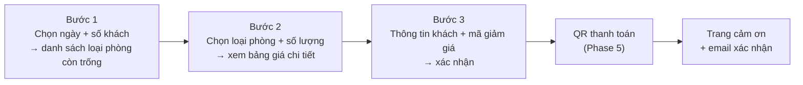

# Phase 7: Landing page, CMS nội dung & đánh giá

## Overview

Bộ mặt của đồ án: trang giới thiệu homestay và toàn bộ luồng đặt phòng cho khách, cộng với lớp CMS để admin sửa nội dung mà không cần đụng code, và tính năng đánh giá sau khi trả phòng.

**Chạy song song được với Phase 6.**

## Requirements

- Functional: 8 màn hình công khai; 4 màn hình CMS trong admin; đánh giá có kiểm duyệt.
- Non-functional: responsive từ 360px; điểm Lighthouse Accessibility ≥ 90; ảnh lazy-load; không có văn bản cứng nào thuộc nhóm nội dung mà admin phải sửa được.

## Architecture

### Sơ đồ trang công khai

```
/                          Trang chủ: hero + tìm phòng + giới thiệu + loại phòng
                           + tiện ích + thư viện ảnh + đánh giá + tin tức + liên hệ
/phong                     Danh sách loại phòng (lọc theo ngày, số khách, giá)
/phong/:slug               Chi tiết loại phòng: ảnh, tiện ích, giá, nút đặt
/dat-phong                 Luồng 3 bước
/dat-phong/thanh-toan/:code  QR + đếm ngược (Phase 5)
/dat-phong/hoan-tat/:code    Trang cảm ơn
/tra-cuu                   Tra cứu bằng mã + SĐT
/tai-khoan/dat-phong       Lịch sử đặt phòng (cần đăng nhập)
/danh-gia/:code            Form đánh giá sau khi trả phòng
/tin-tuc, /tin-tuc/:slug   Tin tức & khuyến mãi
```

### Luồng đặt phòng 3 bước



Trạng thái từng bước giữ trong một signal store (`BookingFlowStore`) và đồng bộ lên query param, để người dùng F5 không mất dữ liệu đã nhập.

### Lớp CMS

| Khối trên landing | Nguồn dữ liệu | Màn hình admin |
|---|---|---|
| Hero (tiêu đề, phụ đề, ảnh nền) | `site_contents` key `hero` | `/admin/content/sections` |
| Giới thiệu, liên hệ, bản đồ | `site_contents` | `/admin/content/sections` |
| Băng-rôn khuyến mãi | `banners` | `/admin/content/banners` |
| Thư viện ảnh | `gallery_images` | `/admin/content/gallery` |
| Tiện ích homestay | `amenities` (category `PROPERTY`) | `/admin/room-types` |
| Tin tức / khuyến mãi | `posts` | `/admin/content/posts` |
| Đánh giá hiện trên trang chủ | `reviews` đã `APPROVED` | `/admin/reviews` (Phase 6) |

## Related Code Files

**Backend**
- Create: `content/PublicContentController.java` — `GET /api/content/sections`, `/banners`, `/gallery`, `/posts`, `/posts/{slug}`
- Create: `content/AdminContentController.java` — CRUD 4 nhóm nội dung
- Create: `content/ContentService.java`, `HtmlSanitizer.java` (lọc HTML bằng danh sách cho phép)
- Create: `review/ReviewController.java` — `POST /api/bookings/{code}/review`, `GET /api/reviews` (đã duyệt, phân trang)
- Create: `review/ReviewService.java` — chỉ cho đánh giá khi booking `CHECKED_OUT` và chưa có review
- Modify: `pom.xml` — thêm thư viện sanitize HTML

**Frontend**
- Create: `layouts/public-layout/` — header trong suốt chuyển nền khi cuộn, footer, menu mobile
- Create: `features/landing/home/` + các section component (hero, search-bar, about, room-types, amenities, gallery, reviews, news, contact)
- Create: `features/landing/room-types/room-type-list.component.ts`, `room-type-detail.component.ts`
- Create: `features/landing/booking/booking-flow.component.ts` + 3 component bước + `booking-flow.store.ts`
- Create: `features/landing/booking/booking-success.component.ts`
- Create: `features/landing/lookup/booking-lookup.component.ts`
- Create: `features/landing/account/my-bookings.component.ts`
- Create: `features/landing/review/review-form.component.ts`
- Create: `features/landing/news/`
- Create: `features/admin/content/` — sections, banners, gallery, posts
- Create: `shared/ui/` — image-gallery-lightbox, star-rating, stepper, empty-state, skeleton-loader
- Create: `core/services/content.service.ts`, `review.service.ts`

## Implementation Steps

1. `public-layout`: header dính, logo, menu (Trang chủ / Phòng / Tin tức / Tra cứu / Liên hệ), nút "Đặt phòng" nổi bật, menu mobile dạng trượt.
2. Trang chủ, các section theo thứ tự: hero + thanh tìm phòng nổi lên trên ảnh → giới thiệu → loại phòng nổi bật → tiện ích → thư viện ảnh (lightbox) → đánh giá khách → tin tức → liên hệ + bản đồ nhúng.
3. Thanh tìm phòng dùng lại `date-range-picker` từ `shared/` (Phase 4); chặn ngày quá khứ; mặc định 2 người lớn.
4. `/phong`: lưới thẻ loại phòng, hiển thị `availableCount` khi đã chọn ngày; lọc theo giá và số khách ở phía client (dữ liệu nhỏ), lọc theo ngày ở phía server.
5. `/phong/:slug`: băng ảnh, mô tả, tiện ích, bảng giá, thẻ đặt phòng dính bên phải trên desktop và dính đáy trên mobile.
6. `booking-flow.store.ts`: signal store giữ `{checkIn, checkOut, adults, children, roomTypeId, quantity, promotionCode, guest}`; đồng bộ query param; kiểm tra lại phòng trống ở bước 3 trước khi gửi (tránh trường hợp phòng bị người khác lấy trong lúc điền form).
7. Bước 3: form dùng typed reactive form, validate SĐT Việt Nam (`^0[35789]\d{8}$`), email, tên. Ô nhập mã giảm giá gọi API kiểm tra và hiện ngay số tiền được giảm.
8. Xử lý 409 `ROOM_NOT_AVAILABLE` ở bước 3: hiện hộp thoại "phòng vừa được đặt", đưa về bước 1 với ngày đã chọn — không để người dùng rơi vào ngõ cụt.
9. `/tra-cuu`: nhập mã + SĐT → hiện trạng thái, chi tiết, nút huỷ (nếu trạng thái cho phép), nút thanh toán lại (nếu `PENDING_PAYMENT` còn hạn).
10. `/tai-khoan/dat-phong`: danh sách phân trang, lọc theo trạng thái, mở chi tiết.
11. `/danh-gia/:code`: chỉ mở khi booking `CHECKED_OUT` và chưa có review; chọn sao + tiêu đề + nội dung; gửi xong hiện "chờ duyệt".
12. `PublicContentController` + `content.service.ts`: trang chủ nạp nội dung động; có giá trị mặc định để trang không vỡ khi CMS còn trống.
13. `HtmlSanitizer` cho nội dung bài viết: chỉ cho phép `p, h2-h4, ul, ol, li, strong, em, a[href], img[src,alt], br, blockquote`. Frontend render qua `[innerHTML]` sau khi đã sanitize ở backend (chống XSS lưu trữ).
14. 4 màn hình CMS trong admin dùng lại `data-table` và `image-uploader` của Phase 6.
15. SEO cơ bản: `<title>`/`<meta description>` theo trang, Open Graph cho trang chi tiết phòng và bài viết, `alt` cho mọi ảnh.
16. Truy cập: điều hướng bằng bàn phím cho stepper và lightbox, `aria-live` cho thông báo lỗi, tương phản màu đạt WCAG AA, tôn trọng `prefers-reduced-motion`.

## Verify

```bash
cd frontend
npm run build && npx ng lint
npx lighthouse http://localhost:4200 --only-categories=accessibility,performance --view

# Kiểm tra thủ công đúng thứ tự
# 1. Trang chủ 360px / 768px / 1440px — không tràn ngang
# 2. Chọn ngày -> chọn phòng -> điền form -> QR -> mô phỏng chuyển khoản -> trang cảm ơn
# 3. F5 giữa chừng bước 3 -> dữ liệu vẫn còn (query param)
# 4. Mở 2 tab, cùng đặt phòng cuối cùng -> tab thứ hai nhận thông báo hết phòng, quay lại bước 1
# 5. /tra-cuu bằng mã + SĐT -> ra đúng booking; sai SĐT -> không lộ thông tin
# 6. Admin đổi hero ở /admin/content/sections -> refresh trang chủ -> nội dung đổi
# 7. Gửi đánh giá -> chưa hiện; admin duyệt -> hiện trên trang chủ
# 8. Đăng bài viết có thẻ <script> -> nội dung hiển thị không chạy script
```

## Todo

- [ ] `public-layout` (header dính, menu mobile, footer)
- [ ] Trang chủ + 8 section
- [ ] `/phong` danh sách + lọc; `/phong/:slug` chi tiết
- [ ] `booking-flow.store` + 3 bước + đồng bộ query param
- [ ] Kiểm tra lại phòng trống ở bước 3 + xử lý 409 êm ái
- [ ] Trang cảm ơn + trang tra cứu + lịch sử đặt phòng
- [ ] Form đánh giá + kiểm duyệt
- [ ] `PublicContentController` + `AdminContentController` + sanitize HTML
- [ ] 4 màn hình CMS trong admin
- [ ] SEO cơ bản + truy cập bàn phím + tương phản AA
- [ ] Lightbox thư viện ảnh, skeleton loader, empty state

## Success Criteria

- [ ] Đi trọn luồng từ trang chủ đến email xác nhận không gặp lỗi
- [ ] Responsive sạch ở 360px, 768px, 1440px — không cuộn ngang
- [ ] Lighthouse Accessibility ≥ 90
- [ ] F5 giữa luồng đặt phòng không mất dữ liệu đã nhập
- [ ] Phòng bị người khác lấy mất → thông báo rõ và đưa về bước 1, không kẹt
- [ ] Admin sửa hero/banner/thư viện ảnh/tin tức → landing đổi ngay, không cần build lại
- [ ] Đánh giá chỉ hiện sau khi được duyệt
- [ ] Bài viết chứa `<script>` không thực thi được (chống XSS)
- [ ] Tra cứu sai SĐT không lộ bất kỳ thông tin nào của booking

## Risk Assessment

| Rủi ro | Dấu hiệu | Phản ứng đã định |
|---|---|---|
| Landing tự viết bằng Tailwind mất nhiều thời gian hơn dự tính | Phase 7 tràn quá 14h | Ưu tiên theo thứ tự: luồng đặt phòng > trang chủ > tin tức. Tin tức có thể lược nếu cạn thời gian (nêu rõ với người dùng, không tự cắt lặng lẽ) |
| XSS lưu trữ qua nội dung CMS | Script chạy được trên trang công khai | Sanitize ở **backend** trước khi lưu (không chỉ ở frontend); test khẳng định với payload `<script>` và `` |
| Phòng bị lấy mất giữa lúc khách điền form | 409 rơi vào mặt người dùng cuối luồng | Kiểm tra lại phòng trống ở bước 3 + hộp thoại xử lý êm; giữ chỗ 15 phút bắt đầu tính từ lúc tạo booking |
| Trang chủ vỡ khi CMS chưa có dữ liệu | Section trống hoặc lỗi null | Mỗi section có nội dung mặc định; seed CMS đầy đủ ở Phase 8 |
| Va chạm với Phase 6 ở `shared/` | Conflict git | Chỉ thêm file mới vào `shared/`, không sửa file đã chốt ở Phase 4 |

**Rollback:** revert commit của phase; API và admin không phụ thuộc landing.
