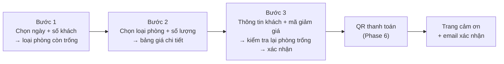

# Phase 8: Landing page, CMS nội dung & đánh giá

# Overview

Bộ mặt của đồ án: trang giới thiệu homestay và toàn bộ luồng đặt phòng cho khách, cộng với lớp CMS để admin sửa nội dung mà không cần đụng code, và tính năng đánh giá sau khi trả phòng.

**Phụ thuộc Phase 7**, không chạy song song hoàn toàn: 4 màn hình CMS nằm trong khu admin và dùng lại `admin-layout` của Phase 7. Phần công khai (trang chủ, danh sách phòng, luồng đặt phòng, tra cứu) **không** phụ thuộc Phase 7 và làm được song song; chỉ khối CMS phải chờ.

## Requirements

- Functional: 9 màn hình công khai; 4 màn hình CMS trong admin; đánh giá có kiểm duyệt.
- Non-functional: **mobile-first** — thiết kế từ 360px lên, vùng chạm ≥ 44px, form một cột; ảnh lazy-load có `width`/`height`; mọi component lấy từ design system Phase 2; không trường tự do nào của người dùng đi ra giao diện mà chưa qua xử lý.
- UX: mọi màn hình phải thiết kế đủ 6 trạng thái (mặc định, đang tải, rỗng, lỗi mạng, hết phòng, hết hạn giữ chỗ) — không chỉ trạng thái đẹp.

## Architecture

### Sơ đồ trang công khai

```
/                          Trang chủ: hero + tìm phòng + giới thiệu + loại phòng
                           + tiện ích + thư viện ảnh + đánh giá + tin tức + liên hệ
/phong                     Danh sách loại phòng (lọc theo ngày, số khách, giá)
/phong/:slug               Chi tiết loại phòng: ảnh, tiện ích, diện tích, giá, nút đặt
/dat-phong                 Luồng 3 bước
/dat-phong/thanh-toan/:code  QR + đếm ngược (Phase 6)
/dat-phong/hoan-tat/:code    Trang cảm ơn
/tra-cuu                   Tra cứu bằng mã + SĐT
/tai-khoan/dat-phong       Lịch sử đặt phòng (cần đăng nhập)
/danh-gia/:code            Form đánh giá sau khi trả phòng
/tin-tuc, /tin-tuc/:slug   Tin tức & khuyến mãi
```

### Chuẩn giao diện — đối chiếu Booking và Agoda

| Yếu tố | Cách làm | Nguồn |
|---|---|---|
| Ô tìm kiếm | Khi focus thì làm mờ nền để dồn chú ý | Agoda |
| Trang chi tiết phòng | Thanh nav dính khi cuộn | Agoda |
| Gallery | 1 ảnh lớn + 2 ảnh nhỏ, bấm mở lightbox | Agoda |
| Khoảng trắng | Rộng rãi, tương phản cao cho thông tin quyết định | Agoda |
| Giá | **Tổng cả kỳ nghỉ** hiện ở thẻ phòng và cả 3 bước, không chỉ giá/đêm | Booking |
| Đánh giá | Đặt ngay dưới khối chọn phòng | Booking |
| Date picker | Chặn sẵn ngày hết phòng, giá từng đêm trên ô ngày | Booking, Airbnb |
| Khan hiếm | "Còn 2 phòng" — số thật từ `availableCount` | Làm khác họ, xem dưới |
| Áp lực thời gian | Chỉ đồng hồ giữ chỗ 15 phút — mốc thật trong DB | Làm khác họ |
| "X người đang xem" | **Không có** | Làm khác họ |

Ba dòng cuối là chỗ cố tình đi khác. Agoda hiện giá/đêm rồi để tổng tiền lộ ra ở checkout — đó là điểm họ bị chê, nên lấy cách của Booking. Còn nhóm tạo áp lực giả thì cả hai đều dùng và Booking.com đã bị EU xử lý vì nó; chi tiết và lý do nằm ở `docs/thiet-ke-giao-dien.md` (Phase 2).

### Luồng đặt phòng 3 bước



**Trạng thái luồng lưu ở đâu.** Chỉ tham số tìm kiếm đi lên URL: `checkIn`, `checkOut`, `adults`, `children`, `roomTypeId`, `quantity`. Thông tin khách (họ tên, email, SĐT) và mã giảm giá nằm trong `sessionStorage`.

Đẩy thông tin khách vào query param để "F5 không mất dữ liệu" là đổi một tiện lợi nhỏ lấy một rò rỉ lớn: URL đi vào lịch sử trình duyệt trên máy dùng chung, vào access log của nginx, và vào header `Referer` gửi tới bản đồ nhúng ở trang chủ cùng mọi tài nguyên bên thứ ba. Khách chia sẻ link "phòng này đẹp nè" là chia sẻ luôn số điện thoại của mình. `sessionStorage` giữ được đúng lợi ích (F5 không mất) mà không có nhược điểm đó.

### Xử lý văn bản do người dùng nhập

| Nhóm trường | Cách xử lý | Lý do |
|---|---|---|
| `posts.content`, `site_contents.body` | Sanitize ở **backend** trước khi lưu, render `[innerHTML]` | Cần định dạng phong phú, do admin soạn |
| `reviews.title`, `reviews.content`, `reviews.admin_reply` | Lưu **văn bản thuần**, render bằng text binding | Do người ẩn danh gửi; không cần HTML |
| `gallery_images.caption`, `banners.title`, `bookings.guest_name`, `bookings.special_request` | Text binding, không `innerHTML` | Không cần HTML |
| `banners.link_url` | Chỉ chấp nhận scheme `http`/`https`/`mailto` | Chặn `javascript:` |
| `img[src]` trong nội dung | Chỉ origin của mình + Cloudinary | Chặn rò rỉ qua ảnh ngoài |

Sanitize chỉ cho "nội dung bài viết" là chưa đủ. Đánh giá là bề mặt nguy hiểm nhất vì nội dung đến từ người ẩn danh, và màn hình duyệt của admin là nơi **bắt buộc** phải mở nó — kiểm duyệt không phải rào chắn bảo mật khi chính hành vi kiểm duyệt là điều kiện kích hoạt.

### Lớp CMS

| Khối trên landing | Nguồn dữ liệu | Màn hình admin |
|---|---|---|
| Hero (tiêu đề, phụ đề, ảnh nền) | `site_contents` key `hero` | `/admin/content/sections` |
| Giới thiệu, liên hệ, bản đồ | `site_contents` | `/admin/content/sections` |
| Băng-rôn khuyến mãi | `banners` | `/admin/content/banners` |
| Thư viện ảnh | `gallery_images` | `/admin/content/gallery` |
| Tiện ích homestay | `amenities` (category `PROPERTY`) | `/admin/room-types` |
| Tin tức / khuyến mãi | `posts` | `/admin/content/posts` |
| Đánh giá hiện trên trang chủ | `reviews` đã `APPROVED` | `/admin/reviews` (Phase 7) |

## Related Code Files

**Backend**
- Create: `content/PublicContentController.java` — `GET /api/content/sections`, `/banners`, `/gallery`, `/posts`, `/posts/{slug}`
- Create: `content/AdminContentController.java` — CRUD 4 nhóm nội dung
- Create: `content/ContentService.java`, `HtmlSanitizer.java`, `UrlSchemeValidator.java`
- Create: `review/ReviewController.java` — `POST /api/bookings/{code}/review`, `GET /api/reviews`
- Create: `review/ReviewService.java`
- Modify: `pom.xml` — thêm thư viện sanitize HTML
- Modify: `phase-03` ma trận phân quyền — thêm endpoint của phase này

**Frontend**
- Create: `layouts/public-layout/` — header chuyển nền khi cuộn, footer, menu mobile
- Create: `features/landing/home/` + các section component (hero, search-bar, about, room-types, amenities, gallery, reviews, news, contact)
- Create: `features/landing/room-types/room-type-list.component.ts`, `room-type-detail.component.ts`
- Create: `features/landing/booking/booking-flow.component.ts` + 3 component bước + `booking-flow.store.ts`
- Create: `features/landing/booking/booking-success.component.ts`
- Create: `features/landing/lookup/booking-lookup.component.ts`
- Create: `features/landing/account/my-bookings.component.ts`
- Create: `features/landing/review/review-form.component.ts`
- Create: `features/landing/news/`
- Create: `features/admin/content/` — sections, banners, gallery, posts (dùng `admin-layout` của Phase 7)
- Dùng lại từ `shared/ui/` (Phase 2): `lightbox`, `star-rating`, `room-card`, `date-range-picker`, `guest-stepper`, `skeleton`, `empty-state`, `toast`, `modal`, `data-table` (cho CMS)
- Create: `core/services/content.service.ts`, `review.service.ts`

## Implementation Steps

1. `public-layout`: header dính, logo, menu (Trang chủ / Phòng / Tin tức / Tra cứu / Liên hệ), nút "Đặt phòng" nổi bật, menu mobile dạng trượt.
2. Trang chủ theo thứ tự: hero + thanh tìm phòng nổi lên trên ảnh → giới thiệu → loại phòng nổi bật → tiện ích → thư viện ảnh (lightbox) → đánh giá khách → tin tức → liên hệ + bản đồ nhúng.
3. Thanh tìm phòng dùng `ui-date-range-picker` (Phase 2), nạp bản đồ giá và số phòng trống từ `availability.service` để chặn sẵn ngày hết phòng; chặn ngày quá khứ theo giờ Việt Nam; mặc định 2 người lớn. Khi focus thì làm mờ nền như Agoda.
4. `/phong`: lưới thẻ loại phòng, hiển thị `availableCount` khi đã chọn ngày; lọc theo giá và số khách ở client, lọc theo ngày ở server.
5. `/phong/:slug`: băng ảnh, mô tả, tiện ích, `area_sqm`, `bed_info`, bảng giá, thẻ đặt phòng dính bên phải trên desktop và dính đáy trên mobile.
6. `booking-flow.store.ts`: signal store; tham số tìm kiếm đồng bộ query param, thông tin khách và mã giảm giá trong `sessionStorage`; kiểm tra lại phòng trống ở bước 3 trước khi gửi.
7. Bước 3: typed reactive form, validate SĐT Việt Nam `^0[35789]\d{8}$`, email, tên. Ô mã giảm giá gọi `POST /api/promotions/check` và hiện ngay số tiền được giảm. **Số tiền cọc lấy từ phản hồi của backend**, frontend không tự tính.
8. Xử lý 409 `ROOM_NOT_AVAILABLE` ở bước 3: hộp thoại "phòng vừa được đặt", đưa về bước 1 với ngày đã chọn — không để người dùng rơi vào ngõ cụt.
9. `/tra-cuu`: nhập mã + SĐT → trả về booking kèm `accessToken` giữ trong `sessionStorage`; hiện trạng thái, chi tiết, nút huỷ (nếu trạng thái cho phép), nút thanh toán lại (nếu `PENDING_PAYMENT` còn hạn).
10. `/tai-khoan/dat-phong`: danh sách phân trang, lọc theo trạng thái, mở chi tiết.
11. `/danh-gia/:code`: yêu cầu `accessToken` hoặc SĐT — **cùng mức xác thực với `lookup` và `cancel`**. Mã booking chỉ 6 ký tự và nằm trên sao kê ngân hàng, nên nếu không kiểm danh tính thì bất kỳ ai thấy mã đều gửi được đánh giá 1 sao đứng tên khách thật. Chỉ mở khi booking `CHECKED_OUT` và chưa có review.
12. `PublicContentController` + `content.service.ts`: trang chủ nạp nội dung động, có giá trị mặc định để trang không vỡ khi CMS còn trống.
13. `HtmlSanitizer` áp cho `posts.content` và `site_contents.body` **ở tầng vào** (trước khi lưu): chỉ cho phép `p, h2-h4, ul, ol, li, strong, em, a[href], img[src,alt], br, blockquote`; `a[href]` giới hạn scheme `http/https/mailto`; `img[src]` giới hạn origin. Các trường còn lại lưu văn bản thuần theo bảng ở trên.
14. 4 màn hình CMS trong admin dùng `ui-data-table` (Phase 2) và `admin-layout` (Phase 7).
15. SEO cơ bản: `<title>`/`<meta description>` theo trang, Open Graph cho trang chi tiết phòng và bài viết, `alt` cho mọi ảnh.
16. Truy cập: điều hướng bàn phím cho stepper và lightbox, `aria-live` cho thông báo lỗi, tương phản màu đạt WCAG AA, tôn trọng `prefers-reduced-motion`. Đây là **mục tiêu chất lượng**, không phải cổng chặn — xem mục Success Criteria.
17. **Mobile:** ở trang chi tiết loại phòng, khối đặt phòng thu gọn thành thanh dính đáy màn hình (giá + tổng + nút "Đặt phòng"); ở bước 3, tóm tắt giá thu gọn thành thanh dính đáy bấm mở rộng được. Trên desktop cả hai là thẻ dính bên phải.
18. **Thanh tiến trình 3 bước luôn hiển thị**, kể cả trên mobile; bước đã qua bấm quay lại được mà không mất dữ liệu đã nhập.
19. **Giá cập nhật tức thì** khi đổi ngày, số phòng hoặc mã giảm giá — tổng cả kỳ, tiền giảm, tiền cọc đều tính lại từ phản hồi backend, không tính ở frontend.
20. Thiết kế đủ 6 trạng thái cho từng màn hình chính: đang tải dùng `ui-skeleton` giữ đúng bố cục sắp hiện (không spinner giữa màn hình), rỗng dùng `ui-empty-state`, lỗi mạng có nút thử lại, hết phòng đưa về bước 1 kèm ngày đã chọn, hết hạn giữ chỗ có nút đặt lại, mã giảm giá sai báo ngay dưới ô nhập.
21. Trang chi tiết loại phòng: tiện ích nhóm theo loại (phòng / homestay), chính sách huỷ hiển thị thành khối riêng nhìn thấy được, không giấu trong accordion đóng sẵn.

## Verify

```bash
cd frontend
npm run build && npx ng lint

# Đo chất lượng truy cập để biết, không để chặn
npx lighthouse http://localhost:4200 --only-categories=accessibility,performance --view
```

Kiểm tra thủ công theo thứ tự:

1. Trang chủ ở 360px / 768px / 1440px — không tràn ngang.
2. Chọn ngày → chọn phòng → điền form → QR → mô phỏng chuyển khoản → trang cảm ơn.
3. F5 giữa bước 3 → dữ liệu vẫn còn; đồng thời **URL không chứa tên, email hay SĐT**.
4. Mở 2 tab, cùng đặt phòng cuối cùng → tab thứ hai nhận thông báo hết phòng và quay về bước 1.
5. `/tra-cuu` bằng mã + SĐT → ra đúng booking; sai SĐT → không lộ thông tin.
6. Mở `/danh-gia/{code}` không có token và không có SĐT → bị từ chối.
7. Admin đổi hero ở `/admin/content/sections` → refresh trang chủ → nội dung đổi.
8. Gửi đánh giá có `` trong tiêu đề → mở `/admin/reviews` → **script không chạy**, hiện ra đúng như văn bản.
9. Đăng bài viết có `<script>` và `<a href="javascript:...">` → nội dung hiển thị không thực thi, link bị loại.

## Todo

- [ ] `public-layout` (header dính, menu mobile, footer)
- [ ] Trang chủ + 8 section
- [ ] `/phong` danh sách + lọc; `/phong/:slug` chi tiết (kèm `area_sqm`, `bed_info`)
- [ ] `booking-flow.store`: tham số tìm kiếm lên URL, thông tin khách vào `sessionStorage`
- [ ] Kiểm tra lại phòng trống ở bước 3 + xử lý 409 êm ái
- [ ] Trang cảm ơn + tra cứu (nhận `accessToken`) + lịch sử đặt phòng
- [ ] Form đánh giá **có kiểm danh tính** + kiểm duyệt
- [ ] `PublicContentController` + `AdminContentController`
- [ ] `HtmlSanitizer` ở tầng vào cho nội dung giàu định dạng
- [ ] Text binding cho review, caption, tên khách, ghi chú
- [ ] `UrlSchemeValidator` cho `banners.link_url`
- [ ] 4 màn hình CMS trong admin
- [ ] SEO cơ bản + truy cập bàn phím + tương phản AA
- [ ] Chuẩn Booking/Agoda: mờ nền khi focus tìm kiếm, nav dính ở trang chi tiết, gallery 1 lớn + 2 nhỏ
- [ ] Tổng tiền cả kỳ hiện ở thẻ phòng và cả 3 bước
- [ ] Thanh đặt phòng dính đáy trên mobile; thẻ giá dính phải trên desktop
- [ ] Thanh tiến trình 3 bước luôn hiển thị, quay lại không mất dữ liệu
- [ ] Đủ 6 trạng thái cho mỗi màn hình chính
- [ ] Tiện ích nhóm theo loại; chính sách huỷ hiển thị rõ, không giấu
- [ ] Cập nhật ma trận phân quyền Phase 4

## Success Criteria

- [ ] Đi trọn luồng từ trang chủ đến email xác nhận không gặp lỗi
- [ ] Responsive sạch ở 360px, 768px, 1440px — không cuộn ngang
- [ ] F5 giữa luồng đặt phòng không mất dữ liệu, **và** URL không chứa tên/email/SĐT
- [ ] Phòng bị người khác lấy mất → thông báo rõ và đưa về bước 1, không kẹt
- [ ] Gửi đánh giá không có `accessToken` và không có SĐT đúng → bị từ chối
- [ ] Đánh giá chứa `` hiển thị nguyên văn ở màn hình duyệt của admin, **không thực thi**
- [ ] Bài viết chứa `<script>` hoặc `javascript:` không thực thi được
- [ ] Admin sửa hero/banner/thư viện ảnh/tin tức → landing đổi ngay, không cần build lại
- [ ] Đánh giá chỉ hiện sau khi được duyệt
- [ ] Tra cứu sai SĐT không lộ bất kỳ thông tin nào của booking
- [ ] Tổng tiền cả kỳ nghỉ xuất hiện trên thẻ loại phòng **và** ở cả 3 bước đặt phòng
- [ ] Ngày đã hết phòng không bấm chọn được trong date picker (chặn trước, không báo lỗi sau)
- [ ] Ở 360px: mọi nút và ô nhập có hộp bao ≥ 44×44px, form một cột, không cuộn ngang
- [ ] Trang chi tiết phòng trên mobile có thanh đặt phòng dính đáy màn hình
- [ ] Không mã màu nào trong landing nằm ngoài token (`check-hardcoded-colors.mjs` thoát 0)
- [ ] Ngắt mạng giữa lúc tải danh sách phòng → hiện lỗi có nút thử lại, không phải trang trắng
- [ ] Mã giảm giá sai → báo ngay dưới ô nhập, không phải toast biến mất sau 3 giây

**Mục tiêu chất lượng (không chặn hoàn thành phase):** Lighthouse Accessibility ≥ 90. Vẫn làm `alt` cho ảnh, điều hướng bàn phím và tương phản AA; nhưng điểm số không phải điều kiện để coi phase là xong — đây là phase nặng nhất và có nguy cơ tràn thời gian cao nhất.

## Risk Assessment

| Rủi ro | Dấu hiệu | Phản ứng đã định |
|---|---|---|
| Landing tự viết bằng Tailwind mất nhiều thời gian hơn dự tính | Phase 8 tràn quá 16h | Ưu tiên theo thứ tự: luồng đặt phòng > trang chủ > CMS > tin tức. Cắt tin tức là phương án cuối, và phải **nói rõ với người dùng**, không tự lược lặng lẽ |
| XSS lưu trữ qua đánh giá hoặc CMS | Script chạy ở trang công khai hoặc màn hình duyệt của admin | Bảng phân loại trường ở trên: nội dung giàu định dạng sanitize ở backend, phần còn lại text binding. Test với `<script>` và `` ở **cả hai** nơi |
| Phòng bị lấy mất giữa lúc khách điền form | 409 rơi vào mặt người dùng cuối luồng | Kiểm tra lại phòng trống ở bước 3 + hộp thoại xử lý êm |
| Trang chủ vỡ khi CMS chưa có dữ liệu | Section trống hoặc lỗi null | Mỗi section có nội dung mặc định; seed CMS đầy đủ ở Phase 9 |
| Khối CMS chờ Phase 7 xong | Nhánh song song bị nghẽn giữa chừng | Làm phần công khai trước (không phụ thuộc Phase 7), để 4 màn hình CMS vào cuối phase |

**Rollback:** revert commit của phase; API và admin không phụ thuộc landing.
