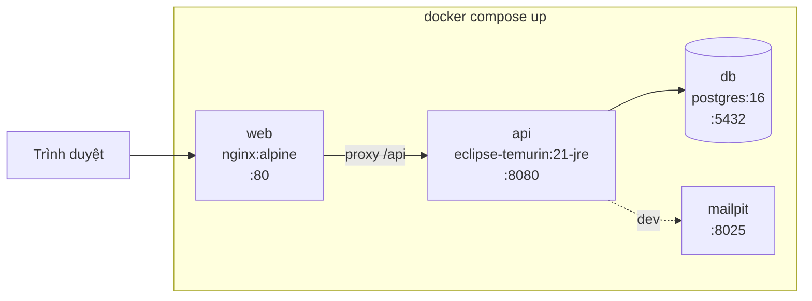

# Phase 8: Đóng gói, seed & tài liệu

## Overview

Biến hệ thống thành thứ chạy được bằng một lệnh trên máy lạ, kèm dữ liệu mẫu thuyết phục và tài liệu kỹ thuật tiếng Việt đủ để bảo vệ đồ án.

## Requirements

- Functional: `docker compose up` dựng Postgres + API + web với dữ liệu mẫu và tài khoản admin sẵn sàng.
- Non-functional: khởi động sạch từ máy chưa từng chạy dự án; không có secret nào trong repo; tài liệu khớp với code thật.

## Architecture



- **web**: build Angular nhiều tầng (`node:20` build → `nginx:alpine` serve), có `try_files` cho SPA routing và `proxy_pass /api` sang service `api`.
- **api**: build Maven nhiều tầng, chạy JRE 21, `healthcheck` gọi `/api/health`.
- **db**: `postgres:16` + volume `pgdata` + `healthcheck` `pg_isready`; `api` chờ `db` khoẻ mới khởi động.
- Dữ liệu mẫu nạp qua Flyway ở `db/seed/` chỉ được thêm vào `spring.flyway.locations` khi profile là `demo` — production sạch dữ liệu giả.

## Related Code Files

- Create: `backend/Dockerfile`, `backend/.dockerignore`
- Create: `frontend/Dockerfile`, `frontend/nginx.conf`, `frontend/.dockerignore`
- Create: `docker-compose.yml` (đầy đủ 3–4 service)
- Create: `backend/src/main/resources/db/seed/V900__demo_data.sql`
- Modify: `backend/src/main/resources/application-demo.yml` — thêm `classpath:db/seed` vào `flyway.locations`
- Create: `docs/kien-truc.md` — kiến trúc hệ thống + sơ đồ thành phần
- Create: `docs/erd.md` — ERD đầy đủ + mô tả từng bảng, từng ràng buộc
- Create: `docs/use-case.md` — sơ đồ và đặc tả use case theo tác nhân
- Create: `docs/luong-dat-phong.md` — sequence đặt phòng + thanh toán + trạng thái
- Create: `docs/api.md` — bảng endpoint, quyền truy cập, mã lỗi
- Create: `docs/cai-dat.md` — hướng dẫn cài đặt và chạy chi tiết
- Create: `docs/kiem-thu.md` — danh mục test và cách chạy
- Modify: `README.md` — tóm tắt + ảnh chụp màn hình + liên kết sang `docs/`
- Modify: `.env.example`

## Implementation Steps

1. `backend/Dockerfile`: tầng build `maven:3.9-eclipse-temurin-21` chạy `mvn package -DskipTests`, tầng chạy `eclipse-temurin:21-jre-alpine` chỉ chép file jar. Chạy bằng user không phải root.
2. `frontend/Dockerfile`: tầng build `node:20-alpine` chạy `npm ci && npm run build`, tầng chạy `nginx:alpine` chép thư mục build ra `/usr/share/nginx/html`.
3. `frontend/nginx.conf`: `try_files $uri $uri/ /index.html;` cho SPA; `location /api { proxy_pass http://api:8080; }`; bật gzip; đặt header bảo mật cơ bản (`X-Content-Type-Options`, `X-Frame-Options`, `Referrer-Policy`).
4. `docker-compose.yml`: 3 service + volume `pgdata` + `uploads` (để ảnh upload local không mất khi dựng lại); mọi biến môi trường đọc từ `.env` với giá trị mặc định an toàn cho demo.
5. `V900__demo_data.sql` — dữ liệu mẫu thật sự dùng được:
   - 1 admin (`admin@tvh.local` / `Admin@123`, hash BCrypt sinh sẵn) + 2 khách hàng
   - 4 loại phòng (Standard 500k, Deluxe 750k, Family 1.2tr, Bungalow 1.5tr) × 3–5 phòng mỗi loại = 15 phòng
   - 12 tiện ích, ảnh dùng đường dẫn tương đối tới ảnh trong repo (không phụ thuộc mạng)
   - ~40 booking rải 6 tháng gần nhất, đủ mọi trạng thái, để dashboard có biểu đồ đẹp
   - 3 mã giảm giá (còn hạn, hết hạn, hết lượt), 8 đánh giá (6 đã duyệt, 2 chờ)
   - nội dung CMS đầy đủ: hero, giới thiệu, 3 banner, 8 ảnh thư viện, 4 bài viết
6. Kiểm tra dữ liệu mẫu không vi phạm ràng buộc `EXCLUDE` (viết sao cho các booking không chồng phòng) — chạy migration là bằng chứng.
7. `docs/erd.md`: sơ đồ Mermaid + bảng mô tả từng cột, giải thích tại sao chọn `EXCLUDE ... gist` thay vì khoá ở tầng ứng dụng. Đây là phần dễ được hỏi nhất khi bảo vệ.
8. `docs/use-case.md`: 3 tác nhân (Khách vãng lai, Khách có tài khoản, Quản trị viên); đặc tả chi tiết 5 use case chính (tìm phòng, đặt phòng, thanh toán, quản lý booking, xem báo cáo) theo mẫu: tác nhân, tiền điều kiện, luồng chính, luồng thay thế, hậu điều kiện.
9. `docs/luong-dat-phong.md`: sequence đặt phòng, sequence thanh toán + webhook, biểu đồ trạng thái booking (chép lại từ Phase 4/5, giữ đồng bộ).
10. `docs/api.md`: bảng đầy đủ endpoint — phương thức, đường dẫn, quyền, mô tả, mã lỗi; trỏ tới `/swagger-ui` cho chi tiết tham số.
11. `docs/kiem-thu.md`: liệt kê từng test và điều nó chứng minh, đặc biệt `BookingConcurrencyIT` và `SepayWebhookIT`; kèm lệnh chạy.
12. `README.md`: giới thiệu 5 dòng, ảnh chụp landing + admin + dashboard, khối lệnh chạy nhanh, tài khoản demo, liên kết `docs/`.
13. Quét secret toàn repo trước khi commit cuối.
14. Chạy thử toàn bộ trên thư mục clone sạch để chắc chắn không phụ thuộc trạng thái máy đang phát triển.

## Verify

```bash
# Kịch bản máy lạ
cd /tmp && rm -rf smoke && git clone <repo-url> smoke && cd smoke
cp .env.example .env
docker compose up -d --build
docker compose ps          # cả 3 service healthy

curl -sf localhost/api/health                       # UP
curl -sf localhost/api/room-types | jq 'length'     # 4
open http://localhost                               # landing có nội dung, không phải trang trắng
open http://localhost/admin                         # đăng nhập admin@tvh.local / Admin@123
open http://localhost/swagger-ui/index.html         # liệt kê đủ endpoint

# Toàn bộ test
cd backend && ./mvnw -q verify
cd ../frontend && npm ci && npm run build && npx ng lint

# Quét secret
git grep -nEi '(api[_-]?key|secret|password|token)\s*[:=]\s*["'"'"'][^"'"'"']{8,}' \
  -- ':!*.example' ':!docs/*' ':!plans/*' || echo "OK: khong lo secret"

# Kiểm tra tài liệu khớp code
grep -c '/api/' docs/api.md   # so với số endpoint trong Swagger
```

## Todo

- [ ] `backend/Dockerfile` nhiều tầng, chạy user không phải root
- [ ] `frontend/Dockerfile` + `nginx.conf` (SPA fallback + proxy + header bảo mật)
- [ ] `docker-compose.yml` đầy đủ + healthcheck + volume
- [ ] `V900__demo_data.sql` (dữ liệu mẫu 6 tháng, đủ mọi trạng thái)
- [ ] `application-demo.yml` tách seed khỏi production
- [ ] `docs/kien-truc.md`
- [ ] `docs/erd.md` (kèm lý giải lựa chọn `EXCLUDE`)
- [ ] `docs/use-case.md` (3 tác nhân, 5 use case đặc tả đầy đủ)
- [ ] `docs/luong-dat-phong.md` (2 sequence + 1 state diagram)
- [ ] `docs/api.md`, `docs/cai-dat.md`, `docs/kiem-thu.md`
- [ ] `README.md` + ảnh chụp màn hình
- [ ] Quét secret + thử lại trên clone sạch

## Success Criteria

- [ ] Trên máy chưa từng chạy dự án: `cp .env.example .env && docker compose up -d --build` là đủ
- [ ] Cả 3 service báo healthy; landing có nội dung thật, không phải trang trắng
- [ ] Đăng nhập admin demo được, dashboard có biểu đồ với dữ liệu 6 tháng
- [ ] `/swagger-ui` liệt kê đủ endpoint
- [ ] `./mvnw verify` và `npm run build` đều xanh
- [ ] Quét secret không phát hiện gì ngoài `.env.example`
- [ ] 7 tài liệu trong `docs/` khớp với code thật (endpoint, bảng, trạng thái)
- [ ] Mọi sơ đồ Mermaid render được trên GitHub

## Risk Assessment

| Rủi ro | Dấu hiệu | Phản ứng đã định |
|---|---|---|
| Dữ liệu mẫu vi phạm ràng buộc `EXCLUDE` | Migration V900 lỗi `23P01`, container `api` không lên | Sinh booking mẫu bằng script có kiểm tra chồng lấn, hoặc phân bổ phòng thủ công theo lịch không giao nhau; migration chạy được chính là bằng chứng |
| Dockerfile build lâu, buổi bảo vệ chờ mất kiên nhẫn | `docker compose up --build` mất hơn 5 phút | Tận dụng cache tầng (chép `pom.xml` / `package.json` trước rồi mới chép mã nguồn); build sẵn image trước buổi bảo vệ |
| Máy hội đồng không có Docker | Không dựng được | `docs/cai-dat.md` có đường chạy thủ công (Postgres cài máy + `mvn spring-boot:run` + `ng serve`); chuẩn bị sẵn video demo dự phòng |
| Tài liệu lệch code sau các lần sửa cuối | Docs mô tả endpoint không còn tồn tại | Viết docs **sau cùng**, đối chiếu trực tiếp với Swagger đang chạy, không viết từ trí nhớ |
| Mật khẩu admin demo lọt vào production | Tài khoản mặc định trên môi trường thật | Seed chỉ nạp ở profile `demo`; `docs/cai-dat.md` cảnh báo đổi mật khẩu khi triển khai thật |

**Rollback:** revert commit; ứng dụng vẫn chạy được ở chế độ dev (`docker-compose.dev.yml` + `mvn spring-boot:run` + `ng serve`).
