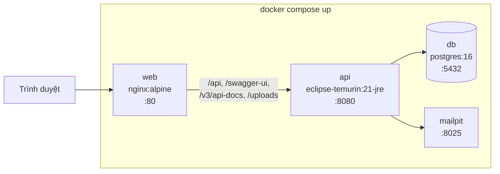

# Phase 8: Đóng gói, seed & tài liệu

## Overview

Biến hệ thống thành thứ chạy được bằng một lệnh trên máy lạ, kèm dữ liệu mẫu thuyết phục và tài liệu kỹ thuật tiếng Việt đủ để bảo vệ đồ án.

## Requirements

- Functional: `docker compose up` dựng Postgres + API + web với dữ liệu mẫu và tài khoản admin sẵn sàng; Swagger và ảnh upload truy cập được **qua cổng 80**, không chỉ qua cổng API.
- Non-functional: khởi động sạch từ máy chưa từng chạy dự án; secret sinh ngẫu nhiên lúc dựng lần đầu; không secret nào trong repo.

## Architecture



### nginx phải chuyển bốn nhóm đường dẫn, không chỉ `/api`

`/swagger-ui/**` và `/v3/api-docs/**` **không** nằm dưới `/api`. Nếu nginx chỉ proxy `/api`, chúng rơi vào `try_files … /index.html` và trả về trang Angular — tiêu chí "`/swagger-ui` liệt kê đủ endpoint" không thể đạt. Cùng lỗi định tuyến làm `/uploads/**` trả 404, phá luôn tiêu chí "upload chạy được khi không có Cloudinary".

```nginx
location /api          { proxy_pass http://api:8080; }
location /swagger-ui   { proxy_pass http://api:8080; }
location /v3/api-docs  { proxy_pass http://api:8080; }
location /uploads {
  proxy_pass http://api:8080;
  add_header X-Content-Type-Options nosniff always;
  add_header Content-Security-Policy "sandbox; default-src 'none'" always;
}
location / { try_files $uri $uri/ /index.html; }
```

Và trên **mọi** `location` proxy:

```nginx
proxy_set_header Host              $host;
proxy_set_header X-Real-IP         $remote_addr;
proxy_set_header X-Forwarded-For   $proxy_add_x_forwarded_for;
proxy_set_header X-Forwarded-Proto $scheme;
```

nginx `proxy_pass` mặc định chỉ đặt `Host` và `Connection`. Thiếu hai dòng `X-*` thì `getRemoteAddr()` trả IP container nginx cho mọi khách, và giới hạn tần suất của Phase 3 biến thành giới hạn toàn hệ thống — một vòng `curl` khoá tính năng đăng nhập của tất cả mọi người. Phải **ghi đè** chứ không nối thêm từ Internet, để header giả không đi lọt.

Header bảo mật chung cho toàn site: `X-Content-Type-Options: nosniff`, `X-Frame-Options: DENY`, `Referrer-Policy: strict-origin-when-cross-origin`, và một `Content-Security-Policy` cơ bản.

### Dữ liệu mẫu KHÔNG đi qua Flyway

Bản kế hoạch đầu nạp seed bằng migration `V900` chỉ khi profile là `demo`. Ba vấn đề:

1. Chạy `demo` rồi đổi sang `prod` trên cùng volume → Flyway thấy migration đã áp dụng nhưng không resolve được trên classpath → `validateOnMigrate` chặn khởi động, container restart loop.
2. Câu "rollback: revert commit" sai — revert xoá file khỏi classpath trong khi DB đã ghi nhận nó, gây đúng lỗi trên. Rollback thật cần `flyway repair` hoặc `down -v`.
3. Seed không thuộc schema. Đưa nó vào lịch sử schema là trộn hai vòng đời khác nhau.

Thay bằng `DemoDataSeeder` — `ApplicationRunner` có `@Profile("demo")`, idempotent (`ON CONFLICT DO NOTHING`), chạy sau khi Flyway xong. Đổi profile không để lại dấu vết trong `flyway_schema_history`.

### Seed phải sống sót được scheduler

`BookingExpiryScheduler` chạy mỗi phút và quét mọi booking `PENDING_PAYMENT` quá hạn. Nếu seed đặt `hold_expires_at` ở quá khứ, toàn bộ booking `PENDING_PAYMENT` mẫu bị chuyển `EXPIRED` trong vòng 60 giây kể từ lúc container khoẻ — dữ liệu "đủ mọi trạng thái" biến mất trước cả khi ai kịp mở màn hình. Nếu đặt `NULL` thì `NULL < now()` cho ra `NULL`, booking treo vĩnh viễn và giam phòng.

Nên: booking `PENDING_PAYMENT` mẫu đặt `hold_expires_at = now() + interval '1 day'`, và mọi ngày trong seed là **tương đối** (`CURRENT_DATE - n`) để dữ liệu không cũ đi theo thời gian.

## Related Code Files

- Create: `backend/Dockerfile`, `backend/.dockerignore`
- Create: `backend/src/main/java/com/tvh/homestay/demo/DemoDataSeeder.java` — `@Profile("demo")`, idempotent
- Create: `backend/src/main/resources/db/seed/demo-data.sql`
- Create: `frontend/Dockerfile`, `frontend/nginx.conf`, `frontend/.dockerignore`
- Create: `docker-compose.yml`
- Create: `scripts/init-env.sh` — sinh secret ngẫu nhiên vào `.env` nếu chưa có
- Create: `docs/kien-truc.md` — kiến trúc hệ thống + sơ đồ thành phần
- Create: `docs/erd.md` — ERD 19 bảng + mô tả từng bảng, từng ràng buộc
- Create: `docs/use-case.md` — sơ đồ và đặc tả use case theo tác nhân
- Create: `docs/luong-dat-phong.md` — sequence đặt phòng + thanh toán + biểu đồ trạng thái
- Create: `docs/api.md` — bảng endpoint, quyền truy cập, mã lỗi
- Create: `docs/cai-dat.md` — hướng dẫn cài đặt, chạy, và đường chạy thủ công không cần Docker
- Create: `docs/kiem-thu.md` — danh mục test và cách chạy
- Create: `docs/bao-mat.md` — mô hình bảo mật, các giới hạn đã biết, khuyến nghị khi triển khai thật
- Modify: `README.md`, `.env.example`

## Implementation Steps

1. `backend/Dockerfile`: tầng build `maven:3.9-eclipse-temurin-21` (`mvn package -DskipTests`), tầng chạy `eclipse-temurin:21-jre-alpine` chỉ chép jar. Chạy bằng user không phải root. Chép `pom.xml` trước rồi mới chép mã nguồn để tận dụng cache tầng.
2. `frontend/Dockerfile`: tầng build `node:20-alpine` (`npm ci && npm run build`), tầng chạy `nginx:alpine`.
3. `frontend/nginx.conf`: bốn `location` proxy + `try_files` + bốn `proxy_set_header` + header bảo mật, đúng như mục Architecture.
4. `docker-compose.yml`: 4 service (`db`, `api`, `web`, `mailpit`), volume `pgdata` và `uploads`, `healthcheck` cho cả ba service chính, `api` chờ `db` khoẻ. `TZ=Asia/Ho_Chi_Minh` cho `db` và `api`, cộng `JAVA_TOOL_OPTIONS=-Duser.timezone=Asia/Ho_Chi_Minh`.
5. `scripts/init-env.sh`: nếu `.env` chưa có thì sinh `JWT_SECRET` và `SEPAY_WEBHOOK_API_KEY` bằng `openssl rand`, ghi vào `.env` (đã nằm trong `.gitignore`). **Không** có giá trị mặc định trong `docker-compose.yml` hay `.env.example` — repo công khai, một secret mặc định ở đó là chìa khoá ADMIN cho mọi bản triển khai.
6. `DemoDataSeeder` + `demo-data.sql` — dữ liệu mẫu thật sự dùng được:
   - 1 admin (`admin@tvh.local`) với **mật khẩu sinh ngẫu nhiên in ra log container** và `must_change_password = true`; 2 khách hàng
   - 4 loại phòng (Standard 500k, Deluxe 750k, Family 1.2tr, Bungalow 1.5tr) × 3–5 phòng mỗi loại = 15 phòng
   - 12 tiện ích; ảnh dùng đường dẫn tương đối tới ảnh trong repo, không phụ thuộc mạng
   - ~40 booking rải 6 tháng gần nhất theo ngày tương đối, đủ mọi trạng thái; booking `PENDING_PAYMENT` có `hold_expires_at` ở tương lai
   - 2 payment cần đối soát (một thiếu tiền, một thừa tiền) để màn hình `/admin/payments` có nội dung
   - 3 mã giảm giá (còn hạn, hết hạn, hết lượt), 8 đánh giá (6 duyệt, 2 chờ)
   - nội dung CMS đầy đủ: hero, giới thiệu, 3 banner, 8 ảnh thư viện, 4 bài viết
7. Sinh booking mẫu sao cho không vi phạm ràng buộc `EXCLUDE` và không lệch `room_quantity` — chạy được chính là bằng chứng.
8. `docs/erd.md`: sơ đồ Mermaid 19 bảng + bảng mô tả từng cột, và giải thích **tại sao** chọn `EXCLUDE … USING gist` thay vì khoá ở tầng ứng dụng. Đây là phần dễ bị hỏi nhất khi bảo vệ.
9. `docs/use-case.md`: 3 tác nhân (Khách vãng lai, Khách có tài khoản, Quản trị viên); đặc tả 6 use case chính (tìm phòng, đặt phòng, thanh toán, đối soát thanh toán, quản lý booking, xem báo cáo) theo mẫu: tác nhân, tiền điều kiện, luồng chính, luồng thay thế, hậu điều kiện.
10. `docs/luong-dat-phong.md`: sequence đặt phòng, sequence thanh toán + webhook (gồm nhánh tiền về muộn), biểu đồ trạng thái booking 8 trạng thái.
11. `docs/api.md`: bảng đầy đủ endpoint — phương thức, đường dẫn, quyền, giới hạn tần suất, mã lỗi; **đối chiếu trực tiếp với ma trận phân quyền ở Phase 3**, không viết từ trí nhớ.
12. `docs/bao-mat.md`: mô hình xác thực, vì sao refresh token nằm trong cookie `HttpOnly`, cơ chế `token_version`, các lớp bảo vệ webhook, và **các giới hạn đã biết** — rate limit in-memory chỉ đúng với một instance; khuyến nghị chuyển webhook sang HMAC-SHA256 + whitelist IP khi triển khai thật.
13. `docs/cai-dat.md`: đường chạy bằng Docker **và** đường chạy thủ công (Postgres cài máy + `mvn spring-boot:run` + `ng serve`) cho trường hợp máy hội đồng không có Docker. Cảnh báo đổi mật khẩu admin khi triển khai thật.
14. `docs/kiem-thu.md`: liệt kê từng test và điều nó chứng minh, đặc biệt `BookingConcurrencyIT` (cả ba kịch bản), `SepayWebhookIT`, `PaymentRaceIT`, `EndpointAuthorizationIT`, `SchemaConstraintIT`.
15. `README.md`: giới thiệu ngắn, ảnh chụp landing + admin + dashboard, khối lệnh chạy nhanh, cách lấy mật khẩu admin demo, liên kết `docs/`.
16. Quét secret toàn repo — **bao gồm cả file `.example`**, vì đó chính là nơi giá trị mặc định hay lọt vào.
17. Chạy thử toàn bộ trên thư mục clone sạch để chắc chắn không phụ thuộc trạng thái máy phát triển.

## Verify

```bash
# Kịch bản máy lạ
cd /tmp && rm -rf smoke && git clone <repo-url> smoke && cd smoke
./scripts/init-env.sh          # sinh secret, KHÔNG lấy từ .env.example
docker compose up -d --build
docker compose ps              # cả 4 service healthy

# Bốn nhóm đường dẫn phải đi qua cổng 80, không phải 8080
curl -sf localhost/api/health                       # UP
curl -sf localhost/api/room-types | jq 'length'     # 4
curl -sf -o /dev/null -w '%{http_code}\n' localhost/swagger-ui/index.html   # 200, KHÔNG phải trang Angular
curl -sf -o /dev/null -w '%{http_code}\n' localhost/v3/api-docs             # 200
curl -sI localhost/uploads/ | grep -i x-content-type-options                # nosniff

# IP khách phải tới được API (nếu không, rate limit thành giới hạn toàn hệ thống)
for i in $(seq 1 11); do curl -s -o /dev/null -w '%{http_code} ' \
  -X POST localhost/api/auth/login -H 'Content-Type: application/json' \
  -d '{"email":"x@y.z","password":"sai"}'; done; echo    # thứ 11 => 429
docker compose logs api | grep -m1 'client_ip'            # phải là IP thật, không phải IP nginx

# Seed phải sống sót scheduler: kiểm tra SAU 90 giây, không phải ngay lập tức
sleep 90
docker exec smoke-db psql -U postgres -d homestay -tAc \
  "SELECT status, count(*) FROM bookings GROUP BY 1 ORDER BY 1;"
# PENDING_PAYMENT vẫn phải > 0

docker exec smoke-db psql -U postgres -d homestay -tAc \
  "SELECT count(*) FROM payments WHERE reconcile_status <> 'NONE';"   # >= 2

# Mật khẩu admin demo lấy từ log, không nằm trong repo
docker compose logs api | grep -i 'mat khau admin demo'

# Đổi sang prod trên cùng volume: PHẢI khởi động được, không restart loop
docker compose stop api
SPRING_PROFILES_ACTIVE=prod docker compose up -d api
docker compose ps api          # healthy, không restarting

# Toàn bộ test
cd backend && ./mvnw -q verify
cd ../frontend && npm ci && npm run build && npx ng lint

# Quét secret — BAO GỒM cả .example
git grep -nEi '(api[_-]?key|secret|password|token)\s*[:=]\s*["'"'"'][^"'"'"']{8,}' \
  -- ':!docs/*' ':!plans/*' || echo "OK: khong lo secret"
```

Đối chiếu tài liệu với hệ thống đang chạy: số endpoint trong `docs/api.md` phải khớp `/v3/api-docs`; số bảng trong `docs/erd.md` phải là 19.

## Todo

- [ ] `backend/Dockerfile` nhiều tầng, user không phải root, tận dụng cache
- [ ] `frontend/Dockerfile` + `nginx.conf` (4 location proxy + 4 `proxy_set_header` + header bảo mật)
- [ ] `docker-compose.yml` 4 service + healthcheck + volume + `TZ`
- [ ] `scripts/init-env.sh` sinh secret ngẫu nhiên; **không** giá trị mặc định trong repo
- [ ] `DemoDataSeeder` `@Profile("demo")` idempotent, **không** qua Flyway
- [ ] Seed ngày tương đối; `PENDING_PAYMENT` có `hold_expires_at` tương lai
- [ ] Seed có 2 payment cần đối soát
- [ ] Mật khẩu admin demo ngẫu nhiên + `must_change_password`
- [ ] `docs/`: kien-truc, erd (19 bảng), use-case (6 use case), luong-dat-phong, api, bao-mat, cai-dat, kiem-thu
- [ ] `README.md` + ảnh chụp màn hình
- [ ] Quét secret gồm cả `.example` + thử lại trên clone sạch
- [ ] Smoke test kiểm tra **sau 90 giây**, không chỉ lúc container vừa khoẻ

## Success Criteria

- [ ] Trên máy chưa từng chạy dự án: `./scripts/init-env.sh && docker compose up -d --build` là đủ
- [ ] Cả 4 service healthy; landing có nội dung thật, không phải trang trắng
- [ ] `localhost/swagger-ui/index.html` trả Swagger, **không** trả trang Angular
- [ ] `localhost/uploads/**` phục vụ được ảnh và có header `nosniff`
- [ ] Login sai 11 lần **qua cổng 80** → 429; log ghi IP thật của khách
- [ ] Sau 90 giây, booking `PENDING_PAYMENT` mẫu vẫn còn
- [ ] `/admin/payments` có sẵn ít nhất 2 mục cần đối soát
- [ ] Đổi profile sang `prod` trên cùng volume → app khởi động bình thường, không restart loop
- [ ] Mật khẩu admin demo chỉ có trong log container, không có trong repo
- [ ] `./mvnw verify` và `npm run build` đều xanh
- [ ] Quét secret không phát hiện gì, kể cả trong `.env.example`
- [ ] 8 tài liệu trong `docs/` khớp với hệ thống đang chạy (số endpoint, số bảng, tập trạng thái)
- [ ] Mọi sơ đồ Mermaid render được trên GitHub

## Risk Assessment

| Rủi ro | Dấu hiệu | Phản ứng đã định |
|---|---|---|
| Dữ liệu mẫu vi phạm ràng buộc `EXCLUDE` hoặc bất biến `room_quantity` | `DemoDataSeeder` ném lỗi lúc khởi động | Sinh booking mẫu theo lịch không giao nhau và gán đủ số phòng; seeder chạy được chính là bằng chứng |
| Scheduler ăn dữ liệu mẫu | Sau ít phút, `PENDING_PAYMENT` về 0 | `hold_expires_at` ở tương lai; smoke test kiểm tra sau 90 giây nên bắt được |
| Máy hội đồng không có Docker | Không dựng được | Đã xác nhận từ Phase 1. `docs/cai-dat.md` có đường chạy thủ công; video demo dự phòng |
| Dockerfile build lâu | `up --build` mất hơn 5 phút | Cache tầng theo `pom.xml`/`package.json`; build sẵn image trước buổi bảo vệ |
| Tài liệu lệch code sau các lần sửa cuối | Docs mô tả endpoint không còn tồn tại | Viết docs **sau cùng**, đối chiếu trực tiếp với `/v3/api-docs` và ma trận Phase 3, không viết từ trí nhớ |
| Secret mặc định lọt vào repo | Quét secret có kết quả trong `.env.example` hoặc `docker-compose.yml` | Quét **bao gồm** file `.example`; `init-env.sh` là đường duy nhất tạo secret |

**Rollback:** revert commit; ứng dụng vẫn chạy được ở chế độ dev (`docker-compose.dev.yml` + `mvn spring-boot:run` + `ng serve`). Vì seed không còn nằm trong Flyway, revert **không** gây lệch `flyway_schema_history`. Nếu cần xoá dữ liệu mẫu: `docker compose down -v`.
