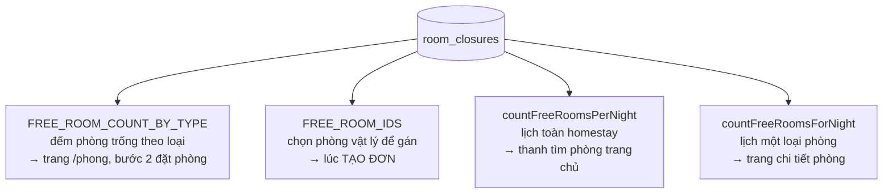

# Phase 10: Lịch khoá phòng theo khoảng ngày

## Overview

Cho quản trị viên đóng một phòng vật lý trong một khoảng ngày cụ thể, rồi tự mở
lại khi hết khoảng đó — phủ nốt vế **"ngày khả dụng"** trong câu yêu cầu của đề
bài: *"Quản trị viên cập nhật phòng, giá, số lượng khách và ngày khả dụng."*

Ba vế kia đã có từ Phase 7. Vế này chưa: `rooms.status` hiện chỉ là công tắc
**vĩnh viễn** (`AVAILABLE` / `MAINTENANCE` / `OUT_OF_SERVICE`), không gắn với
ngày nào cả. Chủ homestay muốn nói *"phòng 201 không nhận khách từ 20/10 đến
25/10 vì sơn lại"* thì phải tự nhớ bật/tắt bằng tay đúng hai ngày đó.

## Requirements

- **Functional:**
  - Admin thêm / xoá khoảng đóng cho từng phòng vật lý, kèm lý do.
  - Hai khoảng đóng của cùng một phòng không được chồng nhau.
  - Ngày nằm trong khoảng đóng biến mất khỏi kết quả tìm phòng, khỏi lịch trên
    trang chủ, và không gán được cho đơn mới.
  - Đóng một phòng đang có đơn **không huỷ đơn nào** — chỉ báo lại danh sách đơn
    bị ảnh hưởng, giống hệt cách chuyển phòng sang bảo trì ở Phase 7.
  - Dữ liệu mẫu có sẵn ít nhất một khoảng đóng để trình diễn được ngay.
- **Non-functional:**
  - Không thêm truy vấn mới vào đường tìm phòng — chỉ thêm điều kiện vào bốn
    truy vấn đã có.
  - Ràng buộc chống chồng lấn đặt ở **tầng cơ sở dữ liệu**, cùng cơ chế với
    `booking_rooms`.
  - Không sửa migration V1–V7 (bất biến).

## Architecture

### Bảng mới: `room_closures`

```sql
CREATE TABLE room_closures (
    id         bigserial   PRIMARY KEY,
    room_id    bigint      NOT NULL REFERENCES rooms (id) ON DELETE CASCADE,
    from_date  date        NOT NULL,
    to_date    date        NOT NULL,
    -- Cột sinh tự động, không bao giờ ghi tay — cùng lý do với booking_rooms.stay.
    blocked    daterange   GENERATED ALWAYS AS (daterange(from_date, to_date, '[)')) STORED,
    reason     varchar(300),
    created_by bigint      REFERENCES users (id),
    created_at timestamptz NOT NULL DEFAULT now(),

    CONSTRAINT ck_room_closures_dates CHECK (to_date > from_date)
);

-- Hai khoảng đóng của cùng một phòng không được chồng nhau. Cho chồng thì màn
-- hình quản trị hiện hai dòng nói cùng một điều, và xoá một dòng không mở lại
-- được phòng — người dùng bấm xoá rồi tưởng đã xong.
ALTER TABLE room_closures
    ADD CONSTRAINT room_closures_no_overlap
    EXCLUDE USING gist (room_id WITH =, blocked WITH &&);

CREATE INDEX idx_room_closures_room ON room_closures (room_id, from_date);
```

`btree_gist` đã bật từ V1 nên không cần khai lại.

### Quy ước khoảng nửa mở `[)` — và vì sao phải nói rõ ở giao diện

`blocked` dùng `'[)'` y hệt `booking_rooms.stay`. Đóng từ **20/10 đến 25/10**
nghĩa là chặn các **đêm** 20, 21, 22, 23, 24 — đêm 25 vẫn bán được.

Đây là chỗ lệch một ngày kinh điển. Nếu giao diện chỉ ghi "từ 20/10 đến 25/10"
thì chủ homestay hiểu là bao gồm cả đêm 25. Màn hình phải hiển thị dạng
**"5 đêm: 20/10 – 24/10 (mở lại từ 25/10)"**, không phải hai ô ngày trần.

Chọn `[)` thay vì `[]` là bắt buộc chứ không phải sở thích: nó phải khớp với
`booking_rooms.stay` để toán tử `&&` so sánh đúng. Trộn hai quy ước là tự tạo ra
một lỗi lệch ngày không bao giờ tái hiện ổn định.

### Bốn truy vấn phải sửa — sót một là thủng



Cả bốn nằm trong `AvailabilityRepository`. Điều kiện thêm vào giống nhau:

```sql
AND NOT EXISTS (
    SELECT 1 FROM room_closures rc
     WHERE rc.room_id = r.id
       AND rc.blocked && daterange(:checkIn, :checkOut, '[)')
)
```

**Q2 là truy vấn nguy hiểm nhất.** Q1/Q3/Q4 chỉ ảnh hưởng thứ khách *nhìn thấy*;
sót chúng thì lịch hiện sai nhưng đơn vẫn không đặt được. Sót **Q2** thì đơn
được tạo và phòng đang đóng bị gán thật — lỗi im lặng, chỉ lộ ra khi khách tới
nhận phòng.

`countFreeRoomsPerNight` có hình dạng khác ba cái kia: nó dùng
`LEFT JOIN sellable s ON NOT EXISTS (...)`. Điều kiện mới phải nối vào **cùng
mệnh đề `ON`** bằng `AND`, không phải đưa xuống `WHERE` — đưa xuống `WHERE` sẽ
biến `LEFT JOIN` thành `INNER JOIN` và những đêm không còn phòng nào biến mất
khỏi kết quả, đúng cái mà `AvailabilityQueryIT.calendarIncludesSoldOutDays` sinh
ra để ngăn.

### API: lồng dưới `/api/admin/rooms`, không tạo nhóm mới

```
GET    /api/admin/rooms/{id}/closures
POST   /api/admin/rooms/{id}/closures
DELETE /api/admin/rooms/closures/{closureId}
```

Lồng vào tiền tố `/api/admin/rooms` đã có trong `AUTHORIZATION_MATRIX` nên
**không phải sửa ma trận phân quyền**, và cũng không đụng tới bài kiểm cấm khai
lại dòng bao `/api/admin`. Tạo một nhóm mới kiểu `/api/admin/closures` thì phải
thêm dòng vào ma trận — làm được, nhưng lồng vào tài nguyên cha đúng hơn về mặt
REST vì khoảng đóng không tồn tại độc lập với phòng.

`POST` trả về `RoomClosureResult(closure, affectedBookings)` — tái dùng nguyên
`AffectedBooking` của Phase 7, không định nghĩa kiểu thứ hai cho cùng một khái
niệm.

### Giao diện quản trị

Thêm một khối vào `/admin/rooms` (không tạo trang mới): chọn phòng → xem danh
sách khoảng đóng → thêm bằng `ui-date-range-picker` → xoá bằng
`ui-confirm-dialog`. Lắp từ thư viện UI đã có, không chế biến thể mới.

### Phía khách: không phải sửa gì

Trang chủ, `/phong`, `/phong/:slug` và luồng đặt phòng đều đọc phòng trống qua
bốn truy vấn trên. Sửa ở tầng dữ liệu là cả bốn màn hình tự đúng theo. Đây là
phần thưởng của việc Phase 5 gom truy vấn phòng trống vào một repository duy
nhất — nói ra được điều này lúc bảo vệ thì nó là một điểm kiến trúc, không phải
may mắn.

## Related Code Files

- **Create:**
  - `backend/src/main/resources/db/migration/V8__room_closures.sql`
  - `backend/src/main/java/com/tvh/homestay/room/entity/RoomClosure.java`
  - `backend/src/main/java/com/tvh/homestay/room/repository/RoomClosureRepository.java`
  - `backend/src/main/java/com/tvh/homestay/admin/AdminRoomClosureController.java`
  - `backend/src/test/java/com/tvh/homestay/booking/RoomClosureIT.java`
  - `frontend/src/app/features/admin/rooms/room-closure-panel.ts`
- **Modify:**
  - `backend/src/main/java/com/tvh/homestay/availability/AvailabilityRepository.java` — **cả bốn** truy vấn
  - `backend/src/main/java/com/tvh/homestay/admin/AdminRoomService.java` — thêm ba thao tác, tái dùng `affectedBookings`
  - `backend/src/main/java/com/tvh/homestay/admin/dto/AdminDtos.java` — `RoomClosureRequest`, `RoomClosureView`, `RoomClosureResult`
  - `backend/src/main/resources/db/seed/demo-data.sql` — một khoảng đóng mẫu
  - `backend/src/test/java/com/tvh/homestay/schema/SchemaMigrationTest.java` — 20 → **21 bảng**, 7 → **8 migration**
  - `frontend/src/app/features/admin/rooms/admin-rooms.ts` — nhúng khối mới
  - `frontend/src/app/core/services/admin-catalog.service.ts` — ba lời gọi
  - `frontend/src/app/core/services/admin.types.ts` — kiểu tương ứng
  - `docs/erd.md`, `docs/api.md`, `docs/use-case.md`, `README.md`

## Implementation Steps

1. **V8** — bảng `room_closures` đúng như mục Architecture. Chạy thử
   `./mvnw test -Dtest=SchemaMigrationTest` để xác nhận Flyway nhận migration
   thứ tám và đếm được 21 bảng.
2. **Entity + repository** — `findByRoomIdOrderByFromDate`, `deleteById`. Không
   cần truy vấn phức tạp: bốn truy vấn phòng trống dùng SQL thuần ở
   `AvailabilityRepository`, không đi qua JPA.
3. **`AvailabilityRepository`** — thêm `NOT EXISTS` vào **cả bốn** truy vấn. Làm
   trước, chạy `AvailabilityQueryIT` ngay để chắc 6 bài kiểm cũ vẫn xanh khi
   chưa có khoảng đóng nào.
4. **`AdminRoomService`** — `listClosures`, `addClosure`, `removeClosure`.
   `addClosure` bắt `SQLSTATE 23P01` từ ràng buộc chống chồng lấn và dịch thành
   một `AdminException` có mã ổn định, **không** để lỗi cơ sở dữ liệu thô đi
   thẳng ra client.
5. **Controller** — ba endpoint lồng dưới `/api/admin/rooms`.
6. **Dữ liệu mẫu** — một khoảng đóng trên một phòng **không** có đơn nào trong
   khoảng đó, ngày tương đối (`CURRENT_DATE + 40` đến `+45`), lý do
   *"Sơn lại phòng"*. Idempotent: `WHERE NOT EXISTS` theo `(room_id, from_date)`.
7. **Giao diện** — khối khoảng đóng trong `/admin/rooms`, hiển thị dạng
   "N đêm: dd/MM – dd/MM (mở lại từ dd/MM)".
8. **Tài liệu** — cập nhật `erd.md` (21 bảng + mô tả bảng mới + lý do dùng
   `EXCLUDE` lần thứ hai), `api.md` (ba endpoint, đếm lại số thao tác từ
   `/v3/api-docs` đang chạy), `use-case.md` (thêm use case quản trị), `README.md`
   (dòng dữ liệu mẫu).

## Success Criteria

- [ ] Admin đóng phòng 201 từ hôm nay + 40 đến + 45; tìm phòng đúng khoảng đó
      thấy số phòng Deluxe **giảm đúng 1**
- [ ] Đêm ngay trước và đêm mở lại (`to_date`) **không** bị ảnh hưởng — kiểm
      bằng số, không bằng cảm giác
- [ ] Đặt đơn trùng khoảng đóng: phòng đang đóng **không bao giờ** được gán
- [ ] Lịch trên trang chủ và trang chi tiết phòng đều hiện đúng
- [ ] Thêm khoảng đóng chồng lên khoảng đã có → bị từ chối kèm thông báo rõ ràng,
      không phải lỗi 500
- [ ] Đóng phòng đang có đơn → trả về danh sách đơn bị ảnh hưởng, **không đơn nào
      bị huỷ**
- [ ] Xoá khoảng đóng → phòng bán lại được ngay
- [ ] `SchemaMigrationTest` báo 21 bảng, 8 migration, tất cả `success`
- [ ] Toàn bộ test cũ vẫn xanh (118 + số bài mới)
- [ ] `docker compose down -v && up -d` dựng lại sạch, có khoảng đóng mẫu
- [ ] `docs/erd.md` ghi 21 bảng, `docs/api.md` khớp `/v3/api-docs`

## Mandatory Tests — `RoomClosureIT`

| Bài kiểm | Chứng minh |
|---|---|
| `closedRangeRemovesRoomFromSearch` | Đóng một phòng → `findFreeRoomTypes` đếm giảm đúng 1 trong khoảng, **không đổi** ngoài khoảng |
| `closedRoomIsNeverAssignedToNewBooking` | Đặt đơn trùng khoảng đóng → phòng đó không nằm trong `booking_rooms`. **Bài kiểm quan trọng nhất** — nó canh truy vấn Q2, chỗ sót gây lỗi im lặng |
| `halfOpenBoundary` | Đóng `[20, 25)` → đêm 24 bị chặn, đêm 25 **không** bị chặn |
| `calendarShowsClosedNights` | Lịch toàn homestay và lịch một loại phòng đều trừ đúng, và **vẫn trả đủ mọi ngày** trong khoảng (không rơi mất ngày vì `LEFT JOIN` bị biến thành `INNER JOIN`) |
| `overlappingClosuresRejected` | Khoảng chồng nhau bị `23P01` và được dịch thành lỗi có mã |
| `closingRoomWithBookingDoesNotCancelIt` | Đơn vẫn `CONFIRMED`, `booking_rooms` vẫn `ACTIVE`, chỉ trả về danh sách cảnh báo |
| `deletingClosureReopensRoom` | Xoá xong đếm lại thấy phòng trở về kho |

## Risk Assessment

| Rủi ro | Dấu hiệu | Phản ứng đã định |
|---|---|---|
| **Sót một trong bốn truy vấn** | Lịch hiện đúng nhưng đơn vẫn gán được phòng đang đóng (hoặc ngược lại) | `closedRoomIsNeverAssignedToNewBooking` + `calendarShowsClosedNights` cùng bắt. Sửa xong chạy **cả** `AvailabilityQueryIT` lẫn `BookingConcurrencyIT` |
| **Lệch một ngày ở biên** | Đêm `to_date` bị chặn nhầm, hoặc đêm `to_date - 1` vẫn bán được | `halfOpenBoundary` kiểm đúng hai đêm biên. Giao diện phải ghi rõ "mở lại từ dd/MM" |
| **`LEFT JOIN` hoá `INNER JOIN` ở Q3** | Lịch thiếu ngày thay vì hiện ngày 0 phòng — frontend coi ngày vắng mặt là ngày KHÔNG bị chặn, nên khách chọn được đúng ngày không đặt được | Điều kiện mới nối vào mệnh đề `ON`, không xuống `WHERE`. `calendarIncludesSoldOutDays` (đã có) canh sẵn |
| **Lỗi ràng buộc thô lọt ra client** | Client nhận 500 kèm chuỗi `SQLSTATE 23P01` | Bắt ở `AdminRoomService`, dịch thành mã lỗi ổn định như các nhánh khác |
| **Dữ liệu mẫu che mất phòng lúc trình diễn** | Khoảng đóng mẫu rơi trúng ngày hội đồng thử đặt | Đặt ở `+40..+45` ngày, xa khoảng khách thường thử; và ghi vào `docs/kiem-thu.md` |
| **Migration V8 xung đột với bản đã triển khai** | `validateOnMigrate` chặn khởi động | V8 là bảng **mới**, không đụng V1–V7. Volume cũ chỉ cần chạy thêm một migration |

**Rollback:** revert commit. V8 chỉ thêm một bảng và không sửa bảng nào khác, nên
`DROP TABLE room_closures` là đủ để quay lại trạng thái Phase 9; bốn truy vấn trở
về bản cũ cùng commit. Không dữ liệu nghiệp vụ nào mất.

## Ghi chú cho buổi bảo vệ

Sau phase này, câu *"Quản trị viên cập nhật phòng, giá, số lượng khách và ngày
khả dụng"* được phủ **đủ bốn vế**. Đây cũng là lần thứ hai dự án dùng
`EXCLUDE USING gist` cho một bài toán khác (chống chồng khoảng đóng, không phải
chống trùng đặt phòng) — một minh chứng cụ thể rằng lựa chọn PostgreSQL ở Phase 3
không phải để dùng một lần.
