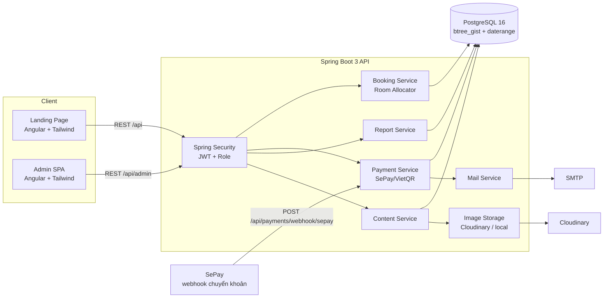
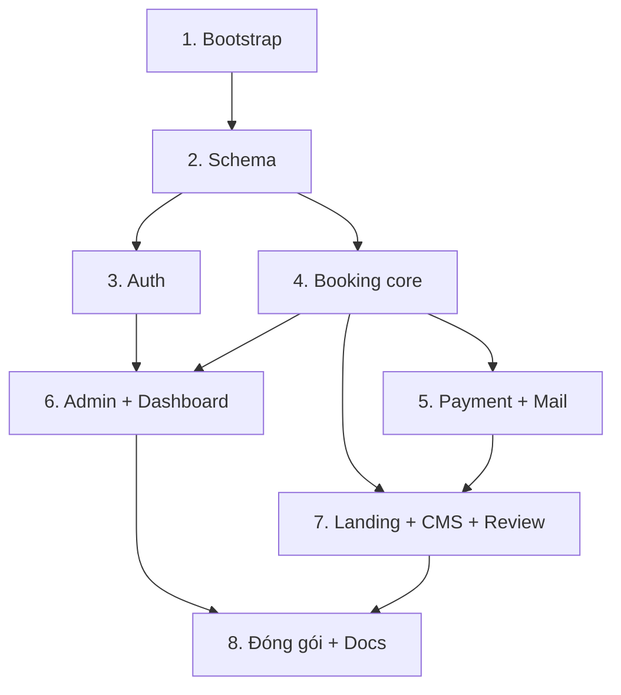

# Homestay TVH — Website giới thiệu & đặt phòng

## Overview

Xây dựng từ đầu (repo trống) một hệ thống đặt phòng homestay hoàn chỉnh trong một monorepo:

- `backend/` — Java 21 + Spring Boot 3.5, PostgreSQL 16, Flyway, Spring Security (JWT), springdoc-openapi.
- `frontend/` — Angular (standalone components + signals) + Tailwind CSS, tự viết toàn bộ component, không dùng Angular Material/PrimeNG.
- `docs/` — tài liệu kỹ thuật tiếng Việt (ERD, use case, sequence, kiến trúc) bằng Mermaid.
- `docker-compose.yml` — dựng Postgres + API + web bằng một lệnh, kèm dữ liệu mẫu.

Điểm kỹ thuật cốt lõi của đồ án: **chống đặt trùng phòng được khoá ở tầng cơ sở dữ liệu** bằng PostgreSQL `EXCLUDE USING gist` trên `daterange`, không phụ thuộc vào kiểm tra ở tầng service. Đây là lý do chọn PostgreSQL thay vì MySQL.

## Goals

| # | Goal | Priority |
|---|------|----------|
| 1 | Khách tìm phòng trống theo ngày và đặt phòng thành công, không bao giờ đặt trùng | P1 |
| 2 | Đặt cọc qua QR VietQR/SePay, webhook xác nhận tự động chuyển booking sang CONFIRMED | P1 |
| 3 | Admin quản lý loại phòng, phòng, booking, khuyến mãi, đánh giá và nội dung landing | P1 |
| 4 | Dashboard doanh thu + tỉ lệ lấp đầy phản ánh đúng dữ liệu thật | P2 |
| 5 | `docker compose up` là đủ để chạy toàn bộ hệ thống kèm dữ liệu mẫu | P1 |
| 6 | Tài liệu kỹ thuật tiếng Việt đầy đủ trong `docs/` phục vụ bảo vệ đồ án | P2 |

## Kiến trúc tổng thể

## Phases

| # | Phase | Status | Phụ thuộc | Effort |
|---|-------|--------|-----------|--------|
| 1 | [Phase 1: Khởi tạo monorepo & hạ tầng dev](./phase-01-bootstrap.md) | Pending | — | 4h |
| 2 | [Phase 2: Schema cơ sở dữ liệu & Flyway migration](./phase-02-database-schema.md) | Pending | 1 | 6h |
| 3 | [Phase 3: Xác thực & phân quyền (JWT)](./phase-03-auth.md) | Pending | 2 | 6h |
| 4 | [Phase 4: Lõi đặt phòng & chống trùng lịch](./phase-04-booking-core.md) | Pending | 2 | 10h |
| 5 | [Phase 5: Thanh toán QR, webhook & email](./phase-05-payment-qr.md) | Pending | 4 | 8h |
| 6 | [Phase 6: Trang admin & dashboard](./phase-06-admin-dashboard.md) | Pending | 3, 4 | 12h |
| 7 | [Phase 7: Landing page, CMS nội dung & đánh giá](./phase-07-landing-cms.md) | Pending | 4, 5 | 14h |
| 8 | [Phase 8: Đóng gói, seed & tài liệu](./phase-08-packaging-docs.md) | Pending | 6, 7 | 6h |

### Phase nào chạy song song được

- **Phase 3 ∥ Phase 4** — auth và booking core độc lập về file (`auth/`, `user/` vs `booking/`, `availability/`). Chạy song song được sau khi Phase 2 xong.
- **Phase 6 ∥ Phase 7** — admin và landing chạm hai cây thư mục frontend khác nhau (`features/admin/` vs `features/landing/`). Điểm va chạm duy nhất: `shared/` component dùng chung → **làm xong `shared/` ở cuối Phase 4 rồi mới tách nhánh**.
- **Không song song được:** Phase 2 (mọi thứ phụ thuộc schema), Phase 5 (cần booking entity của Phase 4), Phase 8 (gom kết quả).

## Success Criteria

- [ ] Tìm phòng theo ngày chỉ trả về loại phòng thực sự còn trống (số phòng vật lý trống > 0)
- [ ] Đặt phòng sinh QR đúng số tiền cọc; webhook về → booking chuyển CONFIRMED; khách nhận email xác nhận
- [ ] Hai request đặt cùng phòng cùng khoảng ngày → request thứ hai bị từ chối; test Testcontainers chạy song song chứng minh
- [ ] Admin đăng nhập thấy đúng booking đó, đổi được trạng thái; dashboard cộng đúng doanh thu
- [ ] Guest tra cứu booking bằng mã + SĐT; user đã đăng ký xem được lịch sử đặt phòng
- [ ] `docker compose up` chạy toàn bộ, có dữ liệu mẫu + tài khoản admin; `/swagger-ui` liệt kê đủ API
- [ ] `docs/` có ERD, use case, sequence đặt phòng + thanh toán, kiến trúc hệ thống bằng tiếng Việt
- [ ] Không có secret nào bị commit; `.env.example` đầy đủ biến

## Non-goals

Mobile app · đa chi nhánh/multi-tenant · đồng bộ Booking.com/Agoda · kế toán & hoá đơn điện tử · chat realtime · song ngữ Việt–Anh.

## Giả định mặc định (không dừng lại để hỏi)

| Hạng mục | Khi CHƯA có credential thật |
|---|---|
| SePay/VietQR | Code đúng luồng thật, đọc key từ env. Bổ sung endpoint `POST /api/dev/payments/{id}/simulate-transfer` (chỉ bật ở profile `dev`) để demo |
| Cloudinary | Đọc key từ env; thiếu key → `LocalImageStorage` ghi vào `uploads/` và serve tĩnh |
| SMTP | Đọc từ env; thiếu cấu hình → `LoggingMailSender` ghi nội dung mail ra log |
| Ngôn ngữ | Landing chỉ tiếng Việt |

## Quy ước kỹ thuật

- **Tiền tệ:** `NUMERIC(12,2)` VND, không dùng `double`. Frontend format `vi-VN`.
- **Ngày:** `check_in`/`check_out` là `DATE` (không giờ), nửa mở `[check_in, check_out)` — trả phòng ngày nào thì ngày đó bán lại được.
- **Múi giờ:** DB `TIMESTAMPTZ`, app chạy `Asia/Ho_Chi_Minh`.
- **API response:** bọc lỗi bằng RFC 7807 `application/problem+json` qua `@RestControllerAdvice`.
- **Đặt tên:** Java PascalCase/camelCase; file Angular kebab-case; bảng/cột SQL snake_case.
- **Secret:** chỉ qua biến môi trường + `.env.example`. Không commit `.env`.

## Open questions

1. Có tài khoản SePay + ngân hàng thật để đối soát không? (nếu không → dùng luồng mô phỏng ở Phase 5)
2. Cloudinary cloud name / API key? (nếu không → fallback lưu ổ đĩa)
3. SMTP Gmail app password hay Mailtrap? (nếu không → log-only)
4. Số phòng thực tế của Homestay TVH (bao nhiêu loại, mỗi loại mấy phòng, giá bao nhiêu) để seed dữ liệu mẫu đúng thực tế?

<!-- slug: homestay-tvh-booking -->
