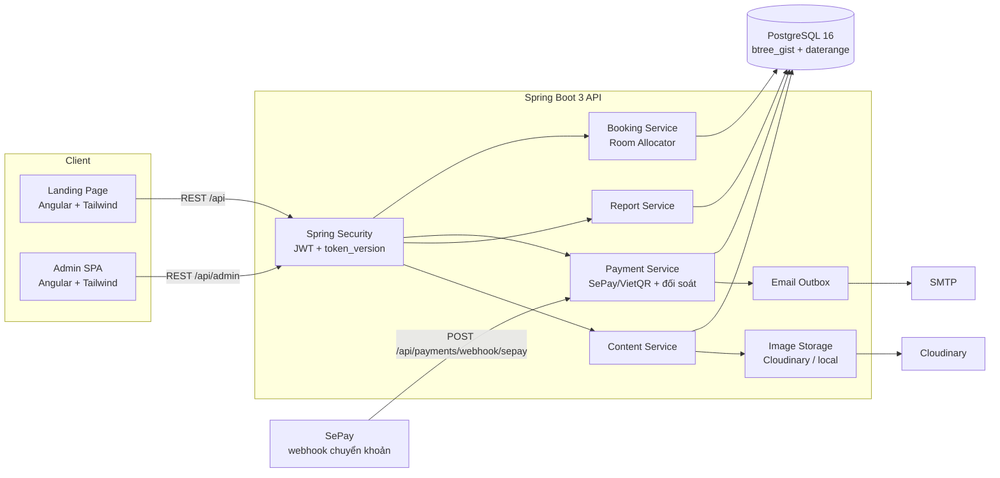
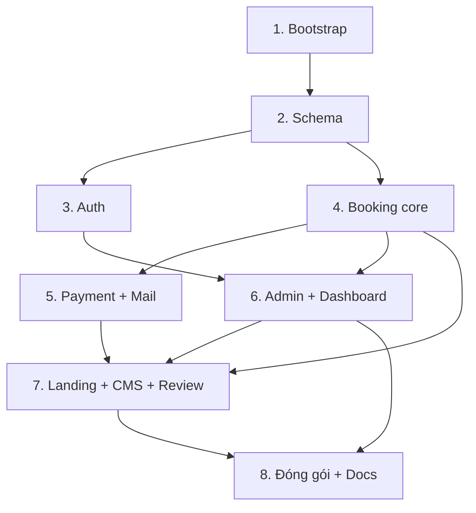

# Homestay TVH — Website giới thiệu & đặt phòng

## Overview

Xây dựng từ đầu (repo trống) một hệ thống đặt phòng homestay hoàn chỉnh trong một monorepo:

- `backend/` — Java 21 + Spring Boot 3.5, PostgreSQL 16, Flyway, Spring Security (JWT), springdoc-openapi.
- `frontend/` — Angular (standalone components + signals) + Tailwind CSS, tự viết component, không dùng Angular Material/PrimeNG.
- `docs/` — tài liệu kỹ thuật tiếng Việt (ERD, use case, sequence, kiến trúc, bảo mật) bằng Mermaid.
- `docker-compose.yml` — dựng Postgres + API + web bằng một lệnh, kèm dữ liệu mẫu.

Điểm kỹ thuật cốt lõi: **chống đặt trùng phòng được khoá ở tầng cơ sở dữ liệu** bằng PostgreSQL `EXCLUDE USING gist` trên `daterange`, không phụ thuộc kiểm tra ở tầng service. Đây là lý do chọn PostgreSQL thay vì MySQL.

## Goals

| # | Goal | Priority |
|---|------|----------|
| 1 | Khách tìm phòng trống theo ngày và đặt phòng thành công, không bao giờ đặt trùng | P1 |
| 2 | Đặt cọc qua QR VietQR/SePay, webhook xác nhận tự động chuyển booking sang CONFIRMED | P1 |
| 3 | Không có nhánh nào để tiền của khách biến mất im lặng — mọi khoản không khớp vào hàng đợi đối soát | P1 |
| 4 | Admin quản lý loại phòng, phòng, booking, đối soát, khuyến mãi, đánh giá và nội dung landing | P1 |
| 5 | Dashboard doanh thu + tỉ lệ lấp đầy phản ánh đúng dữ liệu thật | P2 |
| 6 | `docker compose up` là đủ để chạy toàn bộ hệ thống kèm dữ liệu mẫu | P1 |
| 7 | Tài liệu kỹ thuật tiếng Việt đầy đủ trong `docs/` phục vụ bảo vệ đồ án | P2 |

## Kiến trúc tổng thể

## Phases

| # | Phase | Status | Phụ thuộc | Effort |
|---|-------|--------|-----------|--------|
| 1 | [Phase 1: Khởi tạo monorepo & hạ tầng dev](./phase-01-bootstrap.md) | Pending | — | 5h |
| 2 | [Phase 2: Schema cơ sở dữ liệu & Flyway migration](./phase-02-database-schema.md) | Pending | 1 | 8h |
| 3 | [Phase 3: Xác thực & phân quyền (JWT)](./phase-03-auth.md) | Pending | 2 | 7h |
| 4 | [Phase 4: Lõi đặt phòng & chống trùng lịch](./phase-04-booking-core.md) | Pending | 2 | 13h |
| 5 | [Phase 5: Thanh toán QR, webhook & email](./phase-05-payment-qr.md) | Pending | 4 | 10h |
| 6 | [Phase 6: Trang admin & dashboard](./phase-06-admin-dashboard.md) | Pending | 3, 4 | 13h |
| 7 | [Phase 7: Landing page, CMS nội dung & đánh giá](./phase-07-landing-cms.md) | Pending | 4, 5, 6 | 14h |
| 8 | [Phase 8: Đóng gói, seed & tài liệu](./phase-08-packaging-docs.md) | Pending | 6, 7 | 7h |

### Thứ tự phụ thuộc

**Song song được:** Phase 3 ∥ Phase 4 — hai cây file độc lập (`auth/`, `user/` vs `booking/`, `availability/`), tách được ngay sau khi Phase 2 xong.

**Không song song hoàn toàn:** Phase 6 và Phase 7 chạm cùng khu admin. Bốn màn hình CMS của Phase 7 dùng lại `admin-layout` của Phase 6, nên chúng phải chờ. Phần công khai của Phase 7 (trang chủ, danh sách phòng, luồng đặt phòng, tra cứu) không phụ thuộc Phase 6 và làm song song được — thứ tự trong Phase 7 đã sắp để phần công khai đi trước, khối CMS ở cuối.

`data-table` và `image-uploader` là component dùng chung của cả hai phase, nên chúng được **chốt trong `shared/` ở cuối Phase 4**, trước khi tách nhánh.

**Lưu ý về lịch:** tổng effort là 77h dù có song song. Với một người làm, "song song" chỉ nghĩa là hai phần không chặn nhau về file — nó không rút ngắn tổng thời gian.

## Success Criteria

- [ ] Tìm phòng theo ngày chỉ trả về loại phòng thực sự còn trống, kể cả khi có phòng đang bảo trì
- [ ] Đặt phòng sinh QR đúng số tiền cọc; webhook về → booking `CONFIRMED`; có bản ghi email trong outbox
- [ ] 20 thread đặt cùng 1 phòng cuối → đúng 1 thành công, 19 nhận **409** (không có 500)
- [ ] 3 thread đặt 3 phòng còn lại → cả 3 thành công (kịch bản bắt lỗi thiết kế transaction)
- [ ] Không tồn tại booking có `booking_rooms` lệch `room_quantity`
- [ ] Tiền về sau hạn giữ chỗ → gán lại phòng được thì `CONFIRMED`, không thì vào hàng đợi đối soát — **không nhánh nào im lặng**
- [ ] Admin đăng nhập thấy đúng booking, đổi được trạng thái; dashboard khớp SQL đối chiếu cùng tham số kỳ
- [ ] Tỉ lệ lấp đầy không vượt 100% và không đổi hồi tố khi admin sửa trạng thái phòng
- [ ] Guest tra cứu booking bằng mã + SĐT; user đã đăng ký xem được lịch sử
- [ ] Sau đăng xuất, access token cũ bị từ chối ngay, không chờ hết 15 phút
- [ ] Login sai 11 lần **qua nginx** → 429; đổi `X-Forwarded-For` mỗi lần vẫn 429
- [ ] `docker compose up` chạy toàn bộ, có dữ liệu mẫu; `/swagger-ui` và `/uploads` truy cập được qua cổng 80
- [ ] Sau 90 giây, booking `PENDING_PAYMENT` mẫu vẫn còn (scheduler không ăn dữ liệu demo)
- [ ] `docs/` có ERD 19 bảng, use case, sequence, API, bảo mật — khớp hệ thống đang chạy
- [ ] Không secret nào bị commit, kể cả trong `.env.example`

## Non-goals

Mobile app · đa chi nhánh/multi-tenant · đồng bộ Booking.com/Agoda · kế toán & hoá đơn điện tử · chat realtime · song ngữ Việt–Anh.

## Giả định mặc định (không dừng lại để hỏi)

| Hạng mục | Khi CHƯA có credential thật |
|---|---|
| SePay/VietQR | Code đúng luồng thật, đọc key từ env. Endpoint mô phỏng `POST /api/admin/dev/payments/{transferContent}/simulate-transfer` — cần ADMIN **và** cờ `payments.simulator.enabled`, không nạp ở profile `prod` |
| Cloudinary | Đọc key từ env; thiếu key → `LocalImageStorage` ghi vào `uploads/`, phục vụ qua nginx với `nosniff` |
| SMTP | Đọc từ env; thiếu cấu hình → `LoggingMailSender`. Cả hai đều cập nhật `outbound_emails`, nên bằng chứng gửi luôn tồn tại |
| Ngôn ngữ | Landing chỉ tiếng Việt |

## Quy ước kỹ thuật

- **Tiền tệ:** `NUMERIC(12,2)` VND, không dùng `double`. Frontend format `vi-VN`. Số tiền cọc do backend quyết định.
- **Ngày:** `check_in`/`check_out` là `DATE`, nửa mở `[check_in, check_out)` — trả phòng ngày nào thì ngày đó bán lại được.
- **Múi giờ:** DB `TIMESTAMPTZ`; container và JVM đặt `TZ=Asia/Ho_Chi_Minh` **và** `-Duser.timezone=Asia/Ho_Chi_Minh`; code dùng `LocalDate.now(ZoneId.of("Asia/Ho_Chi_Minh"))` tường minh; mọi `date_trunc` kèm `AT TIME ZONE 'Asia/Ho_Chi_Minh'`. Chỉ đặt `spring.jackson.time-zone` là **không đủ** — nó chỉ chi phối serialization JSON.
- **Profile:** chỉ hai — `demo` (dev và bản đem bảo vệ) và `prod`. Mỗi tính năng gate bằng cờ riêng, không gate bằng profile chồng chéo.
- **Secret:** chỉ qua biến môi trường, **không có giá trị mặc định** ở bất kỳ đâu kể cả `.env.example`; app fail fast khi thiếu; `scripts/init-env.sh` sinh ngẫu nhiên lúc dựng lần đầu.
- **Phân quyền:** `SecurityConfig` kết thúc bằng `anyRequest().denyAll()`. Ma trận phân quyền ở Phase 3 là hợp đồng duy nhất; `EndpointAuthorizationIT` fail nếu có endpoint nào không nằm trong ma trận.
- **API response:** lỗi theo RFC 7807 `application/problem+json` với `code` ổn định.
- **Đặt tên:** Java PascalCase/camelCase; file Angular kebab-case; bảng/cột SQL snake_case.

## Red Team Review

### Session — 2026-09-07

**Findings:** 40 thô → 23 sau khử trùng lặp (23 nhận, 0 bác, 1 nhận có sửa đổi)
**Severity breakdown:** 6 Critical, 9 High, 8 Medium
**Reviewers:** Security Adversary (Fact Checker), Failure Mode Analyst (Flow Tracer), Assumption Destroyer (Scope Auditor), Scope & Complexity Critic (Contract Verifier)

Repo trống nên yêu cầu bằng chứng `file:line` được áp vào **chính file kế hoạch**, cộng kiểm chứng mọi khẳng định kỹ thuật bên ngoài với tài liệu gốc. Không finding nào bị lọc vì thiếu bằng chứng.

| # | Finding | Severity | Disposition | Applied To |
|---|---|---|---|---|
| 1 | Vòng thử phòng bắt `23P01` rồi thử tiếp trong cùng `@Transactional` là bất khả thi — PostgreSQL abort transaction, lệnh sau trả `25P02`; Spring đánh dấu rollback-only | Critical | Accept | Phase 4 |
| 2 | Truy vấn phòng trống dùng `HAVING` với alias và không `GROUP BY` → không parse được; đồng thời trừ hai lần phòng `MAINTENANCE` có booking | Critical | Accept | Phase 4 |
| 3 | Đua webhook ↔ scheduler hết hạn: tiền vào tài khoản, booking `EXPIRED`, `external_id` đã ghi nên không xử lý lại được | Critical | Accept | Phase 2, 4, 5 |
| 4 | `PARTIAL` giữ `PENDING_PAYMENT` nhưng scheduler quét đúng trạng thái đó → xoá booking đã có tiền thật | Critical | Accept | Phase 4, 5 |
| 5 | Xung đột 4 profile: endpoint mô phỏng lọt vào bản compose không auth; Swagger và `/uploads` không truy cập được | Critical | Accept | Phase 1, 5, 8 |
| 6 | Secret có giá trị mặc định trong bản demo → tự ký JWT `role=ADMIN`; lệnh quét secret loại trừ đúng file `.example` chứa chúng | Critical | Accept | Phase 1, 3, 8 |
| 7 | Rate limit theo IP vô hiệu sau nginx (thiếu `X-Forwarded-For`) → giới hạn toàn hệ thống, DoS một dòng curl | Critical | Accept | Phase 3, 8 |
| 8 | Ma trận phân quyền thiếu ≥6 endpoint; mặc định phải là đóng | High | Accept | Phase 3 |
| 9 | Mã booking vừa là bí mật xác thực vừa là nội dung chuyển khoản công khai; `cancel`/`review`/`payment-status` không rate limit | High | Accept | Phase 2, 3, 4 |
| 10 | `POST /api/bookings` không có rào chống tự động hoá → khoá kín kho phòng chi phí 0đ, mail rác qua `guestEmail` tuỳ ý | High | Accept | Phase 3, 4 |
| 11 | Webhook bỏ qua `transferType` in/out và `accountNumber`; regex không neo; thiếu body `{"success": true}` nên SePay retry 7 lần | High | Accept | Phase 5 |
| 12 | Upload SVG vượt kiểm tra magic bytes + refresh token trong `localStorage` → đánh cắp phiên ADMIN | High | Accept | Phase 3, 6 |
| 13 | `spring.jackson.time-zone` không đặt múi giờ JVM → lệch một ngày ở khung 00:00–07:00 | High | Accept | Phase 1, 4, 6 |
| 14 | `room_quantity` và `booking_rooms` không có ràng buộc buộc khớp → gán một phần | High | Accept | Phase 2, 4 |
| 15 | Scheduler bulk `UPDATE` không ghi `booking_status_history` dù kế hoạch tuyên bố "mọi lần chuyển trạng thái đều ghi" | High | Accept | Phase 4 |
| 16 | Schema: 18 bảng chứ không phải 16; 6 bảng không có định nghĩa cột; **thiếu CHECK trên `booking_rooms.status`** → ghi nhầm `'Active'` là phòng bị đặt trùng âm thầm | High | Accept | Phase 2 |
| 17 | Tỉ lệ lấp đầy dùng mẫu số theo trạng thái hiện tại → vượt 100% và đổi hồi tố; câu SQL "đối chiếu tuyệt đối" không cùng tham số kỳ | High | Accept | Phase 6 |
| 18 | Tuyên bố Phase 6 ∥ Phase 7 tự mâu thuẫn — Phase 7 dùng `data-table` của Phase 6; `dependencies` thiếu 6 | High | Accept | plan.md, Phase 4, 6, 7 |
| 19 | Cổng `btree_gist` gác nhầm cửa: phương án lùi `SELECT FOR UPDATE` bị chính Phase 4 phủ nhận; rủi ro thật là môi trường buổi bảo vệ | High | Accept | Phase 1 |
| 20 | Seed qua Flyway `V900` gây lệch `flyway_schema_history` khi đổi profile; scheduler ăn dữ liệu demo trong 60 giây; câu rollback sai | Medium | Accept | Phase 8 |
| 21 | `transfer_content` UNIQUE khiến mỗi booking chỉ có 1 payment; QR cũ khớp nhầm booking đã chết; thừa tiền không có cột để đánh dấu | Medium | Accept | Phase 2, 5 |
| 22 | Email không có bằng chứng gửi, không retry; `AFTER_COMMIT` vs `@Async` mâu thuẫn giữa hai mục | Medium | Accept | Phase 2, 5, 6 |
| 23 | CSV injection qua `guestName`; `used_count` khuyến mãi chỉ tăng không giảm và `usage_limit IS NULL` từ chối mọi mã vô hạn; PII trong query param; lệnh verify sai (`TVH$CODE`, số tiền cọc); danh sách dependency thiếu 4 thư viện | Medium | Accept | Phase 1, 4, 6, 7 |
| 24 | Chuyển webhook sang HMAC-SHA256 + whitelist IP | High | Accept (modified) | Phase 5, 8 |

**Finding 24 — sửa đổi:** đúng về bảo mật nhưng phụ thuộc gói tài khoản SePay của người dùng, nên không đặt làm yêu cầu chặn. Ghi thành khuyến nghị trong `docs/bao-mat.md`; các kiểm tra miễn phí (`transferType`, `accountNumber`, regex neo, body phản hồi) vẫn bắt buộc.

**Ba quyết định chính sách do người dùng chốt:**

1. Tiền về sau hạn giữ chỗ → hệ thống **tự gán lại phòng cùng loại**; hết phòng thì chuyển `AWAITING_REVIEW` cho admin xử lý.
2. Dashboard **dùng thư viện biểu đồ** — ràng buộc "tự viết component" áp cho UI component library, không áp cho thư viện vẽ biểu đồ.
3. Lighthouse Accessibility ≥ 90 **hạ xuống mục tiêu chất lượng**, không còn là cổng chặn của Phase 7.

### Whole-Plan Consistency Sweep

Đã đọc lại `plan.md` và cả 8 file phase sau khi áp dụng. Các thay đổi lan truyền đã được đối chiếu:

- Số bảng: 19 (thêm `outbound_emails` so với 18 mà reviewer đếm được) — đồng bộ ở Phase 2 và Phase 8.
- Tập trạng thái booking: 8 giá trị gồm `AWAITING_REVIEW` — đồng bộ ở Phase 2 (CHECK), Phase 4 (state machine), Phase 5 (bảng quyết định), Phase 6 (bộ lọc).
- `transfer_content` = mã + 2 chữ số `attempt_no` — đồng bộ ở Phase 2, 4, 5; lệnh verify không còn nhân đôi tiền tố `TVH`.
- `access_token` cho thao tác guest — đồng bộ ở Phase 2, 3 (ma trận), 4, 5, 7.
- Profile chỉ còn `demo` và `prod` — đồng bộ ở Phase 1, 3, 5, 8.
- `data-table` và `image-uploader` chuyển về `shared/` ở Phase 4 — đồng bộ ở Phase 4, 6, 7 và bảng phụ thuộc trong `plan.md`.
- Effort tổng cập nhật 66h → 77h theo phạm vi đã bổ sung.

Không còn mâu thuẫn chưa giải quyết.

## Open questions

1. Có tài khoản SePay + ngân hàng thật để đối soát không? (chưa có → dùng endpoint mô phỏng có ADMIN + cờ ở Phase 5)
2. Cloudinary cloud name / API key? (chưa có → fallback lưu ổ đĩa)
3. SMTP Gmail app password hay Mailtrap? (chưa có → `LoggingMailSender`, outbox vẫn ghi nhận)
4. Số phòng thực tế của Homestay TVH (bao nhiêu loại, mỗi loại mấy phòng, giá bao nhiêu) để seed đúng thực tế?
5. **Máy dùng lúc bảo vệ có Docker và có mạng không?** Cần trả lời ở Phase 1 — đây là rủi ro môi trường duy nhất có thể phá toàn bộ kịch bản demo.

<!-- slug: homestay-tvh-booking -->
