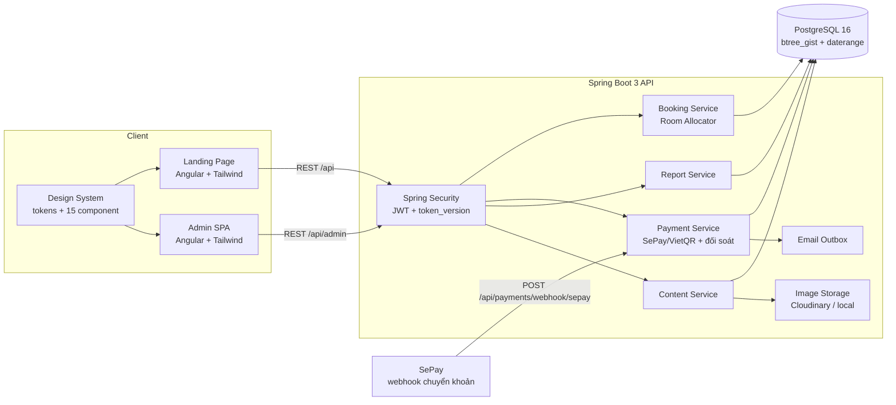
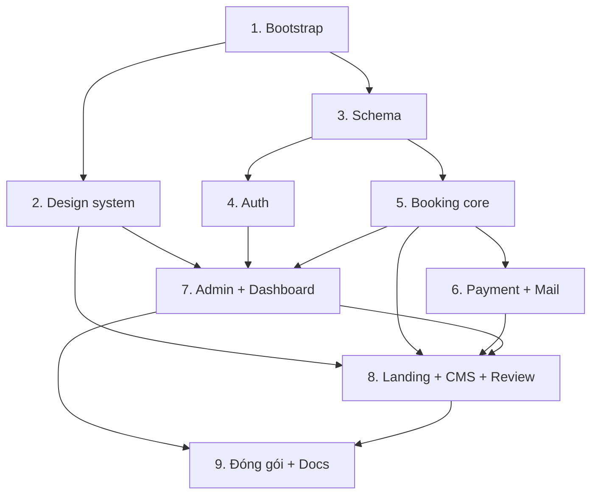

# Homestay TVH — Website giới thiệu & đặt phòng

## Overview

Xây dựng từ đầu (repo trống) một hệ thống đặt phòng homestay hoàn chỉnh trong một monorepo:

- `backend/` — Java 21 + Spring Boot 3.5, PostgreSQL 16, Flyway, Spring Security (JWT), springdoc-openapi.
- `frontend/` — Angular (standalone components + signals) + Tailwind CSS, **design system tự viết**, không dùng Angular Material/PrimeNG.
- `docs/` — tài liệu kỹ thuật tiếng Việt (ERD, use case, sequence, kiến trúc, bảo mật, thiết kế giao diện) bằng Mermaid.
- `docker-compose.yml` — dựng Postgres + API + web bằng một lệnh, kèm dữ liệu mẫu.

Hai điểm được đặt ngang hàng nhau:

**Về kỹ thuật:** chống đặt trùng phòng khoá ở tầng cơ sở dữ liệu bằng PostgreSQL `EXCLUDE USING gist` trên `daterange`, không phụ thuộc kiểm tra ở tầng service. Đây là lý do chọn PostgreSQL thay vì MySQL.

**Về giao diện:** chuẩn tham chiếu là Booking.com và Agoda, nhưng lấy có chọn lọc — lấy phần điều hướng và minh bạch giá của họ, từ chối nhóm pattern tạo áp lực giả, và thay bằng phiên bản trung thực mà hệ thống có dữ liệu thật để nói.

## Goals

| # | Goal | Priority |
|---|------|----------|
| 1 | Khách tìm phòng trống theo ngày và đặt phòng thành công, không bao giờ đặt trùng | P1 |
| 2 | Đặt cọc qua QR VietQR/SePay, webhook xác nhận tự động chuyển booking sang CONFIRMED | P1 |
| 3 | Không có nhánh nào để tiền của khách biến mất im lặng — mọi khoản không khớp vào hàng đợi đối soát | P1 |
| 4 | Giao diện đạt chuẩn trang đặt phòng thương mại: design system nhất quán, mobile-first, mọi trạng thái đều được thiết kế | P1 |
| 5 | Admin quản lý loại phòng, phòng, booking, đối soát, khuyến mãi, đánh giá và nội dung landing | P1 |
| 6 | Dashboard doanh thu + tỉ lệ lấp đầy phản ánh đúng dữ liệu thật | P2 |
| 7 | `docker compose up` là đủ để chạy toàn bộ hệ thống kèm dữ liệu mẫu | P1 |
| 8 | Tài liệu kỹ thuật tiếng Việt đầy đủ trong `docs/` phục vụ bảo vệ đồ án | P2 |

## Kiến trúc tổng thể

## Phases

| # | Phase | Status | Phụ thuộc | Effort |
|---|-------|--------|-----------|--------|
| 1 | [Phase 1: Khởi tạo monorepo & hạ tầng dev](./phase-01-bootstrap.md) | Done | — | 5h |
| 2 | [Phase 2: Design system & UI kit](./phase-02-design-system.md) | Done | 1 | 12h |
| 3 | [Phase 3: Schema cơ sở dữ liệu & Flyway migration](./phase-03-database-schema.md) | Done | 1 | 8h |
| 4 | [Phase 4: Xác thực & phân quyền (JWT)](./phase-04-auth.md) | Pending | 3 | 7h |
| 5 | [Phase 5: Lõi đặt phòng & chống trùng lịch](./phase-05-booking-core.md) | Pending | 3 | 11h |
| 6 | [Phase 6: Thanh toán QR, webhook & email](./phase-06-payment-qr.md) | Pending | 5 | 10h |
| 7 | [Phase 7: Trang admin & dashboard](./phase-07-admin-dashboard.md) | Pending | 2, 4, 5 | 14h |
| 8 | [Phase 8: Landing page, CMS nội dung & đánh giá](./phase-08-landing-cms.md) | Pending | 2, 5, 6, 7 | 16h |
| 9 | [Phase 9: Đóng gói, seed & tài liệu](./phase-09-packaging-docs.md) | Pending | 7, 8 | 7h |

### Thứ tự phụ thuộc

**Song song được — hai cặp:**

- **Phase 2 ∥ Phase 3** ngay sau Phase 1. Design system là công việc frontend thuần, không cần cơ sở dữ liệu hay API; schema là backend thuần. Đây là cặp song song sạch nhất của cả dự án, và là lý do design system được đặt ở vị trí thứ hai chứ không phải ngay trước phase giao diện.
- **Phase 4 ∥ Phase 5** sau khi Phase 3 xong — hai cây file độc lập (`auth/`, `user/` vs `booking/`, `availability/`).

**Không song song hoàn toàn:** bốn màn hình CMS của Phase 8 nằm trong khu admin và dùng lại `admin-layout` của Phase 7, nên chúng phải chờ. Phần công khai của Phase 8 (trang chủ, danh sách phòng, luồng đặt phòng, tra cứu) chỉ cần Phase 2, 5, 6 nên làm song song với Phase 7 được — thứ tự trong Phase 8 đã sắp để phần công khai đi trước, khối CMS ở cuối.

**Lưu ý về lịch:** tổng effort là 90h dù có song song. Với một người làm, "song song" chỉ nghĩa là hai phần không chặn nhau về file — nó không rút ngắn tổng thời gian.

## Success Criteria

**Nghiệp vụ và dữ liệu**

- [ ] Tìm phòng theo ngày chỉ trả về loại phòng thực sự còn trống, kể cả khi có phòng đang bảo trì
- [ ] Đặt phòng sinh QR đúng số tiền cọc; webhook về → booking `CONFIRMED`; có bản ghi email trong outbox
- [ ] 20 thread đặt cùng 1 phòng cuối → đúng 1 thành công, 19 nhận **409** (không có 500)
- [ ] 3 thread đặt 3 phòng còn lại → cả 3 thành công (kịch bản bắt lỗi thiết kế transaction)
- [ ] Không tồn tại booking có `booking_rooms` lệch `room_quantity`
- [ ] Tiền về sau hạn giữ chỗ → gán lại phòng được thì `CONFIRMED`, không thì vào hàng đợi đối soát — **không nhánh nào im lặng**
- [ ] Admin đăng nhập thấy đúng booking, đổi được trạng thái; dashboard khớp SQL đối chiếu cùng tham số kỳ
- [ ] Tỉ lệ lấp đầy không vượt 100% và không đổi hồi tố khi admin sửa trạng thái phòng
- [ ] Guest tra cứu booking bằng mã + SĐT; user đã đăng ký xem được lịch sử

**Giao diện — kiểm được bằng mắt hoặc bằng lệnh**

- [ ] `check-hardcoded-colors.mjs` thoát 0 — không mã màu nào nằm ngoài bảng token
- [ ] Trang `/ui-kit` render đủ 15 component ở mọi trạng thái đã khai báo
- [ ] Đi Tab qua bất kỳ trang nào: mọi thành phần tương tác có vòng focus nhìn thấy được
- [ ] Ở 360px không trang nào cuộn ngang; mọi nút và ô nhập có hộp bao ≥ 44×44px
- [ ] Tổng tiền cả kỳ nghỉ xuất hiện trên thẻ loại phòng và ở cả 3 bước đặt phòng
- [ ] Ngày đã hết phòng không bấm chọn được trong date picker
- [ ] Bật "giảm chuyển động" của hệ điều hành → không hiệu ứng nào chạy
- [ ] Không có `outline: none` nào trong mã nguồn
- [ ] Hộp thoại xác nhận hành động phá huỷ nêu đúng hậu quả, không phải "Bạn có chắc không?"

**Bảo mật và vận hành**

- [ ] Sau đăng xuất, access token cũ bị từ chối ngay, không chờ hết 15 phút
- [ ] Login sai 11 lần **qua nginx** → 429; đổi `X-Forwarded-For` mỗi lần vẫn 429
- [ ] `docker compose up` chạy toàn bộ, có dữ liệu mẫu; `/swagger-ui` và `/uploads` truy cập được qua cổng 80
- [ ] Sau 90 giây, booking `PENDING_PAYMENT` mẫu vẫn còn (scheduler không ăn dữ liệu demo)
- [ ] `docs/` có ERD 19 bảng, use case, sequence, API, bảo mật, thiết kế giao diện — khớp hệ thống đang chạy
- [ ] Không secret nào bị commit, kể cả trong `.env.example`

## Non-goals

Mobile app · đa chi nhánh/multi-tenant · đồng bộ Booking.com/Agoda · kế toán & hoá đơn điện tử · chat realtime · song ngữ Việt–Anh.

## Giả định mặc định (không dừng lại để hỏi)

| Hạng mục | Khi CHƯA có credential thật |
|---|---|
| SePay/VietQR | Code đúng luồng thật, đọc key từ env. Endpoint mô phỏng `POST /api/admin/dev/payments/{transferContent}/simulate-transfer` — cần ADMIN **và** cờ `payments.simulator.enabled`, không nạp ở profile `prod` |
| Cloudinary | Đọc key từ env; thiếu key → `LocalImageStorage` ghi vào `uploads/`, phục vụ qua nginx với `nosniff` |
| SMTP | Đọc từ env; thiếu cấu hình → `LoggingMailSender`. Cả hai đều cập nhật `outbound_emails`, nên bằng chứng gửi luôn tồn tại |
| Ngôn ngữ | Landing chỉ tiếng Việt |

## Quy ước kỹ thuật

- **Tiền tệ:** `NUMERIC(12,2)` VND, không dùng `double`. Frontend format `vi-VN`. Số tiền cọc do backend quyết định; frontend chỉ hiển thị.
- **Ngày:** `check_in`/`check_out` là `DATE`, nửa mở `[check_in, check_out)` — trả phòng ngày nào thì ngày đó bán lại được.
- **Múi giờ:** DB `TIMESTAMPTZ`; container và JVM đặt `TZ=Asia/Ho_Chi_Minh` **và** `-Duser.timezone=Asia/Ho_Chi_Minh`; code dùng `LocalDate.now(ZoneId.of("Asia/Ho_Chi_Minh"))` tường minh; mọi `date_trunc` kèm `AT TIME ZONE 'Asia/Ho_Chi_Minh'`. Chỉ đặt `spring.jackson.time-zone` là **không đủ**.
- **Profile:** chỉ hai — `demo` (dev và bản đem bảo vệ) và `prod`. Mỗi tính năng gate bằng cờ riêng.
- **Secret:** chỉ qua biến môi trường, **không có giá trị mặc định** ở bất kỳ đâu kể cả `.env.example`; app fail fast khi thiếu.
- **Phân quyền:** `SecurityConfig` kết thúc bằng `anyRequest().denyAll()`. Ma trận ở Phase 4 là hợp đồng duy nhất; `EndpointAuthorizationIT` fail nếu có endpoint ngoài ma trận.
- **API response:** lỗi theo RFC 7807 `application/problem+json` với `code` ổn định.
- **Giao diện:** mọi màu, cỡ chữ, khoảng cách đọc từ `tokens.css` (Phase 2). Không mã màu hard-code — có lint chặn. Vùng chạm mobile ≥ 44px, chữ nội dung ≥ 16px. Mọi thành phần tương tác có `focus-visible`; không dùng `outline: none`.
- **Trung thực số liệu:** không hiển thị con số nào mà hệ thống không truy vết được về một hàng trong cơ sở dữ liệu. Chi tiết và lý do ở `docs/thiet-ke-giao-dien.md`.
- **Đặt tên:** Java PascalCase/camelCase; file Angular kebab-case; bảng/cột SQL snake_case.

## Nguyên tắc thiết kế giao diện

Chuẩn tham chiếu là Booking.com và Agoda. Bảng dưới là những gì lấy, những gì từ chối, và thay bằng gì. Đầy đủ ở `phase-02-design-system.md` và `docs/thiet-ke-giao-dien.md`.

| Lấy từ Agoda | Lấy từ Booking | Cố tình làm khác |
|---|---|---|
| Khoảng trắng rộng, tương phản cao | **Tổng tiền cả kỳ** hiện ở mọi bước, không chỉ giá/đêm | "Còn 2 phòng" — số thật từ `availableCount` có `EXCLUDE` bảo chứng |
| Mờ nền khi focus ô tìm kiếm | Khối đánh giá ngay dưới phần chọn phòng | Đồng hồ đếm ngược chỉ dùng cho hạn giữ chỗ thật trong DB |
| Nav dính ở trang chi tiết | Chặn sẵn ngày hết phòng trong date picker | **Không** có "X người đang xem" — hệ thống không đo được thì không nói |
| Gallery 1 ảnh lớn + 2 nhỏ | Giá từng đêm hiện trên ô ngày | |

**Bảng màu đã chốt (08.09.2026).** Homestay TVH chưa có bộ nhận diện thương hiệu, và người dùng chốt dùng bảng màu ở Phase 2. Nghĩa là `tokens.css` **không còn là đề xuất tạm — nó chính là định nghĩa thương hiệu** của dự án: xanh rừng `#0F5C4C` cho hành động chính, đất nung `#B03A0B` cho giá tiền, trên nền giấy ấm `#FBF9F6`. Trang `/ui-kit` trở thành tài liệu tham chiếu thương hiệu, và `docs/thiet-ke-giao-dien.md` ghi lại lựa chọn kèm số đo tương phản. Nếu sau này có logo, việc cần làm là thay giá trị trong `tokens.css` — không component nào phải sửa.

Cột thứ ba là quyết định có ý thức. Nhóm pattern tạo áp lực giả là thứ dễ nhận ra nhất ở hai trang tham chiếu, và Booking.com đã bị cơ quan quản lý châu Âu xử lý vì nó. Với đồ án tốt nghiệp, chép chúng là tự tạo một câu hỏi không trả lời được. Hệ thống này có dữ liệu thật để nói cùng một điều — nên nói thật.

## Red Team Review

### Session — 2026-09-07

**Findings:** 40 thô → 23 sau khử trùng lặp (23 nhận, 0 bác, 1 nhận có sửa đổi)
**Severity breakdown:** 6 Critical, 9 High, 8 Medium
**Reviewers:** Security Adversary (Fact Checker), Failure Mode Analyst (Flow Tracer), Assumption Destroyer (Scope Auditor), Scope & Complexity Critic (Contract Verifier)

Repo trống nên yêu cầu bằng chứng `file:line` được áp vào **chính file kế hoạch**, cộng kiểm chứng mọi khẳng định kỹ thuật bên ngoài với tài liệu gốc. Không finding nào bị lọc vì thiếu bằng chứng.

Số phase trong cột "Applied To" đã cập nhật theo cách đánh số mới (chèn Design system vào vị trí 2).

| # | Finding | Severity | Disposition | Applied To |
|---|---|---|---|---|
| 1 | Vòng thử phòng bắt `23P01` rồi thử tiếp trong cùng `@Transactional` là bất khả thi — PostgreSQL abort transaction, lệnh sau trả `25P02`; Spring đánh dấu rollback-only | Critical | Accept | Phase 5 |
| 2 | Truy vấn phòng trống dùng `HAVING` với alias và không `GROUP BY` → không parse được; đồng thời trừ hai lần phòng `MAINTENANCE` có booking | Critical | Accept | Phase 5 |
| 3 | Đua webhook ↔ scheduler hết hạn: tiền vào tài khoản, booking `EXPIRED`, `external_id` đã ghi nên không xử lý lại được | Critical | Accept | Phase 3, 5, 6 |
| 4 | `PARTIAL` giữ `PENDING_PAYMENT` nhưng scheduler quét đúng trạng thái đó → xoá booking đã có tiền thật | Critical | Accept | Phase 5, 6 |
| 5 | Xung đột 4 profile: endpoint mô phỏng lọt vào bản compose không auth; Swagger và `/uploads` không truy cập được | Critical | Accept | Phase 1, 6, 9 |
| 6 | Secret có giá trị mặc định trong bản demo → tự ký JWT `role=ADMIN`; lệnh quét secret loại trừ đúng file `.example` chứa chúng | Critical | Accept | Phase 1, 4, 9 |
| 7 | Rate limit theo IP vô hiệu sau nginx (thiếu `X-Forwarded-For`) → giới hạn toàn hệ thống, DoS một dòng curl | Critical | Accept | Phase 4, 9 |
| 8 | Ma trận phân quyền thiếu ≥6 endpoint; mặc định phải là đóng | High | Accept | Phase 4 |
| 9 | Mã booking vừa là bí mật xác thực vừa là nội dung chuyển khoản công khai; `cancel`/`review`/`payment-status` không rate limit | High | Accept | Phase 3, 4, 5 |
| 10 | `POST /api/bookings` không có rào chống tự động hoá → khoá kín kho phòng chi phí 0đ, mail rác qua `guestEmail` tuỳ ý | High | Accept | Phase 4, 5 |
| 11 | Webhook bỏ qua `transferType` in/out và `accountNumber`; regex không neo; thiếu body `{"success": true}` nên SePay retry 7 lần | High | Accept | Phase 6 |
| 12 | Upload SVG vượt kiểm tra magic bytes + refresh token trong `localStorage` → đánh cắp phiên ADMIN | High | Accept | Phase 4, 7 |
| 13 | `spring.jackson.time-zone` không đặt múi giờ JVM → lệch một ngày ở khung 00:00–07:00 | High | Accept | Phase 1, 5, 7 |
| 14 | `room_quantity` và `booking_rooms` không có ràng buộc buộc khớp → gán một phần | High | Accept | Phase 3, 5 |
| 15 | Scheduler bulk `UPDATE` không ghi `booking_status_history` dù kế hoạch tuyên bố "mọi lần chuyển trạng thái đều ghi" | High | Accept | Phase 5 |
| 16 | Schema: 18 bảng chứ không phải 16; 6 bảng không có định nghĩa cột; **thiếu CHECK trên `booking_rooms.status`** → ghi nhầm `'Active'` là phòng bị đặt trùng âm thầm | High | Accept | Phase 3 |
| 17 | Tỉ lệ lấp đầy dùng mẫu số theo trạng thái hiện tại → vượt 100% và đổi hồi tố; câu SQL "đối chiếu tuyệt đối" không cùng tham số kỳ | High | Accept | Phase 7 |
| 18 | Tuyên bố song song tự mâu thuẫn — phase landing dùng `data-table` của phase admin; `dependencies` thiếu | High | Accept | plan.md, Phase 5, 7, 8 |
| 19 | Cổng `btree_gist` gác nhầm cửa: phương án lùi `SELECT FOR UPDATE` bị chính phase booking phủ nhận; rủi ro thật là môi trường buổi bảo vệ | High | Accept | Phase 1 |
| 20 | Seed qua Flyway `V900` gây lệch `flyway_schema_history` khi đổi profile; scheduler ăn dữ liệu demo trong 60 giây; câu rollback sai | Medium | Accept | Phase 9 |
| 21 | `transfer_content` UNIQUE khiến mỗi booking chỉ có 1 payment; QR cũ khớp nhầm booking đã chết; thừa tiền không có cột để đánh dấu | Medium | Accept | Phase 3, 6 |
| 22 | Email không có bằng chứng gửi, không retry; `AFTER_COMMIT` vs `@Async` mâu thuẫn giữa hai mục | Medium | Accept | Phase 3, 6, 7 |
| 23 | CSV injection qua `guestName`; `used_count` khuyến mãi chỉ tăng không giảm và `usage_limit IS NULL` từ chối mọi mã vô hạn; PII trong query param; lệnh verify sai; danh sách dependency thiếu 4 thư viện | Medium | Accept | Phase 1, 5, 7, 8 |
| 24 | Chuyển webhook sang HMAC-SHA256 + whitelist IP | High | Accept (modified) | Phase 6, 9 |

**Finding 24 — sửa đổi:** đúng về bảo mật nhưng phụ thuộc gói tài khoản SePay của người dùng, nên không đặt làm yêu cầu chặn. Ghi thành khuyến nghị trong `docs/bao-mat.md`; các kiểm tra miễn phí (`transferType`, `accountNumber`, regex neo, body phản hồi) vẫn bắt buộc.

**Ba quyết định chính sách do người dùng chốt:**

1. Tiền về sau hạn giữ chỗ → hệ thống **tự gán lại phòng cùng loại**; hết phòng thì chuyển `AWAITING_REVIEW` cho admin xử lý.
2. Dashboard **dùng thư viện biểu đồ** — ràng buộc "tự viết component" áp cho UI component library, không áp cho thư viện vẽ biểu đồ.
3. Lighthouse Accessibility ≥ 90 **là mục tiêu chất lượng**, không phải cổng chặn của phase landing.

### Vòng cập nhật UI/UX — 2026-09-08

Người dùng nâng UI/UX lên ngang hàng với backend, chuẩn tham chiếu Booking.com và Agoda. Thay đổi cấu trúc:

- Chèn **Phase 2 — Design system & UI kit** (12h) ngay sau Bootstrap; các phase cũ 2–8 dời thành 3–9.
- Thư viện component chuyển từ cuối phase booking core sang Phase 2. Phase booking core giảm 13h → 11h vì chỉ còn hai service gọi API.
- Phase admin 13h → 14h, phase landing 14h → 16h do bổ sung yêu cầu UX (chip lọc, hộp thoại nêu hậu quả, đủ 6 trạng thái mỗi màn hình, thanh dính mobile).
- Tổng effort 77h → 90h.
- Bổ sung tiêu chí nghiệm thu giao diện dạng kiểm được bằng lệnh, và `docs/thiet-ke-giao-dien.md`.
- Người dùng xác nhận chưa có logo và chốt dùng bảng màu do Phase 2 đề xuất — bảng token trở thành định nghĩa thương hiệu của dự án, không còn là phương án tạm.

Quyết định thiết kế đáng chú ý: **từ chối nhóm dark pattern** của hai trang tham chiếu và thay bằng phiên bản trung thực dựa trên dữ liệu thật của hệ thống. Xem mục "Nguyên tắc thiết kế giao diện" ở trên.

### Whole-Plan Consistency Sweep

Đã đọc lại `plan.md` và cả 9 file phase sau khi áp dụng cả hai vòng. Các thay đổi lan truyền đã được đối chiếu:

- Số bảng: 19 — đồng bộ ở Phase 3 và Phase 9.
- Tập trạng thái booking: 8 giá trị gồm `AWAITING_REVIEW` — đồng bộ ở Phase 3 (CHECK), Phase 5 (state machine), Phase 6 (bảng quyết định), Phase 7 (bộ lọc, badge).
- `transfer_content` = mã + 2 chữ số `attempt_no` — đồng bộ ở Phase 3, 5, 6.
- `access_token` cho thao tác guest — đồng bộ ở Phase 3, 4 (ma trận), 5, 6, 8.
- Profile chỉ còn `demo` và `prod` — đồng bộ ở Phase 1, 4, 6, 9; trang `/ui-kit` cũng gate bằng `demo`.
- Thư viện component: mọi tham chiếu `shared/` trong Phase 5, 7, 8 giờ trỏ về `shared/ui/` do Phase 2 xây; không phase nào còn tự tạo component UI.
- Đánh số phase: mọi tham chiếu chéo trong 9 file và trong bảng red-team đã dời theo ánh xạ 2→3 … 8→9.
- `ui-date-range-picker` (Phase 2) nhận bản đồ `{ngày: {giá, còn phòng}}` từ `availability.service.ts` (Phase 5) — hợp đồng dữ liệu này được nêu ở cả hai phase.

Không còn mâu thuẫn chưa giải quyết.

## Nguồn tham khảo

- Đối chiếu UI/UX Booking.com vs Agoda: https://blog.snappymob.com/ui-ux-audit-booking-com-vs-agoda
- Baymard Institute, benchmark trang đặt chỗ lưu trú 2024: https://baymard.com/blog/travel-accommodations-2024-benchmark
- Phân tích pattern khan hiếm của Booking.com: https://uxdesign.cc/only-one-room-left-244fa7e1f434
- PostgreSQL SELECT (HAVING / GROUP BY): https://www.postgresql.org/docs/16/sql-select.html
- PostgreSQL range types & exclusion constraints: https://www.postgresql.org/docs/16/rangetypes.html
- Spring — rollback rules: https://docs.spring.io/spring-framework/reference/data-access/transaction/declarative/rolling-back.html
- SePay webhook (payload, xác thực, retry): https://docs.sepay.vn/tich-hop-webhooks.html
- nginx proxy module (header mặc định): https://nginx.org/en/docs/http/ngx_http_proxy_module.html
- OWASP CSV injection: https://owasp.org/www-community/attacks/CSV_Injection

## Open questions

1. Có tài khoản SePay + ngân hàng thật để đối soát không? (chưa có → dùng endpoint mô phỏng có ADMIN + cờ ở Phase 6)
2. Cloudinary cloud name / API key? (chưa có → fallback lưu ổ đĩa)
3. SMTP Gmail app password hay Mailtrap? (chưa có → `LoggingMailSender`, outbox vẫn ghi nhận)
4. Số phòng thực tế của Homestay TVH (bao nhiêu loại, mỗi loại mấy phòng, giá bao nhiêu) để seed đúng thực tế?
5. **Máy dùng lúc bảo vệ có Docker và có mạng không?** Cần trả lời ở Phase 1.

<!-- slug: homestay-tvh-booking -->
