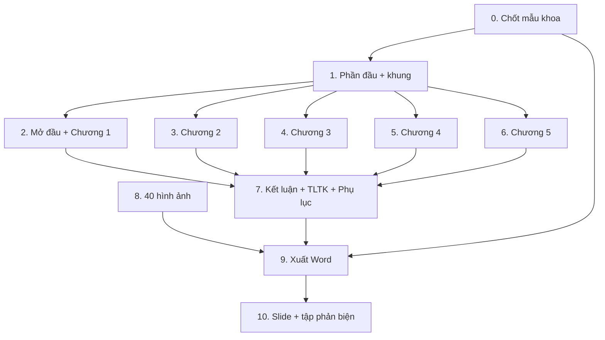

# Kế hoạch viết báo cáo đồ án tốt nghiệp

## Bối cảnh

Hệ thống đã xong 10 phase. `docs/huong-dan-lam-bao-cao.md` (2086 dòng) đã có **nội
dung** đủ cho cả 5 chương, nhưng đó là đề cương chứ chưa phải quyển báo cáo:
nhiều mục mới có khung và ví dụ mẫu, chưa viết đủ; chưa có hình; chưa định dạng.

Việc còn lại là **mở rộng và hoàn thiện**, không phải viết lại từ đầu.

## Mẫu trình bày — ĐÃ CÓ BẢN CHÍNH THỨC (20/09/2026)

> **Cập nhật quan trọng.** Người dùng đã cung cấp hai văn bản chính thức của
> **Khoa Kỹ thuật và Công nghệ — Trường Đại học Trà Vinh**: *"Một số quy định về
> hình thức trình bày thực tập đồ án cơ sở ngành và chuyên ngành"* và bộ biểu
> mẫu **BM5**. Toàn bộ kế hoạch này trước đó neo theo mẫu của ĐH Văn Hiến và
> **đã sai ở nhiều điểm căn bản**, quan trọng nhất là độ dài.
>
> | Hạng mục | Neo cũ (VHU) | **TVU thật** |
> |---|---|---|
> | Độ dài | ≥ 60 trang | **30–50 trang, không vượt 50** |
> | Giãn dòng | 1.3 | **1.5 lines** |
> | Lề phải | 1.5cm | **2cm** |
> | Cách đoạn | before 6pt | **before và after 6pt** |
> | Số trang | La Mã + Ả Rập | **góc phải dưới**, từ Chương 1 |
> | Footer | chương + tên chương | **GVHD / SVTH** |
> | TLTK | tự do | **IEEE**, thứ tự từ điển |
> | Lời cam đoan | bắt buộc | **không yêu cầu** |
> | Tóm tắt đồ án | không có | **bắt buộc** |
> | Cấu trúc | Phần I/II/III | **5 chương có tên cố định** |
>
> Báo cáo đã được tái cấu trúc theo mẫu thật ở commit `c6c7a0a`. Bảng dưới đây
> giữ lại để đối chiếu lịch sử — **không dùng làm căn cứ nữa**.

### Mẫu neo cũ (ĐH Văn Hiến) — chỉ để đối chiếu lịch sử

| Hạng mục | Quy định (VHU) |
|---|---|
| Độ dài | **Tối thiểu 60 trang** phần thuyết minh |
| Lề trang | Trên 2cm · Dưới 2cm · **Trái 3cm** · Phải 1.5cm |
| Font | **Times New Roman, size 13** |
| Giãn dòng | **1.3** · Spacing before 6pt, after 0pt |
| Thụt đầu dòng | 1.0 cm |
| Header | Tên đề tài + số trang, có gạch dưới |
| Footer | Số chương + tên chương, size 8–13, có gạch trên |
| Số trang | Trang phụ: La Mã (i, ii, iii). Phần chính: Ả Rập (1, 2, 3) |
| Không đánh số trang | Bìa phụ, Mục lục |
| Đánh số mục | `Chương 1` **đậm** → `1.1` **đậm** → `1.1.1` ***đậm nghiêng*** |
| Số chương | **Tối thiểu 3 chương**, tối đa tuỳ đề tài |
| In ấn | A4 trắng đen, **đóng đinh bấm — không đóng lò xo**, nộp 2 quyển + CD |
| Slide | Tiêu đề size 44, nội dung size 32; báo cáo **10–20 phút** kể cả hỏi đáp |

**Cấu trúc bắt buộc (VHU):**

```
Bìa chính → Bìa phụ → Mục lục → Lời cảm ơn → LỜI CAM ĐOAN →
Danh mục bảng biểu, hình vẽ → Danh mục từ viết tắt
  Phần I:  MỞ ĐẦU (1–2 trang, 7 mục)
  Phần II: NỘI DUNG (≥ 3 chương)
  Phần III: KẾT LUẬN VÀ ĐỀ NGHỊ
  Phần phụ: Tài liệu tham khảo → Phụ lục
```

**Thang điểm (VHU) — quyết định thứ tự ưu tiên của kế hoạch này:**

| Tiêu chí | Điểm | Hệ quả cho kế hoạch |
|---|---:|---|
| Tính đúng đắn, hợp lý của thiết kế và kết quả đạt được | **5,0** | Chương 3 + 4 + 5 là nơi đáng đầu tư nhất |
| Tinh thần, thái độ làm việc | 1,5 | Lịch sử commit và 10 phase là bằng chứng sẵn có |
| **Khả năng thuyết trình** | **1,5** | Phase 10 (slide + tập phản biện) **không được cắt** |
| Mức độ thời sự và độ khó của đề tài | 1,0 | Nhấn mạnh bài toán tranh chấp ở Chương 1 và 2 |
| Nguồn tài liệu tham khảo rõ ràng | 0,5 | Phase 7 |
| Hình thức trình bày | 0,5 | Phase 9 |

> ⚠️ **Phần thuyết trình đáng 1,5 điểm — bằng toàn bộ điểm "thái độ làm việc"
> và gấp ba lần điểm hình thức.** Sinh viên thường dồn hết thời gian vào quyển
> báo cáo rồi làm slide trong một buổi tối. Kế hoạch này tách riêng Phase 10.

## Khoảng trống đã phát hiện khi đối chiếu đề cương với mẫu

| # | Thiếu gì | Mức độ |
|---|---|---|
| 1 | **Lời cam đoan** — mẫu VHU bắt buộc, đề cương hiện không có | 🔴 Bắt buộc |
| 2 | Mở đầu mẫu VHU có **7 mục**; đề cương có 6 — thiếu "Nhiệm vụ nghiên cứu" và "Các kết quả đạt được" tách riêng | 🔴 Bắt buộc |
| 3 | Đặc tả use case: mới viết đủ **2/11** | ✅ đã đủ 11, ở Phụ lục A |
| 4 | Mô tả bảng CSDL: mới chi tiết **2/21** | ✅ đã đủ 21, ở Phụ lục B |
| 5 | 40 hình: chưa có hình nào ngoài 3 ảnh chụp sẵn | ✅ 30/31 hình, còn Hình 1.3 |
| 6 | Chưa có trích dẫn `[1]`, `[2]` trong bài | 🟢 Hình thức |
| 7 | Chưa có file Word định dạng chuẩn | ✅ `scripts/xuat-ban-word.py` |
| 8 | Chưa có slide bảo vệ | ✅ 20 slide + kịch bản nói + poster |

## Các phase

| # | Phase | Trạng thái | Phụ thuộc | Công |
|---|---|---|---|---|
| 0 | [Chốt mẫu trình bày của khoa](#phase-0) | **Done** | — | 0.5h |
| 1 | [Phần đầu và khung tài liệu](#phase-1) | Done | 0 | 3h |
| 2 | [Mở đầu + Chương 1](#phase-2) | Done | 1 | 5h |
| 3 | [Chương 2 — Cơ sở lý thuyết](#phase-3) | Done | 1 | 6h |
| 4 | [Chương 3 — Phân tích và thiết kế](#phase-4) | Done | 1 | 9h |
| 5 | [Chương 4 — Xây dựng và triển khai](#phase-5) | Done | 1 | 6h |
| 6 | [Chương 5 — Kiểm thử và đánh giá](#phase-6) | Done | 1 | 4h |
| 7 | [Kết luận, TLTK, Phụ lục](#phase-7) | Done | 2–6 | 3h |
| 8 | [28 hình ảnh](#phase-8) | **Done** — 30/31 hình, còn Hình 1.3 phải tự chụp | — (song song) | 9h |
| 9 | [Xuất Word và định dạng](#phase-9) | **Done** — 52 trang, dư 2 so với trần 50 | 0, 7, 8 | 4h |
| 10 | [Slide bảo vệ và tập phản biện](#phase-10) | **Done** — 20 slide + kịch bản nói + poster | 9 | 6h |
| 11 | [Hoàn tất yêu cầu GitHub và nộp](#phase-11) | Todo — việc của người dùng | 9 | 2h |

**Tổng: ~46 giờ.** Phase 8 chạy song song được với Phase 2–7 vì nó không phụ
thuộc nội dung chữ.



---

## Phase 0 — Chốt mẫu trình bày của khoa {#phase-0}

**Đây là việc của bạn, không phải của tôi.** Và nó chặn Phase 9.

- [ ] Xin GVHD **mẫu trình bày chính thức** của Khoa CNTT — ĐH Trà Vinh
- [ ] Hỏi rõ: số chương yêu cầu, có bắt buộc Lời cam đoan không, số trang tối thiểu
- [ ] Xin **mẫu bìa** và **mẫu nhiệm vụ đồ án** (thường là file Word in sẵn)
- [ ] Hỏi có phải nộp CD kèm không

**Nếu không xin được:** dùng mẫu VHU ở trên. Nó đầy đủ và khắt khe, làm đúng nó
thì hầu như chắc chắn đạt yêu cầu của mọi khoa kỹ thuật.

**Skill dùng:** không cần — đây là việc liên lạc với người.

---

## Phase 1 — Phần đầu và khung tài liệu {#phase-1}

**Mục tiêu:** dựng đủ mọi trang phụ và khung chương mục trống, để các phase sau
chỉ việc đổ nội dung vào.

- [ ] Viết **Lời cam đoan** (khoảng trống 🔴 #1)
- [ ] Hoàn thiện Lời cảm ơn từ bản mẫu ở Phụ lục A
- [ ] Bổ sung Mở đầu thành đủ **7 mục** theo mẫu VHU (khoảng trống 🔴 #2)
- [ ] Dựng khung đánh số mục `1.1` / `1.1.1` cho cả 5 chương
- [ ] Danh mục từ viết tắt — đã có 33 mục ở Phụ lục B, rà lại xem còn thiếu gì

**Skill dùng:**

| Skill | Dùng làm gì |
|---|---|
| `ak:interview-docs` | **Lời cam đoan và Lời cảm ơn phải là tiếng nói của bạn.** Skill này phỏng vấn để lấy ý của bạn rồi viết, thay vì tôi bịa ra cảm xúc hộ |
| `ak:docs` | Dựng và rà khung tài liệu |

---

## Phase 2 — Mở đầu + Chương 1 {#phase-2}

**Mục tiêu:** ~12 trang. Đây là phần **người ngoài ngành cũng phải hiểu được**.

- [ ] Mở đầu 7 mục, gói trong 1–2 trang theo đúng quy định
- [ ] 1.1 Giới thiệu bài toán — mở rộng thêm bối cảnh du lịch Trà Vinh
- [ ] 1.2 Khảo sát hiện trạng — thêm số liệu thật nếu khảo sát được homestay thật
- [ ] 1.3 Khảo sát hệ thống tương tự — mở rộng phần phân tích dark pattern
- [ ] 1.4 Yêu cầu — đã có 32 CN + 12 PCN, giữ nguyên
- [ ] 1.5 Phạm vi và giới hạn

**Skill dùng:**

| Skill | Dùng làm gì |
|---|---|
| `ak:research` | Tra số liệu thị trường du lịch homestay ĐBSCL, tỉ lệ hoa hồng thật của Booking/Agoda năm 2026 |
| `ak:copywriting` | Mục 1.1 và Mở đầu là phần dễ viết khô nhất; skill này canh văn phong |
| `ak:interview-docs` | Nếu bạn khảo sát được một homestay thật — phỏng vấn để lấy số liệu thật thay vì mô tả chung chung |

> 💡 **Mẹo ăn điểm "mức độ thời sự" (1,0 điểm):** nếu gọi điện hỏi được **một
> chủ homestay thật** ở Trà Vinh về cách họ đang quản lý lịch phòng, và đưa
> được hai ba câu trích dẫn vào mục 1.2, phần khảo sát hiện trạng lập tức khác
> hẳn mọi đồ án chỉ mô tả chung chung.

---

## Phase 3 — Chương 2: Cơ sở lý thuyết {#phase-3}

**Mục tiêu:** ~14 trang. Chương này quyết định hội đồng tin bạn **hiểu** hay chỉ
**làm theo**.

- [ ] 2.1 Kiến trúc tách rời và REST
- [ ] 2.2 Java 21 + Spring Boot — mở rộng phần giao dịch và ACID
- [ ] 2.3 Angular 21 + Tailwind
- [ ] **2.4 PostgreSQL — mục quan trọng nhất.** Mở rộng thêm:
  - [ ] Giải thích mức cô lập giao dịch (isolation level) và vì sao READ
        COMMITTED không cứu được `check-then-act`
  - [ ] Giải thích chỉ mục GiST hoạt động thế nào ở mức khái niệm
  - [ ] Đưa ví dụ SQL chạy được, có kết quả thật
- [ ] 2.5 JWT · 2.6 Flyway · 2.7 Docker · 2.8 VietQR/SePay · 2.9 Testcontainers
- [ ] 2.10 Bảng tổng hợp công nghệ

**Skill dùng:**

| Skill | Dùng làm gì |
|---|---|
| `ak:research` | Tra tài liệu chính thức PostgreSQL 16 về isolation level và GiST |
| `ak:docs-seeker` | Tra tài liệu API/framework mới nhất qua context7 |
| `ak:fable-thinking` | **Chương này phải lập luận chặt.** Giao thức suy luận này buộc mọi khẳng định phải có bằng chứng và tự phản biện trước khi viết ra |
| `ak:databases` | Rà lại phần lý thuyết CSDL cho chính xác |

---

## Phase 4 — Chương 3: Phân tích và thiết kế {#phase-4}

**Phase nặng nhất — 9 giờ.** Đây là nơi 5,0 điểm "tính đúng đắn của thiết kế"
được quyết định.

- [ ] 3.1 Use case — **viết đủ đặc tả cho cả 11 UC** (khoảng trống 🟡 #3, hiện 2/11)
- [ ] 3.2 Thiết kế CSDL — **mô tả đủ 21 bảng** theo mẫu 3 cột (khoảng trống 🟡 #4, hiện 2/21)
- [ ] 3.3 Máy trạng thái 8 trạng thái + bảng chuyển trạng thái đầy đủ
- [ ] 3.4 Biểu đồ tuần tự — mô tả chữ cho 3 luồng
- [ ] 3.5 Kiến trúc phân lớp
- [ ] 3.6 Thiết kế API — bảng tóm tắt, bảng đầy đủ xuống phụ lục
- [ ] 3.7 Thiết kế giao diện
- [ ] **Bổ sung: biểu đồ lớp (class diagram)** cho các entity chính — nhiều khoa
      yêu cầu, đề cương hiện chưa có

**Skill dùng:**

| Skill | Dùng làm gì |
|---|---|
| `ak:scout` | Đọc nhanh 21 migration và entity để lấy đúng tên cột, kiểu dữ liệu, ràng buộc — **không chép từ trí nhớ** |
| `ak:databases` | Rà thiết kế lược đồ, kiểm tra lập luận chuẩn hoá 3NF |
| `ak:mermaidjs-v11` | Sinh mã Mermaid cho ERD, biểu đồ lớp, biểu đồ trạng thái |
| `ak:scenario` | Sinh các trường hợp biên cho phần "luồng thay thế" của từng use case — đây chính là chỗ đặc tả use case hay bị viết sơ sài |
| `ak:docs` | Viết và rà chương |

> 💡 `ak:scenario` phân rã một chức năng theo 12 chiều để tìm trường hợp biên.
> Đặc tả use case của sinh viên thường chỉ có luồng chính và một luồng thay thế;
> dùng skill này sẽ ra được danh sách luồng thay thế đầy đủ và **đúng thực tế
> hệ thống đang làm gì**.

---

## Phase 5 — Chương 4: Xây dựng và triển khai {#phase-5}

**Mục tiêu:** ~14 trang.

- [ ] 4.1 Môi trường phát triển
- [ ] 4.2 Quy trình 10 phase — bổ sung số liệu thật từ lịch sử Git
- [ ] 4.3 Cài đặt từng chức năng — **thêm đoạn mã tiêu biểu có giải thích**
- [ ] 4.4 Mô hình bảo mật
- [ ] 4.5 Đóng gói và triển khai
- [ ] **Bổ sung: cấu trúc thư mục mã nguồn dạng cây**, có giải thích từng thư mục

**Skill dùng:**

| Skill | Dùng làm gì |
|---|---|
| `ak:retro` | **Sinh số liệu thật từ lịch sử Git**: bao nhiêu commit, phân bố theo thời gian, file nào sửa nhiều nhất. Đây là bằng chứng khách quan cho 1,5 điểm "tinh thần và thái độ làm việc" |
| `ak:scout` | Lấy đúng đoạn mã tiêu biểu để trích dẫn |
| `ak:repomix` | Đóng gói cấu trúc repo thành dạng đọc được, để dựng cây thư mục chính xác |
| `ak:docs` | Viết chương |

> 💡 `ak:retro` là skill ít người nghĩ tới nhưng rất hợp ở đây: nó biến lịch sử
> Git thành biểu đồ và số liệu. "Em làm trong 3 tháng" là lời nói; biểu đồ 200
> commit trải đều 12 tuần là bằng chứng.

---

## Phase 6 — Chương 5: Kiểm thử và đánh giá {#phase-6}

**Mục tiêu:** ~10 trang.

- [ ] 5.1 Chiến lược kiểm thử
- [ ] 5.2 Kết quả 129 test — **chạy lại và lấy số mới nhất**
- [ ] 5.3 Chín lỗi thực tế — mở rộng mỗi lỗi thành một đoạn có hiện tượng,
      chẩn đoán, nguyên nhân gốc, cách sửa
- [ ] 5.4 Kiểm thử phi chức năng
- [ ] 5.5 Kiểm thử thủ công
- [ ] 5.6 Đối chiếu mục tiêu
- [ ] 5.7 Bảy giới hạn đã biết

**Skill dùng:**

| Skill | Dùng làm gì |
|---|---|
| `ak:test` | Chạy lại toàn bộ test, lấy số liệu và báo cáo coverage mới nhất |
| `ak:web-testing` | Chạy kiểm thử a11y (axe) và đo Core Web Vitals để có số thật cho mục 5.4 |
| `ak:sumup` | Tóm tắt lại các quyết định, lỗi và cách khắc phục trong suốt 10 phase — nguồn cho mục 5.3 |

> ⚠️ **Mục 5.3 là mục làm điểm.** Hội đồng đánh giá cao sinh viên trình bày được
> lỗi thật và cách chẩn đoán, hơn hẳn một báo cáo chỉ toàn thành công. Đừng cắt
> mục này cho ngắn.

---

## Phase 7 — Kết luận, Tài liệu tham khảo, Phụ lục {#phase-7}

- [ ] Kết luận và đề nghị (mẫu VHU gọi là "Phần III")
- [ ] Đánh số `[1]`...`[17]` và **thêm trích dẫn trong bài** (khoảng trống 🟢 #6)
- [ ] Rà lại: **xoá mọi tài liệu chưa đọc** khỏi danh mục
- [ ] Phụ lục C — chọn đoạn mã đưa vào, **không quá dài hơn phần chính**

**Skill dùng:**

| Skill | Dùng làm gì |
|---|---|
| `ak:docs` | Rà toàn bộ tính nhất quán số liệu giữa các chương |
| `ak:research` | Bổ sung tài liệu tham khảo đúng chuẩn trích dẫn |

---

## Phase 8 — 28 hình ảnh {#phase-8}

**Chạy song song với Phase 2–7.** Danh sách đầy đủ 28 hình, kèm mô tả từng hình
phải thể hiện điều gì và lấy ở đâu, nằm ở **mục 3 của `docs/huong-dan-lam-bao-cao.md`**.

⚠️ Quy định TVU bắt buộc **mỗi hình và mỗi bảng phải có chú thích nêu rõ nguồn
trích hoặc sao chụp**. Đây là yêu cầu tường minh, không phải tuỳ chọn.

- [ ] Nhóm A — 4 sơ đồ tự vẽ minh hoạ lý thuyết (khó nhất, làm điểm cao nhất)
- [ ] Nhóm B — 10 sơ đồ UML và kiến trúc (hầu hết đã có mã Mermaid sẵn)
- [ ] Nhóm C — 12 ảnh chụp màn hình (3 ảnh đã có sẵn)
- [ ] Nhóm D — 2 ảnh kết quả đo đạc
- [ ] Viết chú thích nêu nguồn cho cả 28 hình

**Skill dùng:**

| Skill | Dùng làm gì | Cho nhóm hình nào |
|---|---|---|
| `ak:agent-browser` | **Tự động chụp toàn bộ 15 màn hình** thay vì chụp tay từng cái. Đăng nhập, điều hướng, chụp, lặp | Nhóm 1 |
| `ak:web-testing` | Chụp ở 3 kích thước màn hình cho hình responsive | Nhóm 1, 4 |
| `ak:mermaidjs-v11` | Sinh mã Mermaid v11 cho sơ đồ UML | Nhóm 2 |
| `ak:diagram` | **Render sơ đồ chất lượng editorial** ra PNG/SVG — đẹp hơn hẳn ảnh chụp mermaid.live | Nhóm 2, 3 |
| `ak:excalidraw` | Sơ đồ vẽ tay cho các hình minh hoạ lý thuyết; cũng tự sinh được sơ đồ kiến trúc từ repo | Nhóm 3 |
| `ak:media-processing` | Cắt, resize, ghép ảnh (hình 4.6 ghép 3 ảnh thành 1) | Mọi nhóm |
| `ak:test` | Chạy test để chụp kết quả | Nhóm 4 |

> 💡 **`ak:agent-browser` là skill tiết kiệm nhiều thời gian nhất của cả kế
> hoạch.** 15 ảnh chụp tay, mỗi ảnh phải dựng đúng trạng thái dữ liệu, mất ~2
> giờ và dễ sót. Tự động hoá thì chụp lại toàn bộ chỉ mất vài phút mỗi lần —
> quan trọng vì bạn sẽ phải chụp lại ít nhất một lần sau khi sửa giao diện.

---

## Phase 9 — Xuất Word và định dạng {#phase-9}

**Chặn bởi Phase 0** — phải có mẫu của khoa trước, không thì định dạng hai lần.

- [ ] Chuyển Markdown → `.docx`
- [ ] Áp đúng: lề 2/2/3/1.5cm, TNR 13, giãn dòng 1.3, thụt đầu dòng 1.0cm
- [ ] Header (tên đề tài + số trang, gạch dưới) và Footer (chương + tên chương, gạch trên)
- [ ] Số trang: La Mã cho trang phụ, Ả Rập cho phần chính, bỏ số ở bìa phụ và mục lục
- [ ] Định dạng đề mục: `Chương` đậm, `1.1` đậm, `1.1.1` đậm nghiêng
- [ ] Chèn 40 hình, đánh số và viết caption
- [ ] Sinh mục lục, danh mục hình, danh mục bảng **tự động**
- [ ] **Đếm trang — phải ≥ 60 trang**
- [ ] Xuất PDF

**Skill dùng:**

| Skill | Dùng làm gì |
|---|---|
| `ak:document-skills` | **Skill chính của phase này.** Đọc và tạo file docx/pdf/pptx — chuyển Markdown sang Word có định dạng |
| `ak:media-processing` | Chuẩn hoá kích thước và độ phân giải ảnh trước khi chèn |

> ⚠️ Kinh nghiệm chung: sinh mục lục **tự động** bằng Heading Styles của Word.
> Gõ tay thì mỗi lần sửa một tiêu đề là số trang sai hết, và hội đồng nhìn ra ngay.

---

## Phase 10 — Slide bảo vệ và tập phản biện {#phase-10}

**1,5 điểm — bằng toàn bộ điểm thái độ làm việc. Đừng làm phase này trong một
buổi tối.**

- [ ] Slide 15–20 trang, tiêu đề size 44, nội dung size 32
- [ ] Kịch bản nói cho **10–20 phút kể cả hỏi đáp** → phần trình bày chỉ nên 10–12 phút
- [ ] Demo dự phòng: quay video màn hình phòng khi máy chiếu hoặc mạng hỏng
- [ ] **Tập trả lời phản biện**
- [ ] Chuẩn bị sẵn Hình 2.3 (sơ đồ tranh chấp) để mở ra chỉ khi bị hỏi câu trọng tâm

**Skill dùng:**

| Skill | Dùng làm gì |
|---|---|
| `ak:document-skills` | Tạo file `.pptx` |
| `ak:predict` | **5 persona chuyên gia tranh luận về đồ án** — dùng để mô phỏng hội đồng phản biện trước khi ra bảo vệ thật. Đây là cách tìm ra câu hỏi khó mà bạn chưa nghĩ tới |
| `ak:show-off` | Tạo trang HTML tự chứa trình diễn hệ thống — phương án dự phòng nếu không demo trực tiếp được |
| `ak:scenario` | Sinh danh sách câu hỏi phản biện theo nhiều chiều |

> 💡 **`ak:predict` là skill đáng dùng nhất ở phase này.** Nó cho 5 persona
> (kiến trúc sư, chuyên gia bảo mật, chuyên gia hiệu năng, chuyên gia UX…) tranh
> luận về thiết kế của bạn. Những câu họ hỏi chính là những câu hội đồng sẽ hỏi.

---

## Bảng tổng hợp tất cả AK skill

| Skill | Phase | Vai trò |
|---|---|---|
| `ak:plan` | — | Tạo chính kế hoạch này |
| `ak:brainstorm` | — | Đã dùng để chốt phạm vi |
| `ak:interview-docs` | 1, 2 | Lời cam đoan, lời cảm ơn, khảo sát homestay thật |
| `ak:docs` | 1, 3, 4, 5, 7 | Viết và rà tài liệu — **skill dùng nhiều nhất** |
| `ak:research` | 2, 3, 7 | Tra số liệu thị trường, tài liệu kỹ thuật, tài liệu tham khảo |
| `ak:docs-seeker` | 3 | Tra tài liệu framework qua context7 |
| `ak:copywriting` | 2 | Văn phong phần mở đầu |
| `ak:fable-thinking` | 3 | Lập luận chặt cho chương lý thuyết |
| `ak:scout` | 4, 5 | Đọc mã nguồn lấy đúng tên cột, đoạn mã tiêu biểu |
| `ak:databases` | 3, 4 | Rà thiết kế lược đồ và lý thuyết CSDL |
| `ak:scenario` | 4, 10 | Sinh luồng thay thế cho use case; sinh câu hỏi phản biện |
| `ak:mermaidjs-v11` | 4, 8 | Sinh mã Mermaid cho sơ đồ UML |
| `ak:diagram` | 8 | Render sơ đồ chất lượng editorial ra PNG/SVG |
| `ak:excalidraw` | 8 | Sơ đồ vẽ tay, tự sinh sơ đồ kiến trúc từ repo |
| `ak:agent-browser` | 8 | **Tự động chụp 15 ảnh màn hình** |
| `ak:web-testing` | 6, 8 | Kiểm thử a11y, chụp đa kích thước màn hình |
| `ak:media-processing` | 8, 9 | Cắt, ghép, resize ảnh |
| `ak:test` | 6, 8 | Chạy lại test lấy số liệu mới |
| `ak:retro` | 5 | Sinh số liệu thật từ lịch sử Git |
| `ak:repomix` | 5 | Dựng cây thư mục mã nguồn chính xác |
| `ak:sumup` | 6 | Tóm tắt quyết định và lỗi qua 10 phase |
| `ak:document-skills` | 9, 10 | **Xuất file Word và PowerPoint** |
| `ak:predict` | 10 | **Mô phỏng hội đồng phản biện** |
| `ak:show-off` | 10 | Trang HTML trình diễn dự phòng |
| `ak:git` | mọi phase | Commit từng phần |
| `ak:project-management` | mọi phase | Theo dõi tiến độ, cập nhật trạng thái phase |
| `ak:markdown-novel-viewer` | mọi phase | Đọc soát bản thảo dài trong trình duyệt cho đỡ mỏi mắt |

**Tổng: 27 skill.** Ba skill quan trọng nhất theo thứ tự giá trị mang lại:

1. **`ak:agent-browser`** — tiết kiệm nhiều giờ nhất (Phase 8)
2. **`ak:document-skills`** — không có thì không ra được file nộp (Phase 9)
3. **`ak:predict`** — bảo vệ 1,5 điểm dễ mất nhất (Phase 10)

## Tiêu chí nghiệm thu toàn kế hoạch

- [ ] File `.docx` ≥ **60 trang** phần thuyết minh
- [ ] Đúng mẫu trình bày của khoa (hoặc mẫu VHU nếu không xin được)
- [ ] Đủ **40 hình**, có đánh số và caption
- [ ] Mục lục, danh mục hình, danh mục bảng sinh tự động
- [ ] Mọi tài liệu tham khảo có trích dẫn trong bài
- [ ] Mọi số liệu khớp hệ thống đang chạy tại thời điểm nộp
- [ ] Slide 15–20 trang + kịch bản nói 10–12 phút
- [ ] Đã tập trả lời ít nhất 10 câu phản biện

## Rủi ro

| Rủi ro | Dấu hiệu | Phản ứng |
|---|---|---|
| Mẫu khoa khác hẳn mẫu VHU | Phase 0 trả về cấu trúc 3 chương thay vì 5 | Gộp chương, giữ nguyên nội dung. Không viết lại |
| Không đủ 60 trang | Đếm ở Phase 9 thấy thiếu | Mở rộng Phase 4 (đặc tả use case, mô tả bảng) — chỗ này còn nhiều dư địa nhất |
| Số liệu lệch do sửa mã | Con số trong bài khác hệ thống | Chạy lại `./mvnw verify` và đếm lại API **ngay trước khi nộp** |
| Chụp lại toàn bộ ảnh vì đổi giao diện | Sửa UI sau khi đã chụp | Dùng `ak:agent-browser` để chụp lại tự động |
| **Dồn slide vào phút chót** | Phase 10 bị đẩy lùi | Phase 10 **không phụ thuộc** chất lượng cuối của Word — bắt đầu sớm được |

## Câu hỏi chưa giải quyết

1. Khoa CNTT — ĐH Trà Vinh yêu cầu **mấy chương**? Quyết định việc có phải gộp
   chương hay không (Phase 0).
2. Có bắt buộc **Lời cam đoan** không? Mẫu VHU bắt buộc; nhiều khoa khác không.
3. Có khảo sát được **homestay thật** ở Trà Vinh không? Nếu có thì mục 1.2 mạnh
   hơn hẳn và ăn điểm "mức độ thời sự".
4. Nộp **bản in + CD** hay chỉ nộp file? Ảnh hưởng Phase 9.

---

## Phase 11 — Hoàn tất yêu cầu GitHub và nộp {#phase-11}

Mục 4 của quy định có yêu cầu riêng về quản lý đồ án bằng GitHub, và **lịch sử
commit là tiêu chí chấm điểm tiến độ**.

- [x] Tạo `progress-report/` [bắt buộc] kèm mẫu báo cáo tuần
- [x] Tạo `thesis/` [bắt buộc] với `doc/ pdf/ html/ abs/ refs/`
- [x] Tạo `setup/` kèm hướng dẫn cài đặt và dữ liệu thử
- [x] Bổ sung cấu trúc kho và chỗ điền thông tin liên lạc vào `README.md` gốc
- [ ] **Điền thông tin liên lạc thật** (email, điện thoại) vào `README.md`
- [ ] **Đổi tên repo** theo cú pháp `cn-<malop>-<hotenkhongdau>-<shortname>`
- [ ] **Mời GVHD làm Collaborator**
- [ ] Viết báo cáo tiến độ hồi cứu vào `progress-report/` — hỏi GVHD hướng xử lý
      việc lịch sử commit chỉ trải 2 tuần
- [ ] Đặt bản Word vào `thesis/doc/`, PDF vào `thesis/pdf/`, slide và poster vào
      `thesis/abs/`
- [ ] Nộp link GitHub qua biểu mẫu Google Form của bộ môn
- [ ] Fork repo về tài khoản chung của bộ môn, cùng GVHD

**Rủi ro lớn nhất:** quy định ghi rõ *"Nếu trong lịch sử commit không ghi nhận
tiến độ cập nhật dự án (dù có báo cáo tiến độ) xem như sinh viên không hoàn
thành báo cáo tiến độ."* Repo hiện có 37 commit nhưng chỉ trải **hai tuần**
(tuần 37 và 38 năm 2026). Lịch sử không sửa được một cách trung thực — cần hỏi
GVHD hướng xử lý.

**Điểm cộng bỏ lỡ nếu quên:** poster 90cm × 60cm hướng đứng được **cộng tối đa
1 điểm** và được tham gia buổi showcase.
